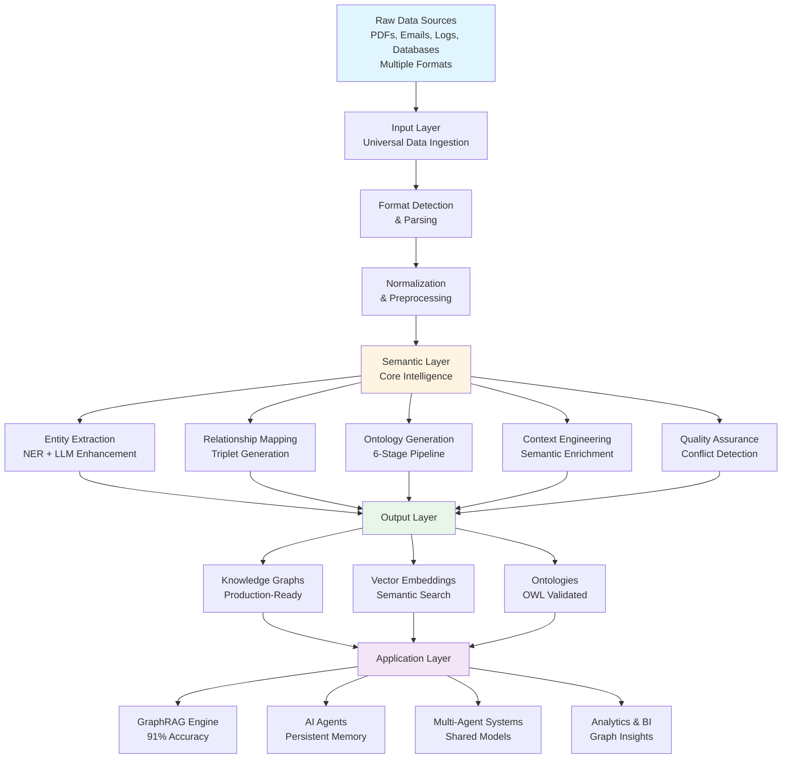

<div align="center">


# 🧠 Semantica

[](https://www.python.org/downloads/)
[](https://opensource.org/licenses/MIT)
[](https://pypi.org/project/semantica/0.0.1/)
[](https://pepy.tech/project/semantica)
[](https://discord.gg/semantica)
[](https://github.com/Hawksight-AI/semantica/actions)

<p align="center">
    <a href="https://github.com/Hawksight-AI/semantica/stargazers">
        
    </a>
    &nbsp;&nbsp;
    <a href="https://github.com/Hawksight-AI/semantica/fork">
        
    </a>
</p>

**Open Source Framework for Semantic Layer & Knowledge Engineering**

> **Transform chaotic data into intelligent knowledge.**

*The missing fabric between raw data and AI engineering. A comprehensive open-source framework for building semantic layers and knowledge engineering systems that transform unstructured data into AI-ready knowledge — powering Knowledge Graph-Powered RAG (GraphRAG), AI Agents, Multi-Agent Systems, and AI applications with structured semantic knowledge.*

**100% Open Source** • **MIT Licensed** • **Production Ready** • **Community Driven**

[**Discord**](https://discord.gg/semantica) • [**GitHub**](https://github.com/Hawksight-AI/semantica)

</div>

## What is Semantica?

Semantica bridges the gap between raw data chaos and AI-ready knowledge. It's a **semantic intelligence platform** that transforms unstructured data into structured, queryable knowledge graphs powering GraphRAG, AI agents, and multi-agent systems.

### What Makes Semantica Different?

Unlike traditional approaches that process isolated documents and extract text into vectors, Semantica understands **semantic relationships across all content**, provides **automated ontology generation**, and builds a **unified semantic layer** with **production-grade QA**.

| **Traditional Approaches** | **Semantica's Approach** |
|:---------------------------|:-------------------------|
| Process data as isolated documents | Understands semantic relationships across all content |
| Extract text and store vectors | Builds knowledge graphs with meaningful connections |
| Generic entity recognition | General-purpose ontology generation and validation |
| Manual schema definition | Automatic semantic modeling from content patterns |
| Disconnected data silos | Unified semantic layer across all data sources |
| Basic quality checks | Production-grade QA with conflict detection & resolution |

---

## 🎯 The Problem We Solve

### The Semantic Gap

Organizations today face a **fundamental mismatch** between how data exists and how AI systems need it.

#### The Semantic Gap: Problem vs. Solution

Organizations have **unstructured data** (PDFs, emails, logs), **messy data** (inconsistent formats, duplicates, conflicts), and **disconnected silos** (no shared context, missing relationships). AI systems need **clear rules** (formal ontologies), **structured entities** (validated, consistent), and **relationships** (semantic connections, context-aware reasoning).

| **What Organizations Have** | **What AI Systems Require** |
|:------------------------------|:------------------------------|
| **Unstructured Data** | **Clear Rules** |
| PDFs, emails, logs | Formal ontologies |
| Mixed schemas | Graphs & Networks |
| Conflicting facts | |
| **Messy, Noisy Data** | **Structured Entities** |
| Inconsistent formats | Validated entities |
| Duplicate records | Domain Knowledge |
| Missing relationships | |
| **Disconnected, Siloed Data** | **Relationships** |
| Data in separate systems | Semantic connections |
| No shared context | Context-Aware Reasoning |
| Isolated knowledge | |

### **SEMANTICA FRAMEWORK**

Semantica operates through three integrated layers that transform raw data into AI-ready knowledge:

**Input Layer** — Universal ingestion from multiple data formats (PDFs, DOCX, HTML, JSON, CSV, databases, live feeds, APIs, streams, archives, multi-modal content) into a unified pipeline.

**Semantic Layer** — Core intelligence engine performing entity extraction, relationship mapping, ontology generation, context engineering, and quality assurance. Includes **advanced entity deduplication** (Jaro-Winkler, disjoint property handling) to ensure a clean single source of truth.

**Output Layer** — Production-ready knowledge graphs, vector embeddings, and validated ontologies that power GraphRAG systems, AI agents, and multi-agent systems.

**Powers: GraphRAG, AI Agents, Multi-Agent Systems**

#### Semantica Processing Flow

<details>
<summary>View Interactive Flowchart</summary>



</details>


### What Happens Without Semantics?

**They Break** — Systems crash due to inconsistent formats and missing structure.

**They Hallucinate** — AI models generate false information without semantic context to validate outputs.

**They Fail Silently** — Systems return wrong answers without warnings, leading to bad decisions.

**Why?** Systems have data — not semantics. They can't connect concepts, understand relationships, validate against domain rules, or detect conflicts.

---

## 💡 The Semantica Solution

**Semantica** is an **open-source framework** that closes the semantic gap between real-world messy data and the structured semantic layers required by advanced AI systems — GraphRAG, agents, multi-agent systems, reasoning models, and more.

### How Semantica Solves These Problems

**Efficient Embeddings** — Uses **FastEmbed** by default for high-performance, lightweight local embedding generation (faster than sentence-transformers).

**Universal Data Ingestion** — Handles multiple formats (PDF, DOCX, HTML, JSON, CSV, databases, APIs, streams) with unified pipeline, no custom parsers needed.

**Automated Semantic Extraction** — NER, relationship extraction, and triplet generation with LLM enhancement discovers entities and relationships automatically.

**Knowledge Graph Construction** — Production-ready graphs with entity resolution, temporal support, and graph analytics. Queryable knowledge ready for AI applications.

**GraphRAG Engine** — Hybrid vector + graph retrieval achieves 91% accuracy (30% improvement) via semantic search + graph traversal for multi-hop reasoning. Features LLM-generated responses grounded in knowledge graph context with reasoning traces. [See Comparison Benchmark](cookbook/use_cases/advanced_rag/02_RAG_vs_GraphRAG_Comparison.ipynb)

**AI Agent Context Engineering** — Persistent memory with RAG + knowledge graphs enables context maintenance, action validation, and structured knowledge access.

**Automated Ontology Generation** — 6-stage LLM pipeline generates validated OWL ontologies with HermiT/Pellet validation, eliminating manual engineering.

**Production-Grade QA** — Conflict detection, deduplication, quality scoring, and provenance tracking ensure trusted, production-ready knowledge graphs.

**Pipeline Orchestration** — Flexible pipeline builder with parallel execution enables scalable processing via orchestrator-worker pattern.

### Core Features at a Glance

| **Feature Category** | **Capabilities** | **Key Benefits** |
|:---------------------|:-----------------|:------------------|
| **Data Ingestion** | Multiple formats (PDF, DOCX, HTML, JSON, CSV, databases, APIs, streams, archives) | Universal ingestion, no custom parsers needed |
| **Semantic Extraction** | NER, relationship extraction, triplet generation, LLM enhancement | Automated discovery of entities and relationships |
| **Knowledge Graphs** | Entity resolution, temporal support, graph analytics, query interface | Production-ready, queryable knowledge structures |
| **Ontology Generation** | 6-stage LLM pipeline, OWL generation, HermiT/Pellet validation | Automated ontology creation from documents |
| **GraphRAG** | Hybrid vector + graph retrieval, multi-hop reasoning, LLM-generated responses | 91% accuracy, 30% improvement over vector-only, reasoning traces |
| **LLM Providers** | Unified interface to 100+ LLMs (Groq, OpenAI, HuggingFace, LiteLLM) | Clean imports, multiple providers, structured output |
| **Agent Memory** | Persistent memory (Save/Load), Hybrid Retrieval (Vector+Graph), FastEmbed support | Context-aware agents with semantic understanding |
| **Pipeline Orchestration** | Parallel execution, custom steps, orchestrator-worker pattern | Scalable, flexible data processing |
| **Quality Assurance** | Conflict detection, deduplication, quality scoring, provenance | Trusted knowledge graphs ready for production |

---

## 👥 Who Is This For?

Semantica is designed for **developers, data engineers, and organizations** building the next generation of AI applications that require semantic understanding and knowledge graphs.

### Who Uses Semantica

**AI/ML Engineers & Data Scientists** — Build GraphRAG systems, AI agents, and multi-agent systems.

**Data Engineers** — Build scalable pipelines with semantic enrichment.

**Knowledge Engineers & Ontologists** — Create knowledge graphs and ontologies with automated pipelines.

**Enterprise Data Teams** — Unify semantic layers, improve data quality, resolve conflicts.

**Software & DevOps Engineers** — Build semantic APIs and infrastructure with production-ready SDK.

**Analysts & Researchers** — Transform data into queryable knowledge graphs for insights.

**Security & Compliance Teams** — Threat intelligence, regulatory reporting, audit trails.

**Product Teams & Startups** — Rapid prototyping of AI products and semantic features.

---

## 📦 Installation

**Prerequisites:** Python 3.8+ (3.9+ recommended) • pip (latest version)

### Install from PyPI (Recommended)

```bash
# Install latest version from PyPI
pip install semantica

# Or install with optional dependencies
pip install semantica[all]

# Verify installation
python -c "import semantica; print(semantica.__version__)"
```

**Current Version:** [](https://pypi.org/project/semantica/0.0.1/) • [View on PyPI](https://pypi.org/project/semantica/0.0.1/)

## 🍳 Semantica Cookbook

> **Interactive Jupyter Notebooks** designed to take you from beginner to expert.

[**View Full Cookbook**](https://github.com/Hawksight-AI/semantica/tree/main/cookbook)

### Featured Recipes

| **Recipe** | **Description** | **Link** |
|:-----------|:----------------|:---------|
| **GraphRAG Complete** | Build a production-ready **Graph Retrieval Augmented Generation** system. Features **Graph Validation**, **Hybrid Retrieval**, and **Logical Inference**. | [Open Notebook](cookbook/use_cases/advanced_rag/01_GraphRAG_Complete.ipynb) |
| **RAG vs. GraphRAG** | Side-by-side comparison. Demonstrates the **Reasoning Gap** and how GraphRAG solves it with **Inference Engines**. | [Open Notebook](cookbook/use_cases/advanced_rag/02_RAG_vs_GraphRAG_Comparison.ipynb) |
| **First Knowledge Graph** | Go from raw text to a queryable knowledge graph in 20 minutes. | [Open Notebook](cookbook/introduction/08_Your_First_Knowledge_Graph.ipynb) |
| **Real-Time Anomalies** | Detect anomalies in streaming data using temporal knowledge graphs and pattern detection. | [Open Notebook](cookbook/use_cases/cybersecurity/01_Real_Time_Anomaly_Detection.ipynb) |

### Core Tutorials

- [**Welcome to Semantica**](cookbook/introduction/01_Welcome_to_Semantica.ipynb) - Framework Overview
- [**Data Ingestion**](cookbook/introduction/02_Data_Ingestion.ipynb) - Universal Ingestion
- [**Entity Extraction**](cookbook/introduction/05_Entity_Extraction.ipynb) - NER & Relationships
- [**Building Knowledge Graphs**](cookbook/introduction/07_Building_Knowledge_Graphs.ipynb) - Graph Construction

### Industry Use Cases (18 Cookbooks)

**Domain-Specific Cookbooks** showcasing real-world applications with real data sources, advanced chunking strategies, temporal KGs, GraphRAG, and comprehensive Semantica module integration:

#### Biomedical
- [**Drug Discovery Pipeline**](cookbook/use_cases/biomedical/01_Drug_Discovery_Pipeline.ipynb) - PubMed RSS, entity-aware chunking, GraphRAG, vector similarity search
- [**Genomic Variant Analysis**](cookbook/use_cases/biomedical/02_Genomic_Variant_Analysis.ipynb) - bioRxiv RSS, temporal KGs, deduplication, pathway analysis

#### Healthcare
- [**Clinical Reports Processing**](cookbook/use_cases/healthcare/01_Clinical_Reports_Processing.ipynb) - FDA RSS, HL7/FHIR integration, patient deduplication
- [**Drug Interactions Analysis**](cookbook/use_cases/healthcare/02_Drug_Interactions_Analysis.ipynb) - Medical RSS, relation-aware chunking, conflict detection, safety ontology

#### Finance
- [**Financial Data Integration MCP**](cookbook/use_cases/finance/01_Financial_Data_Integration_MCP.ipynb) - Alpha Vantage API, MCP servers, seed data, real-time ingestion
- [**Fraud Detection**](cookbook/use_cases/finance/02_Fraud_Detection.ipynb) - Transaction streams, temporal KGs, pattern detection, conflict resolution

#### Blockchain
- [**DeFi Protocol Intelligence**](cookbook/use_cases/blockchain/01_DeFi_Protocol_Intelligence.ipynb) - CoinDesk RSS, ontology-aware chunking, conflict detection, ontology generation
- [**Transaction Network Analysis**](cookbook/use_cases/blockchain/02_Transaction_Network_Analysis.ipynb) - Blockchain APIs, deduplication, network analytics

#### Cybersecurity
- [**Real-Time Anomaly Detection**](cookbook/use_cases/cybersecurity/01_Real_Time_Anomaly_Detection.ipynb) - CVE RSS, Kafka streams, temporal KGs, sentence chunking
- [**Threat Intelligence Hybrid RAG**](cookbook/use_cases/cybersecurity/02_Threat_Intelligence_Hybrid_RAG.ipynb) - Security RSS, entity-aware chunking, enhanced GraphRAG, deduplication

#### Intelligence & Law Enforcement
- [**Criminal Network Analysis**](cookbook/use_cases/intelligence/01_Criminal_Network_Analysis.ipynb) - OSINT RSS, deduplication, network centrality, graph analytics
- [**Intelligence Analysis Orchestrator Worker**](cookbook/use_cases/intelligence/02_Intelligence_Analysis_Orchestrator_Worker.ipynb) - Pipeline orchestrator, multi-source integration, conflict detection

#### Trading
- [**Risk Assessment**](cookbook/use_cases/trading/01_Risk_Assessment.ipynb) - Yahoo Finance API, GraphRAG, entity-aware chunking, portfolio risk modeling
- [**News Sentiment Analysis**](cookbook/use_cases/trading/02_News_Sentiment_Analysis.ipynb) - Financial RSS, semantic transformer chunking, enhanced GraphRAG, sentiment extraction

#### Renewable Energy
- [**Energy Market Analysis**](cookbook/use_cases/renewable_energy/01_Energy_Market_Analysis.ipynb) - Energy RSS, EIA API, temporal KGs, TemporalPatternDetector, trend prediction
- [**Smart Grid Management**](cookbook/use_cases/renewable_energy/02_Smart_Grid_Management.ipynb) - Sensor streams, temporal KGs, token chunking, real-time monitoring

#### Supply Chain
- [**Supply Chain Data Integration**](cookbook/use_cases/supply_chain/01_Supply_Chain_Data_Integration.ipynb) - Logistics RSS, deduplication, relationship mapping
- [**Supply Chain Risk Management**](cookbook/use_cases/supply_chain/02_Supply_Chain_Risk_Management.ipynb) - Supply chain RSS, conflict detection, dependency analysis

> **Note:** Once published to PyPI, you'll be able to install with `pip install semantica`

### Install from Source (Development)

```bash
# Clone and install in editable mode
git clone https://github.com/Hawksight-AI/semantica.git
cd semantica
pip install -e .

# Or with all optional dependencies
pip install -e ".[all]"

# Development setup
pip install -e ".[dev]"
```

## 📚 Resources

> **New to Semantica?** Check out the [**Cookbook**](https://github.com/Hawksight-AI/semantica/tree/main/cookbook) for hands-on examples!

- [**Cookbook**](https://github.com/Hawksight-AI/semantica/tree/main/cookbook) - Interactive notebooks
  - [Introduction](https://github.com/Hawksight-AI/semantica/tree/main/cookbook/introduction) - Getting started tutorials
  - [Advanced](https://github.com/Hawksight-AI/semantica/tree/main/cookbook/advanced) - Advanced techniques
  - [Use Cases](https://github.com/Hawksight-AI/semantica/tree/main/cookbook/use_cases) - Real-world applications

## ✨ Core Capabilities

| **Data Ingestion** | **Semantic Extract** | **Knowledge Graphs** | **Ontology** |
|:--------------------:|:----------------------:|:----------------------:|:--------------:|
| [Multiple Formats](#universal-data-ingestion) | [Entity & Relations](#semantic-intelligence-engine) | [Graph Analytics](#knowledge-graph-construction) | [Auto Generation](#ontology-generation--management) |
| **Context** | **GraphRAG** | **LLM Providers** | **Pipeline** |
| [Agent Memory](#context-engineering--memory-systems) | [Hybrid RAG](#knowledge-graph-powered-rag-graphrag) | [100+ LLMs](#llm-providers-module) | [Parallel Workers](#pipeline-orchestration--parallel-processing) |
| **QA** | **Reasoning** | | |
| [Conflict Resolution](#production-ready-quality-assurance) | [Rule-based Inference](#reasoning--inference-engine) | | |

---

### Universal Data Ingestion

> **Multiple file formats** • PDF, DOCX, HTML, JSON, CSV, databases, feeds, archives

```python
from semantica.ingest import FileIngestor, WebIngestor, DBIngestor

file_ingestor = FileIngestor(recursive=True)
web_ingestor = WebIngestor(max_depth=3)
db_ingestor = DBIngestor(connection_string="postgresql://...")

sources = []
sources.extend(file_ingestor.ingest("documents/"))
sources.extend(web_ingestor.ingest("https://example.com"))
sources.extend(db_ingestor.ingest(query="SELECT * FROM articles"))

print(f" Ingested {len(sources)} sources")
```

[**Cookbook: Data Ingestion**](https://github.com/Hawksight-AI/semantica/tree/main/cookbook/introduction/02_Data_Ingestion.ipynb) • [**Document Parsing**](https://github.com/Hawksight-AI/semantica/tree/main/cookbook/introduction/03_Document_Parsing.ipynb) • [**Data Normalization**](https://github.com/Hawksight-AI/semantica/tree/main/cookbook/introduction/04_Data_Normalization.ipynb) • [**Chunking & Splitting**](https://github.com/Hawksight-AI/semantica/tree/main/cookbook/introduction/11_Chunking_and_Splitting.ipynb)

### Semantic Intelligence Engine

> **Entity & Relation Extraction** • NER, Relationships, Events, Triplets with LLM Enhancement

```python
from semantica.core import Semantica

text = "Apple Inc., founded by Steve Jobs in 1976, acquired Beats Electronics for $3 billion."

core = Semantica(ner_model="transformer", relation_strategy="hybrid")
results = core.extract_semantics(text)

print(f"Entities: {len(results.entities)}, Relationships: {len(results.relationships)}")
```

[**Cookbook: Entity Extraction**](https://github.com/Hawksight-AI/semantica/tree/main/cookbook/introduction/05_Entity_Extraction.ipynb) • [**Relation Extraction**](https://github.com/Hawksight-AI/semantica/tree/main/cookbook/introduction/06_Relation_Extraction.ipynb) • [**Advanced Extraction**](https://github.com/Hawksight-AI/semantica/tree/main/cookbook/advanced/01_Advanced_Extraction.ipynb)

### Knowledge Graph Construction

> **Production-Ready KGs** • Entity Resolution • Temporal Support • Graph Analytics

```python
from semantica.core import Semantica
from semantica.kg import GraphAnalyzer

documents = ["doc1.txt", "doc2.txt", "doc3.txt"]
core = Semantica(graph_db="neo4j", merge_entities=True)
kg = core.build_knowledge_graph(documents, generate_embeddings=True)

analyzer = GraphAnalyzer()
pagerank = analyzer.compute_centrality(kg, method="pagerank")
communities = analyzer.detect_communities(kg, method="louvain")

result = kg.query("Who founded the company?", return_format="structured")
print(f"Nodes: {kg.node_count}, Answer: {result.answer}")
```

[**Cookbook: Building Knowledge Graphs**](https://github.com/Hawksight-AI/semantica/tree/main/cookbook/introduction/07_Building_Knowledge_Graphs.ipynb) • [**Graph Store**](https://github.com/Hawksight-AI/semantica/tree/main/cookbook/introduction/09_Graph_Store.ipynb) • [**Triplet Store**](https://github.com/Hawksight-AI/semantica/tree/main/cookbook/introduction/20_Triplet_Store.ipynb) • [**Visualization**](https://github.com/Hawksight-AI/semantica/tree/main/cookbook/introduction/16_Visualization.ipynb)

[**Graph Analytics**](https://github.com/Hawksight-AI/semantica/tree/main/cookbook/introduction/10_Graph_Analytics.ipynb) • [**Advanced Graph Analytics**](https://github.com/Hawksight-AI/semantica/tree/main/cookbook/advanced/02_Advanced_Graph_Analytics.ipynb)

### Triplet Store Integration

> **SPARQL Support** • **Blazegraph, Jena, RDF4J** • **Reasoning & Inference**

```python
from semantica.triplet_store import TripletStore

# Initialize store (Blazegraph, Jena, or RDF4J)
store = TripletStore(backend="blazegraph", endpoint="http://localhost:9999/blazegraph")

# Add triplets and execute SPARQL queries
store.add_triplet({
    "subject": "http://example.org/Alice",
    "predicate": "http://example.org/knows",
    "object": "http://example.org/Bob"
})

results = store.execute_query("SELECT ?s ?p ?o WHERE { ?s ?p ?o } LIMIT 10")
```

[**Cookbook: Triplet Store**](https://github.com/Hawksight-AI/semantica/tree/main/cookbook/introduction/20_Triplet_Store.ipynb)

### Ontology Generation & Management

> **6-Stage LLM Pipeline** • Automatic OWL Generation • HermiT/Pellet Validation

```python
from semantica.ontology import OntologyGenerator

generator = OntologyGenerator(llm_provider="openai", model="gpt-4")
ontology = generator.generate_from_documents(sources=["domain_docs/"])

print(f"Classes: {len(ontology.classes)}")
```

[**Cookbook: Ontology**](https://github.com/Hawksight-AI/semantica/tree/main/cookbook/introduction/14_Ontology.ipynb)

### Context Engineering & Memory Systems

> **Persistent Memory** • **Hybrid Retrieval (Vector + Graph)** • **Production Graph Store (Neo4j)** • **Entity Linking** • **Multi-Hop Reasoning**

```python
from semantica.context import AgentContext
from semantica.vector_store import VectorStore
from semantica.graph_store import GraphStore
from semantica.llms import Groq

# Initialize Context with Hybrid Retrieval (Graph + Vector)
context = AgentContext(
    vector_store=VectorStore(backend="faiss"),
    knowledge_graph=GraphStore(backend="neo4j"), # Optional: Use persistent graph
    hybrid_alpha=0.75  # 75% weight to Knowledge Graph, 25% to Vector
)

# Store memory with automatic entity linking
context.store(
    "User is building a RAG system with Semantica",
    metadata={"priority": "high", "topic": "rag"}
)

# Retrieve with context expansion
results = context.retrieve("What is the user building?", use_graph_expansion=True)

# Query with reasoning and LLM-generated responses
llm_provider = Groq(model="llama-3.1-8b-instant", api_key=os.getenv("GROQ_API_KEY"))
reasoned_result = context.query_with_reasoning(
    query="What is the user building?",
    llm_provider=llm_provider,
    max_hops=2
)
```

**Core Notebooks:**
- [**Context Module Introduction**](https://github.com/Hawksight-AI/semantica/tree/main/cookbook/introduction/19_Context_Module.ipynb) - Basic memory and storage.
- [**Advanced Context Engineering**](https://github.com/Hawksight-AI/semantica/tree/main/cookbook/advanced/11_Advanced_Context_Engineering.ipynb) - Hybrid retrieval, graph builders, and custom memory policies.

**Related Components:**
[**Vector Store**](https://github.com/Hawksight-AI/semantica/tree/main/cookbook/introduction/13_Vector_Store.ipynb) • [**Embedding Generation**](https://github.com/Hawksight-AI/semantica/tree/main/cookbook/introduction/12_Embedding_Generation.ipynb) • [**Advanced Vector Store**](https://github.com/Hawksight-AI/semantica/tree/main/cookbook/advanced/Advanced_Vector_Store_and_Search.ipynb)

### Knowledge Graph-Powered RAG (GraphRAG)

> **30% Accuracy Improvement** • Vector + Graph Hybrid Search • 91% Accuracy • **Multi-Hop Reasoning** • **LLM-Generated Responses**

```python
from semantica.context import AgentContext
from semantica.llms import Groq, OpenAI, LiteLLM
from semantica.vector_store import VectorStore
import os

# Initialize GraphRAG with hybrid retrieval
context = AgentContext(
    vector_store=VectorStore(backend="faiss"),
    knowledge_graph=kg
)

# Configure LLM provider (supports Groq, OpenAI, HuggingFace, LiteLLM)
llm_provider = Groq(
    model="llama-3.1-8b-instant",
    api_key=os.getenv("GROQ_API_KEY")
)

# Query with multi-hop reasoning and LLM-generated responses
result = context.query_with_reasoning(
    query="What IPs are associated with security alerts?",
    llm_provider=llm_provider,
    max_results=10,
    max_hops=2
)

print(f"Response: {result['response']}")
print(f"Reasoning Path: {result['reasoning_path']}")
print(f"Confidence: {result['confidence']:.3f}")
```

**Key Features:**
- **Multi-Hop Reasoning**: Traverses knowledge graph up to N hops to find related entities
- **LLM-Generated Responses**: Natural language answers grounded in graph context
- **Reasoning Trace**: Shows entity relationship paths used in reasoning
- **Multiple LLM Providers**: Supports Groq, OpenAI, HuggingFace, and LiteLLM (100+ LLMs)

[**Cookbook: GraphRAG**](https://github.com/Hawksight-AI/semantica/tree/main/cookbook/use_cases/advanced_rag/01_GraphRAG_Complete.ipynb) • [**Real-Time Anomaly Detection**](https://github.com/Hawksight-AI/semantica/tree/main/cookbook/use_cases/cybersecurity/01_Real_Time_Anomaly_Detection.ipynb)

### LLM Providers Module

> **Unified LLM Interface** • **100+ LLM Support via LiteLLM** • **Clean Imports** • **Multiple Providers**

```python
from semantica.llms import Groq, OpenAI, HuggingFaceLLM, LiteLLM
import os

# Groq - Fast inference
groq = Groq(
    model="llama-3.1-8b-instant",
    api_key=os.getenv("GROQ_API_KEY")
)
response = groq.generate("What is AI?")

# OpenAI
openai = OpenAI(
    model="gpt-4",
    api_key=os.getenv("OPENAI_API_KEY")
)
response = openai.generate("What is AI?")

# HuggingFace - Local models
hf = HuggingFaceLLM(model_name="gpt2")
response = hf.generate("What is AI?")

# LiteLLM - Unified interface to 100+ LLMs
litellm = LiteLLM(
    model="openai/gpt-4o",  # or "anthropic/claude-sonnet-4-20250514", "groq/llama-3.1-8b-instant", etc.
    api_key=os.getenv("OPENAI_API_KEY")
)
response = litellm.generate("What is AI?")

# Structured output
structured = groq.generate_structured("Extract entities from: Apple Inc. was founded by Steve Jobs.")
```

**Supported Providers:**
- **Groq**: Fast inference with Llama models
- **OpenAI**: GPT-3.5, GPT-4, and other OpenAI models
- **HuggingFace**: Local LLM inference with Transformers
- **LiteLLM**: Unified interface to 100+ LLM providers (OpenAI, Anthropic, Azure, Bedrock, Vertex AI, and more)

### Reasoning & Inference Engine

> **Rule-based Inference** • **Forward/Backward Chaining** • **Rete Algorithm** • **Explanation Generation**

```python
from semantica.reasoning import Reasoner

# Initialize Reasoner
reasoner = Reasoner()

# Define rules and facts
rules = ["IF Parent(?a, ?b) AND Parent(?b, ?c) THEN Grandparent(?a, ?c)"]
facts = ["Parent(Alice, Bob)", "Parent(Bob, Charlie)"]

# Infer new facts (Forward Chaining)
inferred = reasoner.infer_facts(facts, rules)
print(f"Inferred: {inferred}") # ['Grandparent(Alice, Charlie)']

# Explain reasoning
from semantica.reasoning import ExplanationGenerator
explainer = ExplanationGenerator()
# ... generate explanation for inferred facts
```

[**Cookbook: Reasoning**](https://github.com/Hawksight-AI/semantica/tree/main/cookbook/advanced/08_Reasoning_and_Inference.ipynb) • [**Rete Engine**](https://github.com/Hawksight-AI/semantica/tree/main/cookbook/advanced/09_Rete_Engine.ipynb)

### Pipeline Orchestration & Parallel Processing

> **Orchestrator-Worker Pattern** • Parallel Execution • Scalable Processing

```python
from semantica.pipeline import PipelineBuilder, ExecutionEngine

pipeline = PipelineBuilder() \
    .add_step("ingest", "custom", func=ingest_data) \
    .add_step("extract", "custom", func=extract_entities) \
    .add_step("build", "custom", func=build_graph) \
    .build()

result = ExecutionEngine().execute_pipeline(pipeline, parallel=True)
```


### Production-Ready Quality Assurance

> **Enterprise-Grade QA** • Conflict Detection • Deduplication

```python
from semantica.deduplication import DuplicateDetector
from semantica.conflicts import ConflictDetector

entities = kg.get("entities", [])
conflicts = ConflictDetector().detect_conflicts(entities)
duplicates = DuplicateDetector(similarity_threshold=0.85).detect_duplicates(entities)

print(f"Conflicts: {len(conflicts)} | Duplicates: {len(duplicates)}")
```

[**Cookbook: Conflict Detection & Resolution**](https://github.com/Hawksight-AI/semantica/tree/main/cookbook/introduction/17_Conflict_Detection_and_Resolution.ipynb) • [**Deduplication**](https://github.com/Hawksight-AI/semantica/tree/main/cookbook/introduction/18_Deduplication.ipynb)

### Export & Integration

> **Multi-Format Export** • JSON, CSV, RDF, GraphML

```python
from semantica.export import GraphExporter

exporter = GraphExporter(kg)
exporter.export("graph.json", format="json")
exporter.export("graph.ttl", format="turtle")
```

[**Cookbook: Export**](https://github.com/Hawksight-AI/semantica/tree/main/cookbook/introduction/15_Export.ipynb) • [**Multi-Format Export**](https://github.com/Hawksight-AI/semantica/tree/main/cookbook/advanced/05_Multi_Format_Export.ipynb) • [**Multi-Source Integration**](https://github.com/Hawksight-AI/semantica/tree/main/cookbook/advanced/06_Multi_Source_Data_Integration.ipynb)

## 🚀 Quick Start

> **For comprehensive examples, see the [**Cookbook**](https://github.com/Hawksight-AI/semantica/tree/main/cookbook) with interactive notebooks!**

```python
from semantica.core import Semantica

# Initialize and build knowledge graph
core = Semantica(ner_model="transformer", relation_strategy="hybrid")
documents = ["doc1.txt", "doc2.txt", "doc3.txt"]
kg = core.build_knowledge_graph(documents, merge_entities=True)

# Query the graph
result = kg.query("Who founded the company?", return_format="structured")
print(f"Answer: {result.answer} | Nodes: {kg.node_count}, Edges: {kg.edge_count}")
```

[**Cookbook: Your First Knowledge Graph**](https://github.com/Hawksight-AI/semantica/tree/main/cookbook/introduction/08_Your_First_Knowledge_Graph.ipynb)

## 🎯 Use Cases

**Enterprise Knowledge Engineering** — Unify data sources into knowledge graphs, breaking down silos.

**AI Agents & Autonomous Systems** — Build agents with persistent memory and semantic understanding.

**Multi-Format Document Processing** — Process multiple formats through a unified pipeline.

**Data Pipeline Processing** — Build scalable pipelines with parallel execution.

**Intelligence & Security** — Analyze networks, threat intelligence, forensic analysis.

**Finance & Trading** — Fraud detection, market intelligence, risk assessment.

**Healthcare & Biomedical** — Clinical reports, drug discovery, medical literature analysis.

[**Explore Use Case Examples**](https://github.com/Hawksight-AI/semantica/tree/main/cookbook/use_cases) — See real-world implementations in finance, healthcare, cybersecurity, trading, and more. **18 comprehensive domain-specific cookbooks** with real data sources, advanced chunking strategies, temporal KGs, GraphRAG, and full Semantica module integration.

## 🔬 Advanced Features

**Incremental Updates** — Real-time stream processing with Kafka, RabbitMQ, Kinesis for live updates.

**Multi-Language Support** — Process multiple languages with automatic detection.

**Custom Ontology Import** — Import and extend Schema.org and custom ontologies.

**Advanced Reasoning** — Forward/backward chaining, Rete-based pattern matching, and automated explanation generation.

**Graph Analytics** — Centrality, community detection, path finding, temporal analysis.

**Custom Pipelines** — Build custom pipelines with parallel execution.

**API Integration** — Integrate external APIs for entity enrichment.

[**See Advanced Examples**](https://github.com/Hawksight-AI/semantica/tree/main/cookbook/advanced) — Advanced extraction, graph analytics, reasoning, and more.

## 🗺️ Roadmap

### Q1 2026
- [x] Core framework (v1.0)
- [x] GraphRAG engine
- [x] 6-stage ontology pipeline
- [x] Advanced reasoning v2 (Rete, Forward/Backward Chaining)
- [ ] Quality assurance features and Quality Assurance module
- [ ] Enhanced multi-language support
- [ ] Real-time streaming improvements

### Q2 2026
- [ ] Multi-modal processing

---

## 🤝 Community & Support

### Join Our Community

| **Channel** | **Purpose** |
|:-----------:|:-----------|
| [**Discord**](https://discord.gg/semantica) | Real-time help, showcases |
| [**GitHub Discussions**](https://github.com/Hawksight-AI/semantica/discussions) | Q&A, feature requests |

### Learning Resources


### Enterprise Support

| **Tier** | **Features** | **SLA** | **Price** |
|:--------:|:-----------|:-------:|:--------:|
| **Community** | Public support | Best effort | Free |
| **Professional** | Email support | 48h | Contact |
| **Enterprise** | 24/7 support | 4h | Contact |
| **Premium** | Phone, custom dev | 1h | Contact |

**Contact:** [GitHub Issues](https://github.com/Hawksight-AI/semantica/issues) with "[Enterprise]" prefix

## 🤝 Contributing

### How to Contribute

```bash
# Fork and clone
git clone https://github.com/your-username/semantica.git
cd semantica

# Create branch
git checkout -b feature/your-feature

# Install dev dependencies
pip install -e ".[dev,test]"

# Make changes and test
pytest tests/
black semantica/
flake8 semantica/

# Commit and push
git commit -m "Add feature"
git push origin feature/your-feature
```

### Contribution Types

1. **Code** - New features, bug fixes
2. **Documentation** - Improvements, tutorials
3. **Bug Reports** - [Create issue](https://github.com/Hawksight-AI/semantica/issues/new)
4. **Feature Requests** - [Request feature](https://github.com/Hawksight-AI/semantica/issues/new)

### Recognition

Contributors receive:
- Recognition in [CONTRIBUTORS.md](https://github.com/Hawksight-AI/semantica/blob/main/CONTRIBUTORS.md)
- GitHub badges
- Semantica swag
- Featured showcases

## 🏆 Contributors

<a href="https://github.com/Hawksight-AI/semantica/graphs/contributors">
  
</a>

## 📜 License

Semantica is licensed under the **MIT License** - see the [LICENSE](https://github.com/Hawksight-AI/semantica/blob/main/LICENSE) file for details.

<div align="center">

**Built by the Semantica Community**

[GitHub](https://github.com/Hawksight-AI/semantica) • [Discord](https://discord.gg/semantica)

</div>
