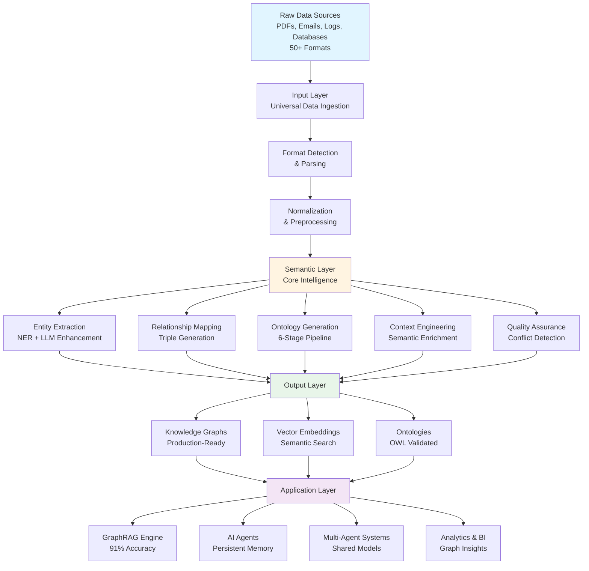

<div align="center">


# 🧠 Semantica

[](https://www.python.org/downloads/)
[](https://opensource.org/licenses/MIT)
[](https://pypi.org/project/semantica/0.0.1/)
[](https://pepy.tech/project/semantica)
[](https://discord.gg/semantica)
[](https://github.com/Hawksight-AI/semantica/actions)
[](https://github.com/psf/black)

**Open Source Framework for Semantic Layer & Knowledge Engineering**

> **Transform chaotic data into intelligent knowledge.**

*The missing fabric between raw data and AI engineering. A comprehensive open-source framework for building semantic layers and knowledge engineering systems that transform unstructured data into AI-ready knowledge — powering Knowledge Graph-Powered RAG (GraphRAG), AI Agents, Multi-Agent Systems, and AI applications with structured semantic knowledge.*

**100% Open Source** • **MIT Licensed** • **Production Ready** • **Community Driven**

[**Discord**](https://discord.gg/semantica) • [**GitHub**](https://github.com/Hawksight-AI/semantica)

</div>

## What is Semantica?

Semantica bridges the gap between raw data chaos and AI-ready knowledge. It's a **semantic intelligence platform** that transforms unstructured data into structured, queryable knowledge graphs powering GraphRAG, AI agents, and multi-agent systems.

### What Makes Semantica Different?

Unlike traditional approaches that process isolated documents and extract text into vectors, Semantica understands **semantic relationships across all content**, provides **automated ontology generation**, and builds a **unified semantic layer** with **production-grade QA**.

| **Traditional Approaches** | **Semantica's Approach** |
|:---------------------------|:-------------------------|
| Process data as isolated documents | Understands semantic relationships across all content |
| Extract text and store vectors | Builds knowledge graphs with meaningful connections |
| Generic entity recognition | General-purpose ontology generation and validation |
| Manual schema definition | Automatic semantic modeling from content patterns |
| Disconnected data silos | Unified semantic layer across all data sources |
| Basic quality checks | Production-grade QA with conflict detection & resolution |

---

## 🎯 The Problem We Solve

### The Semantic Gap

Organizations today face a **fundamental mismatch** between how data exists and how AI systems need it.

#### The Semantic Gap: Problem vs. Solution

Organizations have **unstructured data** (PDFs, emails, logs), **messy data** (inconsistent formats, duplicates, conflicts), and **disconnected silos** (no shared context, missing relationships). AI systems need **clear rules** (formal ontologies), **structured entities** (validated, consistent), and **relationships** (semantic connections, context-aware reasoning).

| **What Organizations Have** | **What AI Systems Require** |
|:------------------------------|:------------------------------|
| **Unstructured Data** | **Clear Rules** |
| PDFs, emails, logs | Formal ontologies |
| Mixed schemas | Graphs & Networks |
| Conflicting facts | |
| **Messy, Noisy Data** | **Structured Entities** |
| Inconsistent formats | Validated entities |
| Duplicate records | Domain Knowledge |
| Missing relationships | |
| **Disconnected, Siloed Data** | **Relationships** |
| Data in separate systems | Semantic connections |
| No shared context | Context-Aware Reasoning |
| Isolated knowledge | |

### **SEMANTICA FRAMEWORK**

Semantica operates through three integrated layers that transform raw data into AI-ready knowledge:

**Input Layer** — Universal ingestion from 50+ data formats (PDFs, DOCX, HTML, JSON, CSV, databases, live feeds, APIs, streams, archives, multi-modal content) into a unified pipeline.

**Semantic Layer** — Core intelligence engine performing entity extraction, relationship mapping, ontology generation, context engineering, and quality assurance. This is where unstructured data transforms into structured knowledge.

**Output Layer** — Production-ready knowledge graphs, vector embeddings, and validated ontologies that power GraphRAG systems, AI agents, and multi-agent systems.

**Powers: GraphRAG, AI Agents, Multi-Agent Systems**

#### Semantica Processing Flow

<details>
<summary>View Interactive Flowchart</summary>



</details>


### What Happens Without Semantics?

**They Break** — Systems crash due to inconsistent formats and missing structure.

**They Hallucinate** — AI models generate false information without semantic context to validate outputs.

**They Fail Silently** — Systems return wrong answers without warnings, leading to bad decisions.

**Why?** Systems have data — not semantics. They can't connect concepts, understand relationships, validate against domain rules, or detect conflicts.

---

## 💡 The Semantica Solution

**Semantica** is an **open-source framework** that closes the semantic gap between real-world messy data and the structured semantic layers required by advanced AI systems — GraphRAG, agents, multi-agent systems, reasoning models, and more.

### How Semantica Solves These Problems

**Universal Data Ingestion** — Handles 50+ formats (PDF, DOCX, HTML, JSON, CSV, databases, APIs, streams) with unified pipeline, no custom parsers needed.

**Automated Semantic Extraction** — NER, relationship extraction, and triple generation with LLM enhancement discovers entities and relationships automatically.

**Knowledge Graph Construction** — Production-ready graphs with entity resolution, temporal support, and graph analytics. Queryable knowledge ready for AI applications.

**GraphRAG Engine** — Hybrid vector + graph retrieval achieves 91% accuracy (30% improvement) via semantic search + graph traversal for multi-hop reasoning.

**AI Agent Context Engineering** — Persistent memory with RAG + knowledge graphs enables context maintenance, action validation, and structured knowledge access.

**Automated Ontology Generation** — 6-stage LLM pipeline generates validated OWL ontologies with HermiT/Pellet validation, eliminating manual engineering.

**Production-Grade QA** — Conflict detection, deduplication, quality scoring, and provenance tracking ensure trusted, production-ready knowledge graphs.

**Pipeline Orchestration** — Flexible pipeline builder with parallel execution enables scalable processing via orchestrator-worker pattern.

### Core Features at a Glance

| **Feature Category** | **Capabilities** | **Key Benefits** |
|:---------------------|:-----------------|:------------------|
| **Data Ingestion** | 50+ formats (PDF, DOCX, HTML, JSON, CSV, databases, APIs, streams, archives) | Universal ingestion, no custom parsers needed |
| **Semantic Extraction** | NER, relationship extraction, triple generation, LLM enhancement | Automated discovery of entities and relationships |
| **Knowledge Graphs** | Entity resolution, temporal support, graph analytics, query interface | Production-ready, queryable knowledge structures |
| **Ontology Generation** | 6-stage LLM pipeline, OWL generation, HermiT/Pellet validation | Automated ontology creation from documents |
| **GraphRAG** | Hybrid vector + graph retrieval, multi-hop reasoning | 91% accuracy, 30% improvement over vector-only |
| **Agent Memory** | Persistent memory, RAG integration, MCP-compatible tools | Context-aware agents with semantic understanding |
| **Pipeline Orchestration** | Parallel execution, custom steps, orchestrator-worker pattern | Scalable, flexible data processing |
| **Quality Assurance** | Conflict detection, deduplication, quality scoring, provenance | Trusted knowledge graphs ready for production |

---

## 👥 Who Is This For?

Semantica is designed for **developers, data engineers, and organizations** building the next generation of AI applications that require semantic understanding and knowledge graphs.

### Who Uses Semantica

**AI/ML Engineers & Data Scientists** — Build GraphRAG systems, AI agents, and multi-agent systems.

**Data Engineers** — Build scalable pipelines with semantic enrichment.

**Knowledge Engineers & Ontologists** — Create knowledge graphs and ontologies with automated pipelines.

**Enterprise Data Teams** — Unify semantic layers, improve data quality, resolve conflicts.

**Software & DevOps Engineers** — Build semantic APIs and infrastructure with production-ready SDK.

**Analysts & Researchers** — Transform data into queryable knowledge graphs for insights.

**Security & Compliance Teams** — Threat intelligence, regulatory reporting, audit trails.

**Product Teams & Startups** — Rapid prototyping of AI products and semantic features.

---

## 📦 Installation

**Prerequisites:** Python 3.8+ (3.9+ recommended) • pip (latest version)

### Install from PyPI (Recommended)

```bash
# Install latest version from PyPI
pip install semantica

# Or install with optional dependencies
pip install semantica[all]

# Verify installation
python -c "import semantica; print(semantica.__version__)"
```

**Current Version:** [](https://pypi.org/project/semantica/0.0.1/) • [View on PyPI](https://pypi.org/project/semantica/0.0.1/)

### Install from Source (Development)

```bash
# Clone and install in editable mode
git clone https://github.com/Hawksight-AI/semantica.git
cd semantica
pip install -e .

# Or with all optional dependencies
pip install -e ".[all]"

# Development setup
pip install -e ".[dev]"
```

## 📚 Resources

> **New to Semantica?** Check out the [**Cookbook**](https://github.com/Hawksight-AI/semantica/tree/main/cookbook) for hands-on examples!

- [**Cookbook**](https://github.com/Hawksight-AI/semantica/tree/main/cookbook) - 50+ interactive notebooks
  - [Introduction](https://github.com/Hawksight-AI/semantica/tree/main/cookbook/introduction) - Getting started tutorials
  - [Advanced](https://github.com/Hawksight-AI/semantica/tree/main/cookbook/advanced) - Advanced techniques
  - [Use Cases](https://github.com/Hawksight-AI/semantica/tree/main/cookbook/use_cases) - Real-world applications

## ✨ Core Capabilities

| **Data Ingestion** | **Semantic Extract** | **Knowledge Graphs** | **Ontology** |
|:--------------------:|:----------------------:|:----------------------:|:--------------:|
| [50+ Formats](#universal-data-ingestion) | [Entity & Relations](#semantic-intelligence-engine) | [Graph Analytics](#knowledge-graph-construction) | [Auto Generation](#ontology-generation--management) |
| **Context** | **GraphRAG** | **Pipeline** | **QA** |
| [Agent Memory](#context-engineering-for-ai-agents) | [Hybrid RAG](#knowledge-graph-powered-rag-graphrag) | [Parallel Workers](#pipeline-orchestration--parallel-processing) | [Conflict Resolution](#production-ready-quality-assurance) |

---

### Universal Data Ingestion

> **50+ file formats** • PDF, DOCX, HTML, JSON, CSV, databases, feeds, archives

```python
from semantica.ingest import FileIngestor, WebIngestor, DBIngestor

file_ingestor = FileIngestor(recursive=True)
web_ingestor = WebIngestor(max_depth=3)
db_ingestor = DBIngestor(connection_string="postgresql://...")

sources = []
sources.extend(file_ingestor.ingest("documents/"))
sources.extend(web_ingestor.ingest("https://example.com"))
sources.extend(db_ingestor.ingest(query="SELECT * FROM articles"))

print(f" Ingested {len(sources)} sources")
```

[**Cookbook: Data Ingestion**](https://github.com/Hawksight-AI/semantica/tree/main/cookbook/introduction/02_Data_Ingestion.ipynb)

### Semantic Intelligence Engine

> **Entity & Relation Extraction** • NER, Relationships, Events, Triples with LLM Enhancement

```python
from semantica import Semantica

text = "Apple Inc., founded by Steve Jobs in 1976, acquired Beats Electronics for $3 billion."

core = Semantica(ner_model="transformer", relation_strategy="hybrid")
results = core.extract_semantics(text)

print(f"Entities: {len(results.entities)}, Relationships: {len(results.relationships)}")
```

[**Cookbook: Entity Extraction**](https://github.com/Hawksight-AI/semantica/tree/main/cookbook/introduction/05_Entity_Extraction.ipynb) • [**Relation Extraction**](https://github.com/Hawksight-AI/semantica/tree/main/cookbook/introduction/06_Relation_Extraction.ipynb)

### Knowledge Graph Construction

> **Production-Ready KGs** • Entity Resolution • Temporal Support • Graph Analytics

```python
from semantica import Semantica
from semantica.kg import GraphAnalyzer

documents = ["doc1.txt", "doc2.txt", "doc3.txt"]
core = Semantica(graph_db="neo4j", merge_entities=True)
kg = core.build_knowledge_graph(documents, generate_embeddings=True)

analyzer = GraphAnalyzer()
pagerank = analyzer.compute_centrality(kg, method="pagerank")
communities = analyzer.detect_communities(kg, method="louvain")

result = kg.query("Who founded the company?", return_format="structured")
print(f"Nodes: {kg.node_count}, Answer: {result.answer}")
```

[**Cookbook: Building Knowledge Graphs**](https://github.com/Hawksight-AI/semantica/tree/main/cookbook/introduction/07_Building_Knowledge_Graphs.ipynb) • [**Graph Analytics**](https://github.com/Hawksight-AI/semantica/tree/main/cookbook/introduction/10_Graph_Analytics.ipynb)

### Ontology Generation & Management

> **6-Stage LLM Pipeline** • Automatic OWL Generation • HermiT/Pellet Validation

```python
from semantica.ontology import OntologyGenerator, OntologyValidator

generator = OntologyGenerator(llm_provider="openai", model="gpt-4")
ontology = generator.generate_from_documents(sources=["domain_docs/"])

validator = OntologyValidator(reasoner="hermit")
validation = validator.validate(ontology)

print(f"Classes: {len(ontology.classes)}, Valid: {validation.is_consistent}")
```

[**Cookbook: Ontology**](https://github.com/Hawksight-AI/semantica/tree/main/cookbook/introduction/14_Ontology.ipynb)

### Context Engineering for AI Agents

> **Persistent Memory** • RAG + Knowledge Graphs • MCP-Compatible Tools

```python
from semantica.context import AgentMemory, ContextRetriever
from semantica.vector_store import VectorStore

memory = AgentMemory(vector_store=VectorStore(backend="faiss"), retention_policy="unlimited")
memory.store("User prefers technical docs", metadata={"user_id": "user_123"})

retriever = ContextRetriever(memory_store=memory)
context = retriever.retrieve("What are user preferences?", max_results=5)
```

[**Cookbook: Vector Store**](https://github.com/Hawksight-AI/semantica/tree/main/cookbook/introduction/13_Vector_Store.ipynb)

### Knowledge Graph-Powered RAG (GraphRAG)

> **30% Accuracy Improvement** • Vector + Graph Hybrid Search • 91% Accuracy

```python
from semantica.qa_rag import GraphRAGEngine
from semantica.vector_store import VectorStore

graphrag = GraphRAGEngine(
    vector_store=VectorStore(backend="faiss"),
    knowledge_graph=kg
)
result = graphrag.query("Who founded the company?", top_k=5, expand_graph=True)
print(f"Answer: {result.answer} (Confidence: {result.confidence:.2f})")
```

[**Cookbook: GraphRAG**](https://github.com/Hawksight-AI/semantica/tree/main/cookbook/use_cases/advanced_rag/01_GraphRAG_Complete.ipynb)

### Pipeline Orchestration & Parallel Processing

> **Orchestrator-Worker Pattern** • Parallel Execution • Scalable Processing

```python
from semantica.pipeline import PipelineBuilder, ExecutionEngine

pipeline = PipelineBuilder() \
    .add_step("ingest", "custom", func=ingest_data) \
    .add_step("extract", "custom", func=extract_entities) \
    .add_step("build", "custom", func=build_graph) \
    .build()

result = ExecutionEngine().execute_pipeline(pipeline, parallel=True)
```

[**Cookbook: Pipeline Orchestration**](https://github.com/Hawksight-AI/semantica/tree/main/cookbook/advanced/07_Pipeline_Orchestration.ipynb)

### Production-Ready Quality Assurance

> **Enterprise-Grade QA** • Conflict Detection • Deduplication

```python
from semantica.deduplication import DuplicateDetector
from semantica.conflicts import ConflictDetector

conflicts = ConflictDetector().detect_conflicts(kg)
duplicates = DuplicateDetector().find_duplicates(entities=kg.entities, similarity_threshold=0.85)

print(f"Conflicts: {len(conflicts)} | Duplicates: {len(duplicates)}")
```

[**Cookbook: Conflict Detection**](https://github.com/Hawksight-AI/semantica/tree/main/cookbook/introduction/17_Conflict_Detection.ipynb) • [**Deduplication**](https://github.com/Hawksight-AI/semantica/tree/main/cookbook/introduction/18_Deduplication.ipynb)

## 🚀 Quick Start

> **For comprehensive examples, see the [**Cookbook**](https://github.com/Hawksight-AI/semantica/tree/main/cookbook) with 50+ interactive notebooks!**

```python
from semantica import Semantica

# Initialize and build knowledge graph
core = Semantica(ner_model="transformer", relation_strategy="hybrid")
documents = ["doc1.txt", "doc2.txt", "doc3.txt"]
kg = core.build_knowledge_graph(documents, merge_entities=True)

# Query the graph
result = kg.query("Who founded the company?", return_format="structured")
print(f"Answer: {result.answer} | Nodes: {kg.node_count}, Edges: {kg.edge_count}")
```

[**Cookbook: Your First Knowledge Graph**](https://github.com/Hawksight-AI/semantica/tree/main/cookbook/introduction/08_Your_First_Knowledge_Graph.ipynb)

## 🎯 Use Cases

**Enterprise Knowledge Engineering** — Unify data sources into knowledge graphs, breaking down silos.

**AI Agents & Autonomous Systems** — Build agents with persistent memory and semantic understanding.

**Multi-Format Document Processing** — Process 50+ formats through a unified pipeline.

**Data Pipeline Processing** — Build scalable pipelines with parallel execution.

**Intelligence & Security** — Analyze networks, threat intelligence, forensic analysis.

**Finance & Trading** — Fraud detection, market intelligence, risk assessment.

**Healthcare & Biomedical** — Clinical reports, drug discovery, medical literature analysis.

[**Explore Use Case Examples**](https://github.com/Hawksight-AI/semantica/tree/main/cookbook/use_cases) — See real-world implementations in finance, healthcare, cybersecurity, trading, and more.

## 🔬 Advanced Features

**Incremental Updates** — Real-time stream processing with Kafka, RabbitMQ, Kinesis for live updates.

**Multi-Language Support** — Process 50+ languages with automatic detection.

**Custom Ontology Import** — Import and extend Schema.org and custom ontologies.

**Advanced Reasoning** — Deductive, inductive, abductive reasoning with HermiT/Pellet.

**Graph Analytics** — Centrality, community detection, path finding, temporal analysis.

**Custom Pipelines** — Build custom pipelines with parallel execution.

**API Integration** — Integrate external APIs for entity enrichment.

[**See Advanced Examples**](https://github.com/Hawksight-AI/semantica/tree/main/cookbook/advanced) — Advanced extraction, graph analytics, reasoning, and more.

## 🗺️ Roadmap

### Q1 2026
- [x] Core framework (v1.0)
- [x] GraphRAG engine
- [x] 6-stage ontology pipeline
- [ ] Quality assurance features and Quality Assurance module
- [ ] Enhanced multi-language support
- [ ] Real-time streaming improvements
- [ ] Advanced reasoning v2

### Q2 2026
- [ ] Multi-modal processing

---

## 🤝 Community & Support

### Join Our Community

| **Channel** | **Purpose** |
|:-----------:|:-----------|
| [**Discord**](https://discord.gg/semantica) | Real-time help, showcases |
| [**GitHub Discussions**](https://github.com/Hawksight-AI/semantica/discussions) | Q&A, feature requests |
| [**Twitter**](https://twitter.com/semantica_ai) | Updates, tips |
| [**YouTube**](https://youtube.com/@semantica) | Tutorials, webinars |

### Learning Resources


### Enterprise Support

| **Tier** | **Features** | **SLA** | **Price** |
|:--------:|:-----------|:-------:|:--------:|
| **Community** | Public support | Best effort | Free |
| **Professional** | Email support | 48h | Contact |
| **Enterprise** | 24/7 support | 4h | Contact |
| **Premium** | Phone, custom dev | 1h | Contact |

**Contact:** [GitHub Issues](https://github.com/Hawksight-AI/semantica/issues) with "[Enterprise]" prefix

## 🤝 Contributing

### How to Contribute

```bash
# Fork and clone
git clone https://github.com/your-username/semantica.git
cd semantica

# Create branch
git checkout -b feature/your-feature

# Install dev dependencies
pip install -e ".[dev,test]"

# Make changes and test
pytest tests/
black semantica/
flake8 semantica/

# Commit and push
git commit -m "Add feature"
git push origin feature/your-feature
```

### Contribution Types

1. **Code** - New features, bug fixes
2. **Documentation** - Improvements, tutorials
3. **Bug Reports** - [Create issue](https://github.com/Hawksight-AI/semantica/issues/new)
4. **Feature Requests** - [Request feature](https://github.com/Hawksight-AI/semantica/issues/new)

### Recognition

Contributors receive:
- Recognition in [CONTRIBUTORS.md](https://github.com/Hawksight-AI/semantica/blob/main/CONTRIBUTORS.md)
- GitHub badges
- Semantica swag
- Featured showcases

## 📜 License

Semantica is licensed under the **MIT License** - see the [LICENSE](https://github.com/Hawksight-AI/semantica/blob/main/LICENSE) file for details.

<div align="center">

**Built by the Semantica Community**

[GitHub](https://github.com/Hawksight-AI/semantica) • [Discord](https://discord.gg/semantica)

</div>
