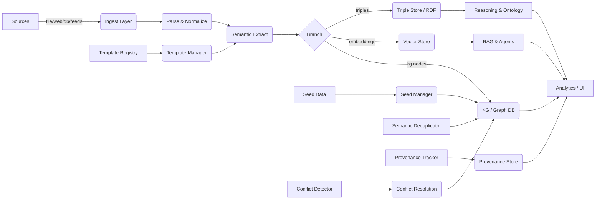

# SemantiCore — Modules, Features, Roadmap & Visuals

> **Purpose:** A concise engineering guide listing every module, feature, responsibilities, recommended tech, and visual diagrams to help you design, implement, and ship the SemantiCore open‑source semantic toolkit.

---

## 1. High-level overview

SemantiCore transforms raw, multi-format input into semantic knowledge (triples, ontologies, graphs, embeddings) suitable for RAG, multi-agent systems, GraphRAG, and domain-specific AI pipelines. The architecture is modular, pluggable, and cloud-native.

---

## 2. Modules (catalog)

Each module is a self-contained package with a clear public API.

1. **core**

   * **Responsibilities:** orchestration, pipeline runner, configuration, plugin registry, lifecycle management.
   * **Exports:** `SemantiCore`, `PipelineBuilder`, `Config`, `PluginManager`.
   * **Submodules:** 
     - **orchestrator:** Pipeline coordination, task scheduling, resource management
     - **config_manager:** YAML/JSON config parsing, environment variables, validation
     - **plugin_registry:** Dynamic plugin loading, version compatibility, dependency resolution
     - **lifecycle:** Startup/shutdown hooks, health checks, graceful degradation
   * **Functions:**
     - `SemantiCore.initialize()` - Setup all modules and connections
     - `SemantiCore.run_pipeline()` - Execute complete processing pipeline
     - `SemantiCore.get_status()` - Return system health and metrics
     - `PipelineBuilder.add_step()` - Add processing step to pipeline
     - `PipelineBuilder.set_parallelism()` - Configure parallel execution
     - `Config.validate()` - Validate configuration against schema
     - `PluginManager.load_plugin()` - Dynamically load plugin modules
     - `PluginManager.list_plugins()` - Show available plugins and versions

2. **ingest**

   * **Submodules:** `file`, `web`, `feed`, `stream`, `repo`, `email`, `db_export`.
   * **Features:** format detection, connector registry, backpressure support, incremental ingestion, resume tokens.
   * **Detailed Submodules:**
     - **file:** Local file system, network drives, cloud storage (S3, GCS, Azure)
     - **web:** HTTP/HTTPS scraping, RSS feeds, sitemap crawling, JavaScript rendering
     - **feed:** RSS/Atom feeds, social media APIs, news aggregators
     - **stream:** Real-time data streams, WebSocket connections, message queues
     - **repo:** Git repositories, SVN, Mercurial, package managers
     - **email:** IMAP/POP3, Exchange, Gmail API, email archives
     - **db_export:** Database dumps, SQL queries, NoSQL exports, ETL pipelines
   * **Functions:**
     - `FileIngestor.scan_directory()` - Recursively scan directory for files
     - `FileIngestor.detect_format()` - Auto-detect file type and encoding
     - `WebIngestor.crawl_site()` - Crawl website with depth and rate limiting
     - `WebIngestor.extract_links()` - Extract and follow hyperlinks
     - `FeedIngestor.parse_rss()` - Parse RSS/Atom feeds with metadata
     - `StreamIngestor.connect()` - Establish real-time data connection
     - `RepoIngestor.clone_repo()` - Clone and track repository changes
     - `EmailIngestor.connect_imap()` - Connect to email server
     - `DBIngestor.export_table()` - Export database table to structured format
     - `IngestManager.resume_from_token()` - Resume interrupted ingestion
     - `IngestManager.get_progress()` - Monitor ingestion progress
     - `ConnectorRegistry.register()` - Register custom data connectors

3. **parse**

   * **Submodules:** `pdf`, `docx`, `pptx`, `excel`, `html`, `jsonl`, `csv`, `latex`, `images`, `tables`.
   * **Features:** layout-aware extraction, OCR integration (Tesseract/Google Vision), table extraction (Camelot, Tabula), figure extraction.
   * **Detailed Submodules:**
     - **pdf:** PDF text extraction, form fields, annotations, embedded images, digital signatures
     - **docx:** Word document text, styles, headers, footers, embedded objects, track changes
     - **pptx:** PowerPoint slides, speaker notes, embedded media, animations, slide masters
     - **excel:** Spreadsheet data, formulas, charts, pivot tables, multiple sheets, cell formatting
     - **html:** Web page content, DOM structure, CSS styling, JavaScript content, meta tags
     - **jsonl:** JSON Lines parsing, schema inference, validation, error handling
     - **csv:** Comma/tab separated values, custom delimiters, header detection, data types
     - **latex:** Mathematical equations, document structure, bibliography, cross-references
     - **images:** OCR text extraction, image metadata, EXIF data, face detection, object recognition
     - **tables:** Table structure detection, cell merging, header identification, data extraction
   * **Functions:**
     - `PDFParser.extract_text()` - Extract text with positioning and formatting
     - `PDFParser.extract_tables()` - Extract tables using Camelot/Tabula
     - `PDFParser.extract_images()` - Extract embedded images and figures
     - `DOCXParser.get_document_structure()` - Extract document outline and sections
     - `DOCXParser.extract_track_changes()` - Extract revision history
     - `PPTXParser.extract_slides()` - Extract slide content and speaker notes
     - `ExcelParser.read_sheet()` - Read specific worksheet with data types
     - `ExcelParser.extract_charts()` - Extract chart data and metadata
     - `HTMLParser.parse_dom()` - Parse HTML into structured DOM tree
     - `HTMLParser.extract_metadata()` - Extract meta tags and structured data
     - `ImageParser.ocr_text()` - Perform OCR using Tesseract/Google Vision
     - `ImageParser.detect_objects()` - Detect objects and faces in images
     - `TableParser.detect_structure()` - Detect table boundaries and headers
     - `TableParser.extract_cells()` - Extract individual cell data
     - `ParserRegistry.get_parser()` - Get appropriate parser for file type
     - `ParserRegistry.supported_formats()` - List all supported file formats

4. **normalize**

   * **Responsibilities:** text cleaning, language detection, encoding normalization, named entity canonicalization, date normalization.
   * **Submodules:** 
     - **text_cleaner:** HTML tag removal, whitespace normalization, special character handling
     - **language_detector:** Multi-language identification, confidence scoring, language families
     - **encoding_handler:** UTF-8 conversion, BOM detection, encoding validation
     - **entity_normalizer:** Named entity standardization, acronym expansion, aliases mapping
     - **date_normalizer:** Date format detection, timezone handling, relative date resolution
     - **number_normalizer:** Number format standardization, unit conversion, currency handling
   * **Functions:**
     - `TextCleaner.remove_html()` - Strip HTML tags and preserve text content
     - `TextCleaner.normalize_whitespace()` - Standardize spacing and line breaks
     - `TextCleaner.remove_special_chars()` - Clean special characters and symbols
     - `LanguageDetector.detect()` - Identify text language with confidence score
     - `LanguageDetector.supported_languages()` - List all supported languages
     - `EncodingHandler.normalize()` - Convert to UTF-8 and validate encoding
     - `EncodingHandler.detect_encoding()` - Auto-detect file encoding
     - `EntityNormalizer.canonicalize()` - Standardize entity names and aliases
     - `EntityNormalizer.expand_acronyms()` - Expand abbreviations and acronyms
     - `DateNormalizer.parse_date()` - Parse various date formats to ISO standard
     - `DateNormalizer.resolve_relative()` - Convert relative dates to absolute
     - `NumberNormalizer.standardize()` - Convert numbers to standard format
     - `NumberNormalizer.convert_units()` - Convert between measurement units
     - `NormalizationPipeline.run()` - Execute complete normalization pipeline
     - `NormalizationPipeline.get_stats()` - Return normalization statistics

5. **split**

   * **Chunking strategies:** sliding window, semantic chunking, structural (section-aware), table-aware splitting.
   * **Preserves provenance for each chunk.**
   * **Submodules:**
     - **sliding_window:** Fixed-size chunks with overlap, configurable window size and stride
     - **semantic_chunker:** Meaning-based splitting using NLP, sentence boundaries, topic detection
     - **structural_chunker:** Document-aware splitting, section headers, paragraph boundaries
     - **table_chunker:** Table-aware splitting, preserve table structure and relationships
     - **provenance_tracker:** Source tracking, offset mapping, confidence scoring
     - **chunk_validator:** Chunk quality assessment, overlap detection, size validation
   * **Functions:**
     - `SlidingWindowChunker.split()` - Create fixed-size chunks with overlap
     - `SlidingWindowChunker.set_window_size()` - Configure chunk size and overlap
     - `SemanticChunker.split_by_meaning()` - Split based on semantic boundaries
     - `SemanticChunker.detect_topics()` - Identify topic changes for splitting
     - `StructuralChunker.split_by_sections()` - Split on document structure
     - `StructuralChunker.identify_headers()` - Detect section headers and levels
     - `TableChunker.preserve_tables()` - Keep tables intact during splitting
     - `TableChunker.extract_table_context()` - Extract surrounding context for tables
     - `ProvenanceTracker.track_source()` - Track original source and position
     - `ProvenanceTracker.get_provenance()` - Retrieve chunk source information
     - `ChunkValidator.validate_chunk()` - Validate chunk quality and size
     - `ChunkValidator.detect_overlaps()` - Find overlapping chunks
     - `SplitManager.run_strategy()` - Execute chosen splitting strategy
     - `SplitManager.get_chunk_stats()` - Return chunking statistics
     - `SplitManager.merge_chunks()` - Combine related chunks when needed

6. **semantic_extract**

   * **Capabilities:** NER, relation extraction, event detection, co-reference resolution, entity linking, triple extraction.
   * **Backends:** spaCy, Stanza, HuggingFace pipelines, LLM prompts (for complex relations).
   * **Submodules:**
     - **ner_extractor:** Named entity recognition, entity classification, confidence scoring
     - **relation_extractor:** Relationship detection, relation classification, dependency parsing
     - **event_detector:** Event identification, temporal extraction, event participants
     - **coref_resolver:** Co-reference resolution, pronoun resolution, entity linking
     - **triple_extractor:** Subject-predicate-object extraction, RDF triple generation
     - **llm_enhancer:** LLM-based extraction, complex relation detection, reasoning
     - **extraction_validator:** Quality assessment, confidence thresholds, validation rules
   * **Functions:**
     - `NERExtractor.extract_entities()` - Extract named entities with types and confidence
     - `NERExtractor.classify_entities()` - Classify entities into predefined categories
     - `RelationExtractor.find_relations()` - Detect relationships between entities
     - `RelationExtractor.classify_relations()` - Classify relation types and directions
     - `EventDetector.detect_events()` - Identify events and their participants
     - `EventDetector.extract_temporal()` - Extract temporal information for events
     - `CorefResolver.resolve_references()` - Resolve co-references and pronouns
     - `CorefResolver.link_entities()` - Link entities across document sections
     - `TripleExtractor.extract_triples()` - Extract RDF-style triples
     - `TripleExtractor.validate_triples()` - Validate triple structure and consistency
     - `LLMEnhancer.enhance_extraction()` - Use LLM for complex extraction tasks
     - `LLMEnhancer.detect_patterns()` - Identify complex patterns and relationships
     - `ExtractionValidator.validate_quality()` - Assess extraction quality
     - `ExtractionValidator.filter_by_confidence()` - Filter results by confidence score
     - `ExtractionPipeline.run()` - Execute complete extraction pipeline
     - `ExtractionPipeline.get_results()` - Return structured extraction results

7. **ontology**

   * **OntologyGenerator:** infer classes/properties, generate OWL/RDF, map to base ontologies (schema.org, FOAF, DC), versioning.
   * **Submodules:**
     - **class_inferrer:** Automatic class discovery, hierarchy inference, class relationships
     - **property_generator:** Property inference, data type detection, cardinality analysis
     - **owl_generator:** OWL/RDF generation, ontology serialization, format conversion
     - **base_mapper:** Schema.org integration, FOAF mapping, Dublin Core alignment
     - **version_manager:** Ontology versioning, change tracking, migration support
     - **ontology_validator:** Schema validation, consistency checking, constraint validation
     - **domain_ontologies:** Pre-built ontologies for common domains (finance, healthcare, legal)
   * **Functions:**
     - `ClassInferrer.infer_classes()` - Automatically discover entity classes
     - `ClassInferrer.build_hierarchy()` - Build class inheritance hierarchy
     - `ClassInferrer.analyze_relationships()` - Analyze class relationships and dependencies
     - `PropertyGenerator.infer_properties()` - Infer object and data properties
     - `PropertyGenerator.detect_data_types()` - Detect property data types and constraints
     - `PropertyGenerator.analyze_cardinality()` - Analyze property cardinality (one-to-many, etc.)
     - `OWLGenerator.generate_owl()` - Generate OWL ontology in RDF/XML format
     - `OWLGenerator.serialize_rdf()` - Serialize to various RDF formats (Turtle, N-Triples)
     - `BaseMapper.map_to_schema_org()` - Map entities to schema.org vocabulary
     - `BaseMapper.map_to_foaf()` - Map to FOAF (Friend of a Friend) ontology
     - `BaseMapper.map_to_dublin_core()` - Map to Dublin Core metadata standards
     - `VersionManager.create_version()` - Create new ontology version
     - `VersionManager.track_changes()` - Track changes between versions
     - `VersionManager.migrate_ontology()` - Support ontology migration and updates
     - `OntologyValidator.validate_schema()` - Validate ontology schema consistency
     - `OntologyValidator.check_constraints()` - Check ontology constraint violations
     - `DomainOntologies.get_finance_ontology()` - Get pre-built financial ontology
     - `DomainOntologies.get_healthcare_ontology()` - Get pre-built healthcare ontology
     - `OntologyManager.build_ontology()` - Build complete ontology from extracted data
     - `OntologyManager.export_ontology()` - Export ontology in various formats

8. **triple_store**

   * **Adapters:** Blazegraph, Apache Jena, RDF4J, GraphDB, Virtuoso — export/import, bulk load.
   * **Submodules:**
     - **blazegraph_adapter:** Blazegraph integration, SPARQL queries, bulk operations
     - **jena_adapter:** Apache Jena integration, RDF model management, inference engine
     - **rdf4j_adapter:** RDF4J integration, repository management, transaction support
     - **graphdb_adapter:** GraphDB integration, reasoning capabilities, visualization
     - **virtuoso_adapter:** Virtuoso integration, high-performance queries, clustering
     - **triple_manager:** Triple CRUD operations, batch processing, validation
     - **query_engine:** SPARQL query execution, query optimization, result formatting
     - **bulk_loader:** High-volume data loading, indexing, performance optimization
   * **Functions:**
     - `BlazegraphAdapter.connect()` - Connect to Blazegraph instance
     - `BlazegraphAdapter.execute_sparql()` - Execute SPARQL queries
     - `BlazegraphAdapter.bulk_load()` - Load triples in bulk
     - `JenaAdapter.create_model()` - Create and manage RDF models
     - `JenaAdapter.add_triples()` - Add triples to model
     - `JenaAdapter.run_inference()` - Execute inference rules
     - `RDF4JAdapter.create_repository()` - Create and configure repositories
     - `RDF4JAdapter.begin_transaction()` - Start transaction for batch operations
     - `GraphDBAdapter.enable_reasoning()` - Enable reasoning capabilities
     - `GraphDBAdapter.visualize_graph()` - Generate graph visualizations
     - `VirtuosoAdapter.connect_cluster()` - Connect to Virtuoso cluster
     - `VirtuosoAdapter.optimize_queries()` - Optimize query performance
     - `TripleManager.add_triple()` - Add single triple to store
     - `TripleManager.add_triples()` - Add multiple triples
     - `TripleManager.delete_triple()` - Delete specific triple
     - `TripleManager.update_triple()` - Update existing triple
     - `QueryEngine.execute_sparql()` - Execute SPARQL queries
     - `QueryEngine.optimize_query()` - Optimize query for performance
     - `QueryEngine.format_results()` - Format query results
     - `BulkLoader.load_file()` - Load triples from file
     - `BulkLoader.create_indexes()` - Create database indexes
     - `BulkLoader.monitor_progress()` - Monitor loading progress
     - `TripleStoreManager.get_store_info()` - Get store statistics and status
     - `TripleStoreManager.backup_store()` - Create backup of store
     - `TripleStoreManager.restore_store()` - Restore from backup

9. **kg** (knowledge graph)

   * **Graph builder, entity resolution, deduplication, seed manager, provenance, conflict detector, conflict resolution UI hooks.**
   * **Submodules:**
     - **graph_builder:** Knowledge graph construction, node creation, edge management
     - **entity_resolver:** Entity disambiguation, identity resolution, merge strategies
     - **deduplicator:** Duplicate detection, entity merging, conflict resolution
     - **seed_manager:** Initial data loading, foundation entities, baseline knowledge
     - **provenance_tracker:** Source tracking, extraction history, confidence scoring
     - **conflict_detector:** Conflict identification, severity classification, resolution workflows
     - **graph_validator:** Graph consistency, schema validation, quality metrics
     - **graph_analyzer:** Graph analytics, centrality measures, community detection
   * **Functions:**
     - `GraphBuilder.create_node()` - Create knowledge graph node
     - `GraphBuilder.create_edge()` - Create relationship edge between nodes
     - `GraphBuilder.build_subgraph()` - Build subgraph from specific entities
     - `GraphBuilder.merge_graphs()` - Merge multiple knowledge graphs
     - `EntityResolver.resolve_identity()` - Resolve entity identity across sources
     - `EntityResolver.merge_entities()` - Merge duplicate entities
     - `EntityResolver.get_canonical()` - Get canonical entity representation
     - `Deduplicator.find_duplicates()` - Find duplicate entities
     - `Deduplicator.merge_duplicates()` - Merge duplicate entities
     - `Deduplicator.validate_merge()` - Validate merge operation
     - `SeedManager.load_seed_data()` - Load initial seed data
     - `SeedManager.validate_seed_data()` - Validate seed data quality
     - `SeedManager.update_seed_data()` - Update existing seed data
     - `ProvenanceTracker.track_source()` - Track information source
     - `ProvenanceTracker.get_provenance()` - Retrieve provenance information
     - `ProvenanceTracker.calculate_confidence()` - Calculate confidence scores
     - `ConflictDetector.detect_conflicts()` - Detect conflicts between sources
     - `ConflictDetector.classify_severity()` - Classify conflict severity
     - `ConflictDetector.create_resolution_workflow()` - Create resolution workflow
     - `GraphValidator.validate_consistency()` - Validate graph consistency
     - `GraphValidator.check_schema_compliance()` - Check schema compliance
     - `GraphValidator.calculate_quality_metrics()` - Calculate quality metrics
     - `GraphAnalyzer.calculate_centrality()` - Calculate node centrality
     - `GraphAnalyzer.detect_communities()` - Detect community structures
     - `GraphAnalyzer.analyze_connectivity()` - Analyze graph connectivity
     - `KnowledgeGraphManager.build_graph()` - Build complete knowledge graph
     - `KnowledgeGraphManager.export_graph()` - Export graph in various formats
     - `KnowledgeGraphManager.visualize_graph()` - Generate graph visualizations

10. **embeddings**

     * **SemanticEmbedder:** multi-modal embeddings, context windows, pooling strategies, embedding provider adapters (OpenAI, BGE, Llama‑embeddings).
     * **Submodules:**
       - **text_embedder:** Text-based embeddings, sentence transformers, document embeddings
       - **image_embedder:** Image embeddings, vision models, multi-modal fusion
       - **audio_embedder:** Audio embeddings, speech recognition, audio analysis
       - **multimodal_embedder:** Cross-modal embeddings, fusion strategies, alignment
       - **context_manager:** Context window management, sliding windows, attention mechanisms
       - **pooling_strategies:** Mean pooling, max pooling, attention pooling, hierarchical pooling
       - **provider_adapters:** OpenAI, BGE, Llama, custom model integrations
       - **embedding_optimizer:** Embedding optimization, dimensionality reduction, clustering
     * **Functions:**
       - `TextEmbedder.embed_text()` - Generate text embeddings
       - `TextEmbedder.embed_sentence()` - Generate sentence-level embeddings
       - `TextEmbedder.embed_document()` - Generate document-level embeddings
       - `ImageEmbedder.embed_image()` - Generate image embeddings
       - `ImageEmbedder.extract_features()` - Extract visual features
       - `ImageEmbedder.embed_batch()` - Process multiple images
       - `AudioEmbedder.embed_audio()` - Generate audio embeddings
       - `AudioEmbedder.extract_audio_features()` - Extract audio features
       - `MultimodalEmbedder.fuse_embeddings()` - Fuse multiple modality embeddings
       - `MultimodalEmbedder.align_modalities()` - Align different modality representations
       - `ContextManager.set_window_size()` - Set context window size
       - `ContextManager.apply_sliding_window()` - Apply sliding window approach
       - `ContextManager.manage_attention()` - Manage attention mechanisms
       - `PoolingStrategies.mean_pooling()` - Apply mean pooling strategy
       - `PoolingStrategies.max_pooling()` - Apply max pooling strategy
       - `PoolingStrategies.attention_pooling()` - Apply attention-based pooling
       - `ProviderAdapter.connect_openai()` - Connect to OpenAI embedding API
       - `ProviderAdapter.connect_bge()` - Connect to BGE embedding service
       - `ProviderAdapter.connect_llama()` - Connect to Llama embedding model
       - `ProviderAdapter.load_custom_model()` - Load custom embedding model
       - `EmbeddingOptimizer.optimize_dimensions()` - Optimize embedding dimensions
       - `EmbeddingOptimizer.apply_clustering()` - Apply clustering to embeddings
       - `EmbeddingOptimizer.calculate_similarity()` - Calculate embedding similarities
       - `SemanticEmbedder.generate_embeddings()` - Generate embeddings for input
       - `SemanticEmbedder.batch_process()` - Process multiple inputs in batch
       - `SemanticEmbedder.get_embedding_stats()` - Get embedding statistics

11. **vector_store**

     * **Adapters:** Pinecone, FAISS, Milvus, Weaviate, Qdrant. Features: namespace, metadata store, hybrid search.
     * **Submodules:**
       - **pinecone_adapter:** Pinecone integration, index management, vector operations
       - **faiss_adapter:** FAISS integration, index types, similarity search
       - **milvus_adapter:** Milvus integration, collection management, distributed search
       - **weaviate_adapter:** Weaviate integration, schema management, graphQL queries
       - **qdrant_adapter:** Qdrant integration, point management, filtering
       - **namespace_manager:** Namespace isolation, access control, data separation
       - **metadata_store:** Metadata indexing, filtering, search capabilities
       - **hybrid_search:** Vector + metadata search, ranking algorithms, result fusion
       - **index_optimizer:** Index optimization, performance tuning, maintenance
     * **Functions:**
       - `PineconeAdapter.connect()` - Connect to Pinecone service
       - `PineconeAdapter.create_index()` - Create new vector index
       - `PineconeAdapter.upsert_vectors()` - Insert or update vectors
       - `PineconeAdapter.query_vectors()` - Query similar vectors
       - `FAISSAdapter.create_index()` - Create FAISS index
       - `FAISSAdapter.add_vectors()` - Add vectors to index
       - `FAISSAdapter.search_similar()` - Search for similar vectors
       - `FAISSAdapter.save_index()` - Save index to disk
       - `MilvusAdapter.create_collection()` - Create Milvus collection
       - `MilvusAdapter.insert_vectors()` - Insert vectors into collection
       - `MilvusAdapter.search_vectors()` - Search vectors in collection
       - `WeaviateAdapter.create_schema()` - Create Weaviate schema
       - `WeaviateAdapter.add_objects()` - Add objects to Weaviate
       - `WeaviateAdapter.graphql_query()` - Execute GraphQL queries
       - `QdrantAdapter.create_collection()` - Create Qdrant collection
       - `QdrantAdapter.upsert_points()` - Insert or update points
       - `QdrantAdapter.search_points()` - Search points with filters
       - `NamespaceManager.create_namespace()` - Create isolated namespace
       - `NamespaceManager.set_access_control()` - Set namespace permissions
       - `NamespaceManager.list_namespaces()` - List available namespaces
       - `MetadataStore.index_metadata()` - Index metadata for search
       - `MetadataStore.filter_by_metadata()` - Filter results by metadata
       - `MetadataStore.search_metadata()` - Search metadata content
       - `HybridSearch.combine_results()` - Combine vector and metadata results
       - `HybridSearch.rank_results()` - Rank results using multiple criteria
       - `HybridSearch.fuse_results()` - Fuse results from different sources
       - `IndexOptimizer.optimize_index()` - Optimize index performance
       - `IndexOptimizer.rebuild_index()` - Rebuild index for better performance
       - `IndexOptimizer.get_performance_metrics()` - Get index performance metrics
       - `VectorStoreManager.get_store_info()` - Get store information
       - `VectorStoreManager.backup_store()` - Create store backup
       - `VectorStoreManager.restore_store()` - Restore from backup

12. **reasoning**

     * **Inference rules, SPARQL-based reasoning, Rete-like rule engine hooks, abductive/deductive inference.**
     * **Submodules:**
       - **inference_engine:** Rule-based inference, forward/backward chaining, conflict resolution
       - **sparql_reasoner:** SPARQL-based reasoning, query expansion, result inference
       - **rete_engine:** Rete algorithm implementation, pattern matching, rule execution
       - **abductive_reasoner:** Abductive reasoning, hypothesis generation, explanation finding
       - **deductive_reasoner:** Deductive reasoning, logical inference, theorem proving
       - **rule_manager:** Rule definition, rule validation, rule execution tracking
       - **reasoning_validator:** Reasoning validation, consistency checking, error detection
       - **explanation_generator:** Explanation generation, reasoning paths, justification
     * **Functions:**
       - `InferenceEngine.add_rule()` - Add inference rule to engine
       - `InferenceEngine.execute_rules()` - Execute inference rules
       - `InferenceEngine.forward_chain()` - Perform forward chaining
       - `InferenceEngine.backward_chain()` - Perform backward chaining
       - `InferenceEngine.resolve_conflicts()` - Resolve rule conflicts
       - `SPARQLReasoner.expand_query()` - Expand SPARQL query with reasoning
       - `SPARQLReasoner.infer_results()` - Infer additional results
       - `SPARQLReasoner.apply_reasoning()` - Apply reasoning to query results
       - `ReteEngine.compile_rules()` - Compile rules into Rete network
       - `ReteEngine.match_patterns()` - Match patterns using Rete algorithm
       - `ReteEngine.execute_matches()` - Execute matched rules
       - `AbductiveReasoner.generate_hypotheses()` - Generate explanatory hypotheses
       - `AbductiveReasoner.find_explanations()` - Find explanations for observations
       - `AbductiveReasoner.rank_hypotheses()` - Rank hypotheses by plausibility
       - `DeductiveReasoner.apply_logic()` - Apply logical inference rules
       - `DeductiveReasoner.prove_theorem()` - Prove logical theorems
       - `DeductiveReasoner.validate_argument()` - Validate logical arguments
       - `RuleManager.define_rule()` - Define new inference rule
       - `RuleManager.validate_rule()` - Validate rule syntax and logic
       - `RuleManager.track_execution()` - Track rule execution history
       - `ReasoningValidator.validate_reasoning()` - Validate reasoning process
       - `ReasoningValidator.check_consistency()` - Check reasoning consistency
       - `ReasoningValidator.detect_errors()` - Detect reasoning errors
       - `ExplanationGenerator.generate_explanation()` - Generate reasoning explanation
       - `ExplanationGenerator.show_reasoning_path()` - Show reasoning path
       - `ExplanationGenerator.justify_conclusion()` - Justify reasoning conclusion
       - `ReasoningManager.run_reasoning()` - Run complete reasoning process
       - `ReasoningManager.get_reasoning_results()` - Get reasoning results
       - `ReasoningManager.export_reasoning()` - Export reasoning process

13. **pipeline**

     * **PipelineBuilder, failure/retry semantics, parallelism strategies, resource scheduling.**
     * **Submodules:**
       - **pipeline_builder:** Pipeline construction, step configuration, dependency management
       - **execution_engine:** Pipeline execution, step orchestration, progress tracking
       - **failure_handler:** Error handling, retry logic, fallback strategies
       - **parallelism_manager:** Parallel execution, resource allocation, load balancing
       - **resource_scheduler:** Resource management, CPU/GPU allocation, memory optimization
       - **pipeline_validator:** Pipeline validation, dependency checking, cycle detection
       - **monitoring_hooks:** Execution monitoring, metrics collection, alerting
       - **pipeline_templates:** Pre-built pipeline templates, common workflows
     * **Functions:**
       - `PipelineBuilder.add_step()` - Add processing step to pipeline
       - `PipelineBuilder.set_dependencies()` - Set step dependencies
       - `PipelineBuilder.configure_step()` - Configure step parameters
       - `PipelineBuilder.validate_pipeline()` - Validate pipeline configuration
       - `ExecutionEngine.run_pipeline()` - Execute complete pipeline
       - `ExecutionEngine.pause_pipeline()` - Pause pipeline execution
       - `ExecutionEngine.resume_pipeline()` - Resume paused pipeline
       - `ExecutionEngine.get_progress()` - Get execution progress
       - `FailureHandler.handle_error()` - Handle execution errors
       - `FailureHandler.retry_step()` - Retry failed step
       - `FailureHandler.apply_fallback()` - Apply fallback strategy
       - `ParallelismManager.set_parallelism()` - Set parallel execution level
       - `ParallelismManager.allocate_resources()` - Allocate execution resources
       - `ParallelismManager.load_balance()` - Balance load across resources
       - `ResourceScheduler.allocate_cpu()` - Allocate CPU resources
       - `ResourceScheduler.allocate_gpu()` - Allocate GPU resources
       - `ResourceScheduler.optimize_memory()` - Optimize memory usage
       - `PipelineValidator.check_dependencies()` - Check step dependencies
       - `PipelineValidator.detect_cycles()` - Detect dependency cycles
       - `PipelineValidator.validate_configuration()` - Validate pipeline configuration
       - `MonitoringHooks.collect_metrics()` - Collect execution metrics
       - `MonitoringHooks.set_alerts()` - Set execution alerts
       - `MonitoringHooks.get_status()` - Get pipeline status
       - `PipelineTemplates.get_template()` - Get pre-built pipeline template
       - `PipelineTemplates.customize_template()` - Customize template for specific use case
       - `PipelineTemplates.save_template()` - Save custom pipeline template
       - `PipelineManager.create_pipeline()` - Create new pipeline
       - `PipelineManager.schedule_pipeline()` - Schedule pipeline execution
       - `PipelineManager.monitor_pipelines()` - Monitor all running pipelines

14. **streaming**

     * **Integration:** Kafka, Pulsar, RabbitMQ, Kinesis; exactly-once semantics where feasible; checkpoints.
     * **Submodules:**
       - **kafka_adapter:** Apache Kafka integration, producer/consumer management, topic management
       - **pulsar_adapter:** Apache Pulsar integration, subscription management, message routing
       - **rabbitmq_adapter:** RabbitMQ integration, queue management, exchange routing
       - **kinesis_adapter:** AWS Kinesis integration, stream management, shard handling
       - **stream_processor:** Stream processing logic, windowing, aggregation
       - **checkpoint_manager:** Checkpoint creation, recovery, consistency management
       - **exactly_once:** Exactly-once semantics, idempotency, deduplication
       - **stream_monitor:** Stream monitoring, metrics collection, health checks
       - **backpressure_handler:** Backpressure management, flow control, rate limiting
     * **Functions:**
       - `KafkaAdapter.connect()` - Connect to Kafka cluster
       - `KafkaAdapter.create_topic()` - Create new Kafka topic
       - `KafkaAdapter.produce_message()` - Produce message to topic
       - `KafkaAdapter.consume_messages()` - Consume messages from topic
       - `KafkaAdapter.manage_partitions()` - Manage topic partitions
       - `PulsarAdapter.connect()` - Connect to Pulsar cluster
       - `PulsarAdapter.create_subscription()` - Create message subscription
       - `PulsarAdapter.publish_message()` - Publish message to topic
       - `PulsarAdapter.receive_messages()` - Receive messages from subscription
       - `RabbitMQAdapter.connect()` - Connect to RabbitMQ server
       - `RabbitMQAdapter.create_queue()` - Create message queue
       - `RabbitMQAdapter.publish_message()` - Publish message to exchange
       - `RabbitMQAdapter.consume_queue()` - Consume messages from queue
       - `KinesisAdapter.connect()` - Connect to Kinesis stream
       - `KinesisAdapter.create_stream()` - Create new Kinesis stream
       - `KinesisAdapter.put_record()` - Put record to stream
       - `KinesisAdapter.get_records()` - Get records from stream
       - `StreamProcessor.process_stream()` - Process incoming stream data
       - `StreamProcessor.apply_windowing()` - Apply time-based windowing
       - `StreamProcessor.aggregate_data()` - Aggregate stream data
       - `CheckpointManager.create_checkpoint()` - Create processing checkpoint
       - `CheckpointManager.recover_from_checkpoint()` - Recover from checkpoint
       - `CheckpointManager.manage_consistency()` - Manage checkpoint consistency
       - `ExactlyOnce.enable_idempotency()` - Enable idempotent processing
       - `ExactlyOnce.deduplicate_messages()` - Remove duplicate messages
       - `ExactlyOnce.ensure_consistency()` - Ensure exactly-once consistency
       - `StreamMonitor.collect_metrics()` - Collect stream processing metrics
       - `StreamMonitor.check_health()` - Check stream health status
       - `StreamMonitor.set_alerts()` - Set monitoring alerts
       - `BackpressureHandler.manage_flow()` - Manage data flow control
       - `BackpressureHandler.apply_rate_limiting()` - Apply rate limiting
       - `BackpressureHandler.handle_backpressure()` - Handle backpressure situations
       - `StreamingManager.create_stream()` - Create new data stream
       - `StreamingManager.monitor_streams()` - Monitor all active streams
       - `StreamingManager.get_stream_stats()` - Get stream statistics

15. **domains**

     * **Domain-specific processors (cybersecurity, biomedical, finance, legal). Each provides templates, mapping rules, ontologies, and extractors.**
     * **Submodules:**
       - **cybersecurity_processor:** Security domain processing, threat detection, vulnerability analysis
       - **biomedical_processor:** Medical domain processing, drug discovery, clinical data analysis
       - **finance_processor:** Financial domain processing, market analysis, risk assessment
       - **legal_processor:** Legal domain processing, contract analysis, regulation compliance
       - **domain_templates:** Domain-specific templates, schemas, data models
       - **mapping_rules:** Domain mapping rules, entity relationships, vocabulary mapping
       - **domain_ontologies:** Domain-specific ontologies, taxonomies, classification systems
       - **domain_extractors:** Specialized extractors for domain entities and relationships
       - **domain_validator:** Domain-specific validation rules, compliance checking
     * **Functions:**
       - `CybersecurityProcessor.detect_threats()` - Detect security threats and vulnerabilities
       - `CybersecurityProcessor.analyze_attacks()` - Analyze attack patterns and techniques
       - `CybersecurityProcessor.assess_risks()` - Assess security risks and impact
       - `BiomedicalProcessor.analyze_clinical_data()` - Analyze clinical trial data
       - `BiomedicalProcessor.drug_discovery()` - Support drug discovery processes
       - `BiomedicalProcessor.medical_entity_extraction()` - Extract medical entities
       - `FinanceProcessor.market_analysis()` - Analyze market trends and patterns
       - `FinanceProcessor.risk_assessment()` - Assess financial risks
       - `FinanceProcessor.compliance_checking()` - Check regulatory compliance
       - `LegalProcessor.contract_analysis()` - Analyze legal contracts
       - `LegalProcessor.regulation_compliance()` - Check regulatory compliance
       - `LegalProcessor.case_law_analysis()` - Analyze case law and precedents
       - `DomainTemplates.get_template()` - Get domain-specific template
       - `DomainTemplates.customize_template()` - Customize template for specific use case
       - `DomainTemplates.validate_template()` - Validate template compliance
       - `MappingRules.define_rules()` - Define domain mapping rules
       - `MappingRules.apply_mapping()` - Apply mapping to data
       - `MappingRules.validate_mapping()` - Validate mapping consistency
       - `DomainOntologies.get_ontology()` - Get domain-specific ontology
       - `DomainOntologies.extend_ontology()` - Extend ontology with new concepts
       - `DomainOntologies.validate_ontology()` - Validate ontology consistency
       - `DomainExtractors.extract_entities()` - Extract domain-specific entities
       - `DomainExtractors.extract_relationships()` - Extract domain relationships
       - `DomainExtractors.validate_extraction()` - Validate extraction quality
       - `DomainValidator.check_compliance()` - Check domain compliance
       - `DomainValidator.validate_data()` - Validate domain data quality
       - `DomainValidator.generate_report()` - Generate compliance report
       - `DomainManager.register_domain()` - Register new domain processor
       - `DomainManager.get_domain()` - Get domain processor
       - `DomainManager.list_domains()` - List available domains

16. **qa_rag**

     * **RAG-optimised tools: semantic chunker, prompt templates, retrieval policies, answer justification, provenance-aware answer builder.**
     * **Submodules:**
       - **semantic_chunker:** Intelligent text chunking, context-aware splitting, overlap management
       - **prompt_templates:** RAG prompt templates, question formatting, context injection
       - **retrieval_policies:** Retrieval strategies, ranking algorithms, result filtering
       - **answer_builder:** Answer construction, context integration, source attribution
       - **provenance_tracker:** Source tracking, confidence scoring, evidence linking
       - **answer_validator:** Answer validation, fact checking, consistency verification
       - **rag_optimizer:** RAG performance optimization, query enhancement, result ranking
       - **conversation_manager:** Multi-turn conversations, context management, history tracking
     * **Functions:**
       - `SemanticChunker.chunk_text()` - Create semantic chunks with context
       - `SemanticChunker.optimize_chunks()` - Optimize chunk size and overlap
       - `SemanticChunker.merge_chunks()` - Merge related chunks when needed
       - `PromptTemplates.get_template()` - Get RAG prompt template
       - `PromptTemplates.format_question()` - Format question for retrieval
       - `PromptTemplates.inject_context()` - Inject retrieved context into prompt
       - `RetrievalPolicies.set_strategy()` - Set retrieval strategy
       - `RetrievalPolicies.rank_results()` - Rank retrieval results
       - `RetrievalPolicies.filter_results()` - Filter results by criteria
       - `AnswerBuilder.construct_answer()` - Construct answer from retrieved context
       - `AnswerBuilder.integrate_context()` - Integrate multiple context sources
       - `AnswerBuilder.attribute_sources()` - Attribute answer to source documents
       - `ProvenanceTracker.track_sources()` - Track information sources
       - `ProvenanceTracker.calculate_confidence()` - Calculate answer confidence
       - `ProvenanceTracker.link_evidence()` - Link answer to supporting evidence
       - `AnswerValidator.validate_answer()` - Validate answer accuracy
       - `AnswerValidator.fact_check()` - Perform fact checking
       - `AnswerValidator.verify_consistency()` - Verify answer consistency
       - `RAGOptimizer.optimize_retrieval()` - Optimize retrieval performance
       - `RAGOptimizer.enhance_queries()` - Enhance user queries
       - `RAGOptimizer.improve_ranking()` - Improve result ranking
       - `ConversationManager.start_conversation()` - Start new conversation
       - `ConversationManager.add_context()` - Add context to conversation
       - `ConversationManager.get_history()` - Get conversation history
       - `RAGManager.process_question()` - Process user question
       - `RAGManager.get_answer()` - Get RAG-generated answer
       - `RAGManager.evaluate_performance()` - Evaluate RAG performance

17. **agents**

     * **Agent manager & orchestration for multiagent workflows, tools for tool‑use, orchestration policies, cost-awareness, sandboxing.**
     * **Submodules:**
       - **agent_manager:** Agent lifecycle management, registration, monitoring
       - **orchestration_engine:** Multi-agent coordination, workflow management, task distribution
       - **tool_registry:** Tool registration, discovery, version management
       - **cost_tracker:** Cost monitoring, budget management, resource optimization
       - **sandbox_manager:** Agent sandboxing, security isolation, resource limits
       - **workflow_engine:** Workflow definition, execution, monitoring
       - **agent_communication:** Inter-agent communication, message routing, protocol management
       - **policy_enforcer:** Policy enforcement, access control, compliance checking
       - **agent_analytics:** Agent performance analytics, behavior analysis, optimization
     * **Functions:**
       - `AgentManager.register_agent()` - Register new agent
       - `AgentManager.start_agent()` - Start agent execution
       - `AgentManager.stop_agent()` - Stop agent execution
       - `AgentManager.monitor_agent()` - Monitor agent status
       - `OrchestrationEngine.coordinate_agents()` - Coordinate multiple agents
       - `OrchestrationEngine.distribute_tasks()` - Distribute tasks among agents
       - `OrchestrationEngine.manage_workflows()` - Manage agent workflows
       - `ToolRegistry.register_tool()` - Register tool for agent use
       - `ToolRegistry.discover_tools()` - Discover available tools
       - `ToolRegistry.get_tool()` - Get specific tool
       - `CostTracker.monitor_costs()` - Monitor agent execution costs
       - `CostTracker.set_budget()` - Set cost budget limits
       - `CostTracker.optimize_resources()` - Optimize resource usage
       - `SandboxManager.create_sandbox()` - Create agent sandbox
       - `SandboxManager.isolate_agent()` - Isolate agent execution
       - `SandboxManager.set_resource_limits()` - Set resource limits
       - `WorkflowEngine.define_workflow()` - Define agent workflow
       - `WorkflowEngine.execute_workflow()` - Execute defined workflow
       - `WorkflowEngine.monitor_progress()` - Monitor workflow progress
       - `AgentCommunication.send_message()` - Send message between agents
       - `AgentCommunication.route_message()` - Route message to appropriate agent
       - `AgentCommunication.manage_protocols()` - Manage communication protocols
       - `PolicyEnforcer.enforce_policy()` - Enforce access policies
       - `PolicyEnforcer.check_compliance()` - Check policy compliance
       - `PolicyEnforcer.set_permissions()` - Set agent permissions
       - `AgentAnalytics.analyze_performance()` - Analyze agent performance
       - `AgentAnalytics.analyze_behavior()` - Analyze agent behavior patterns
       - `AgentAnalytics.optimize_agents()` - Optimize agent performance
       - `MultiAgentManager.create_team()` - Create agent team
       - `MultiAgentManager.orchestrate_workflow()` - Orchestrate team workflow
       - `MultiAgentManager.get_team_status()` - Get team execution status

18. **ui**

     * **Web dashboard components: ingestion monitor, KG viewer (graph UI), conflict resolver, analytics dashboard, pipeline editor.**
     * **Submodules:**
       - **ingestion_monitor:** Real-time ingestion monitoring, progress tracking, error visualization
       - **kg_viewer:** Knowledge graph visualization, interactive graph exploration, node/edge inspection
       - **conflict_resolver:** Conflict resolution interface, conflict visualization, resolution workflows
       - **analytics_dashboard:** Data analytics, metrics visualization, trend analysis
       - **pipeline_editor:** Visual pipeline builder, step configuration, workflow design
       - **data_explorer:** Data exploration interface, search capabilities, result filtering
       - **user_management:** User authentication, role management, access control
       - **notification_system:** Alert notifications, status updates, system announcements
       - **report_generator:** Report creation, export functionality, template management
     * **Functions:**
       - `IngestionMonitor.show_progress()` - Display ingestion progress
       - `IngestionMonitor.track_errors()` - Track and display errors
       - `IngestionMonitor.show_statistics()` - Show ingestion statistics
       - `KGViewer.display_graph()` - Display knowledge graph
       - `KGViewer.zoom_graph()` - Zoom and pan graph view
       - `KGViewer.search_nodes()` - Search for specific nodes
       - `KGViewer.inspect_node()` - Inspect node details
       - `KGViewer.inspect_edge()` - Inspect edge relationships
       - `ConflictResolver.show_conflicts()` - Display detected conflicts
       - `ConflictResolver.resolve_conflict()` - Resolve specific conflict
       - `ConflictResolver.create_workflow()` - Create resolution workflow
       - `AnalyticsDashboard.show_metrics()` - Display system metrics
       - `AnalyticsDashboard.analyze_trends()` - Analyze data trends
       - `AnalyticsDashboard.generate_charts()` - Generate data charts
       - `PipelineEditor.create_pipeline()` - Create new pipeline
       - `PipelineEditor.edit_step()` - Edit pipeline step
       - `PipelineEditor.validate_pipeline()` - Validate pipeline configuration
       - `DataExplorer.search_data()` - Search through data
       - `DataExplorer.filter_results()` - Filter search results
       - `DataExplorer.export_results()` - Export search results
       - `UserManagement.authenticate_user()` - Authenticate user login
       - `UserManagement.manage_roles()` - Manage user roles
       - `UserManagement.set_permissions()` - Set user permissions
       - `NotificationSystem.send_alert()` - Send system alert
       - `NotificationSystem.update_status()` - Update system status
       - `NotificationSystem.announce_change()` - Announce system changes
       - `ReportGenerator.create_report()` - Create custom report
       - `ReportGenerator.export_report()` - Export report in various formats
       - `ReportGenerator.manage_templates()` - Manage report templates
       - `UIManager.initialize_dashboard()` - Initialize dashboard
       - `UIManager.update_components()` - Update UI components
       - `UIManager.get_user_preferences()` - Get user preferences

19. **monitoring**

     * **Metrics, traces (OpenTelemetry), alerts, SLAs, data quality metrics, semantic quality score.**
     * **Submodules:**
       - **metrics_collector:** System metrics collection, performance monitoring, resource usage
       - **tracing_system:** OpenTelemetry integration, distributed tracing, span management
       - **alert_manager:** Alert generation, notification routing, escalation policies
       - **sla_monitor:** SLA tracking, performance thresholds, compliance monitoring
       - **quality_metrics:** Data quality assessment, semantic quality scoring, validation metrics
       - **health_checker:** System health monitoring, component status, dependency checking
       - **performance_analyzer:** Performance analysis, bottleneck detection, optimization suggestions
       - **log_manager:** Log collection, aggregation, analysis, retention policies
       - **dashboard_renderer:** Monitoring dashboard, visualization, real-time updates
     * **Functions:**
       - `MetricsCollector.collect_metrics()` - Collect system metrics
       - `MetricsCollector.monitor_performance()` - Monitor system performance
       - `MetricsCollector.track_resources()` - Track resource usage
       - `TracingSystem.start_trace()` - Start distributed trace
       - `TracingSystem.add_span()` - Add span to trace
       - `TracingSystem.end_trace()` - End trace and collect data
       - `AlertManager.generate_alert()` - Generate system alert
       - `AlertManager.route_notification()` - Route alert notification
       - `AlertManager.escalate_alert()` - Escalate critical alerts
       - `SLAMonitor.track_sla()` - Track SLA compliance
       - `SLAMonitor.check_thresholds()` - Check performance thresholds
       - `SLAMonitor.generate_report()` - Generate SLA compliance report
       - `QualityMetrics.assess_data_quality()` - Assess data quality
       - `QualityMetrics.calculate_semantic_score()` - Calculate semantic quality score
       - `QualityMetrics.validate_metrics()` - Validate quality metrics
       - `HealthChecker.check_system_health()` - Check overall system health
       - `HealthChecker.check_component_status()` - Check individual component status
       - `HealthChecker.verify_dependencies()` - Verify system dependencies
       - `PerformanceAnalyzer.analyze_performance()` - Analyze system performance
       - `PerformanceAnalyzer.detect_bottlenecks()` - Detect performance bottlenecks
       - `PerformanceAnalyzer.suggest_optimizations()` - Suggest performance optimizations
       - `LogManager.collect_logs()` - Collect system logs
       - `LogManager.aggregate_logs()` - Aggregate log data
       - `LogManager.analyze_logs()` - Analyze log patterns
       - `DashboardRenderer.render_dashboard()` - Render monitoring dashboard
       - `DashboardRenderer.update_visualizations()` - Update dashboard visualizations
       - `DashboardRenderer.refresh_data()` - Refresh dashboard data
       - `MonitoringManager.initialize_monitoring()` - Initialize monitoring system
       - `MonitoringManager.get_system_status()` - Get overall system status
       - `MonitoringManager.export_metrics()` - Export monitoring metrics

20. **quality**

     * **QA, validation engine, schema validation, unit tests for extracted triples, confidence thresholds.**
     * **Submodules:**
       - **qa_engine:** Quality assurance engine, automated testing, validation workflows
       - **validation_engine:** Data validation, schema compliance, constraint checking
       - **schema_validator:** Schema validation, structure verification, format checking
       - **triple_validator:** Triple validation, consistency checking, quality scoring
       - **confidence_calculator:** Confidence scoring, reliability assessment, quality metrics
       - **test_generator:** Automated test generation, test case creation, coverage analysis
       - **quality_reporter:** Quality reports, issue tracking, improvement recommendations
       - **data_profiler:** Data profiling, statistics generation, anomaly detection
       - **compliance_checker:** Compliance verification, regulatory checking, audit support
     * **Functions:**
       - `QAEngine.run_qa_tests()` - Run quality assurance tests
       - `QAEngine.validate_data()` - Validate data quality
       - `QAEngine.generate_reports()` - Generate QA reports
       - `ValidationEngine.validate_data()` - Validate data against schemas
       - `ValidationEngine.check_constraints()` - Check data constraints
       - `ValidationEngine.verify_format()` - Verify data format compliance
       - `SchemaValidator.validate_schema()` - Validate data schema
       - `SchemaValidator.verify_structure()` - Verify data structure
       - `SchemaValidator.check_format()` - Check data format
       - `TripleValidator.validate_triple()` - Validate individual triple
       - `TripleValidator.check_consistency()` - Check triple consistency
       - `TripleValidator.score_quality()` - Score triple quality
       - `ConfidenceCalculator.calculate_confidence()` - Calculate confidence score
       - `ConfidenceCalculator.assess_reliability()` - Assess data reliability
       - `ConfidenceCalculator.generate_metrics()` - Generate quality metrics
       - `TestGenerator.generate_tests()` - Generate automated tests
       - `TestGenerator.create_test_cases()` - Create specific test cases
       - `TestGenerator.analyze_coverage()` - Analyze test coverage
       - `QualityReporter.generate_report()` - Generate quality report
       - `QualityReporter.track_issues()` - Track quality issues
       - `QualityReporter.suggest_improvements()` - Suggest quality improvements
       - `DataProfiler.profile_data()` - Profile data characteristics
       - `DataProfiler.generate_statistics()` - Generate data statistics
       - `DataProfiler.detect_anomalies()` - Detect data anomalies
       - `ComplianceChecker.verify_compliance()` - Verify regulatory compliance
       - `ComplianceChecker.check_regulations()` - Check regulatory requirements
       - `ComplianceChecker.generate_audit_report()` - Generate audit report
       - `QualityManager.initialize_qa()` - Initialize quality assurance system
       - `QualityManager.run_validation()` - Run complete validation
       - `QualityManager.get_quality_score()` - Get overall quality score

21. **security**

     * **Access control (RBAC), data masking, PII redaction, audit logs, encryption helpers.**
     * **Submodules:**
       - **access_control:** Role-based access control, permission management, user authentication
       - **data_masking:** Sensitive data masking, anonymization, privacy protection
       - **pii_redactor:** PII detection, redaction, compliance with privacy regulations
       - **audit_logger:** Audit trail logging, activity tracking, compliance reporting
       - **encryption_manager:** Data encryption, key management, secure communication
       - **security_validator:** Security validation, vulnerability assessment, threat detection
       - **compliance_manager:** Regulatory compliance, policy enforcement, audit support
       - **threat_monitor:** Threat monitoring, intrusion detection, security alerts
       - **vulnerability_scanner:** Vulnerability assessment, security scanning, risk analysis
     * **Functions:**
       - `AccessControl.authenticate_user()` - Authenticate user identity
       - `AccessControl.authorize_access()` - Authorize user access to resources
       - `AccessControl.manage_roles()` - Manage user roles and permissions
       - `AccessControl.set_permissions()` - Set resource permissions
       - `DataMasking.mask_sensitive_data()` - Mask sensitive information
       - `DataMasking.anonymize_data()` - Anonymize personal data
       - `DataMasking.protect_privacy()` - Protect data privacy
       - `PIIRedactor.detect_pii()` - Detect personally identifiable information
       - `PIIRedactor.redact_pii()` - Redact PII from data
       - `PIIRedactor.comply_regulations()` - Ensure regulatory compliance
       - `AuditLogger.log_activity()` - Log user activities
       - `AuditLogger.track_changes()` - Track data changes
       - `AuditLogger.generate_report()` - Generate audit reports
       - `EncryptionManager.encrypt_data()` - Encrypt sensitive data
       - `EncryptionManager.manage_keys()` - Manage encryption keys
       - `EncryptionManager.secure_communication()` - Secure data communication
       - `SecurityValidator.validate_security()` - Validate security measures
       - `SecurityValidator.assess_vulnerabilities()` - Assess security vulnerabilities
       - `SecurityValidator.detect_threats()` - Detect security threats
       - `ComplianceManager.check_compliance()` - Check regulatory compliance
       - `ComplianceManager.enforce_policies()` - Enforce security policies
       - `ComplianceManager.support_audits()` - Support compliance audits
       - `ThreatMonitor.monitor_threats()` - Monitor security threats
       - `ThreatMonitor.detect_intrusions()` - Detect intrusion attempts
       - `ThreatMonitor.alert_security()` - Alert on security issues
       - `VulnerabilityScanner.scan_vulnerabilities()` - Scan for security vulnerabilities
       - `VulnerabilityScanner.assess_risks()` - Assess security risks
       - `VulnerabilityScanner.generate_report()` - Generate vulnerability report
       - `SecurityManager.initialize_security()` - Initialize security system
       - `SecurityManager.monitor_security()` - Monitor overall security status
       - `SecurityManager.generate_security_report()` - Generate security report

22. **deploy**

     * **K8s manifests, Helm charts, Dockerfiles, autoscaling policies, GPU scheduling guides.**
     * **Submodules:**
       - **kubernetes_manifests:** K8s deployment files, service definitions, config maps
       - **helm_charts:** Helm chart packaging, templating, value management
       - **docker_builder:** Docker image building, multi-stage builds, optimization
       - **autoscaling_manager:** Horizontal pod autoscaling, resource-based scaling, custom metrics
       - **gpu_scheduler:** GPU resource allocation, scheduling policies, workload distribution
       - **infrastructure_as_code:** Terraform configurations, cloud provider templates, environment setup
       - **deployment_validator:** Deployment validation, health checks, rollback procedures
       - **environment_manager:** Environment management, configuration profiles, secrets management
       - **rollout_manager:** Deployment rollouts, canary deployments, blue-green strategies
     * **Functions:**
       - `KubernetesManifests.create_deployment()` - Create K8s deployment manifest
       - `KubernetesManifests.create_service()` - Create K8s service manifest
       - `KubernetesManifests.create_configmap()` - Create K8s config map
       - `KubernetesManifests.create_secret()` - Create K8s secret
       - `HelmCharts.package_chart()` - Package Helm chart
       - `HelmCharts.template_values()` - Template chart values
       - `HelmCharts.install_chart()` - Install Helm chart
       - `DockerBuilder.build_image()` - Build Docker image
       - `DockerBuilder.optimize_image()` - Optimize Docker image size
       - `DockerBuilder.push_image()` - Push image to registry
       - `AutoscalingManager.configure_hpa()` - Configure horizontal pod autoscaler
       - `AutoscalingManager.set_metrics()` - Set custom scaling metrics
       - `AutoscalingManager.manage_scaling()` - Manage scaling policies
       - `GPUScheduler.allocate_gpu()` - Allocate GPU resources
       - `GPUScheduler.set_policies()` - Set GPU scheduling policies
       - `GPUScheduler.distribute_workload()` - Distribute workload across GPUs
       - `InfrastructureAsCode.create_terraform()` - Create Terraform configuration
       - `InfrastructureAsCode.setup_cloud()` - Setup cloud infrastructure
       - `InfrastructureAsCode.manage_resources()` - Manage cloud resources
       - `DeploymentValidator.validate_deployment()` - Validate deployment configuration
       - `DeploymentValidator.run_health_checks()` - Run deployment health checks
       - `DeploymentValidator.prepare_rollback()` - Prepare rollback procedures
       - `EnvironmentManager.create_environment()` - Create deployment environment
       - `EnvironmentManager.manage_configs()` - Manage environment configurations
       - `EnvironmentManager.manage_secrets()` - Manage environment secrets
       - `RolloutManager.deploy_canary()` - Deploy canary version
       - `RolloutManager.deploy_blue_green()` - Deploy using blue-green strategy
       - `RolloutManager.manage_rollout()` - Manage deployment rollout
       - `DeploymentManager.initialize_deployment()` - Initialize deployment system
       - `DeploymentManager.monitor_deployment()` - Monitor deployment status
       - `DeploymentManager.rollback_deployment()` - Rollback failed deployment

23. **cli**

     * **Lightweight CLI for quick ingestion, building KB, exporting triples, running QA checks.**
     * **Submodules:**
       - **ingestion_cli:** Command-line ingestion tools, batch processing, progress tracking
       - **kb_builder_cli:** Knowledge base building commands, configuration management
       - **export_cli:** Data export commands, format conversion, bulk operations
       - **qa_cli:** Quality assurance commands, validation tools, testing utilities
       - **monitoring_cli:** System monitoring commands, status checking, health verification
       - **pipeline_cli:** Pipeline management commands, execution control, configuration
       - **user_management_cli:** User management commands, authentication, authorization
       - **help_system:** Command help, documentation, examples, tutorials
       - **interactive_shell:** Interactive command shell, command history, auto-completion
     * **Functions:**
       - `IngestionCLI.ingest_files()` - Ingest files from command line
       - `IngestionCLI.ingest_directory()` - Ingest entire directory
       - `IngestionCLI.batch_process()` - Process files in batch
       - `IngestionCLI.track_progress()` - Track ingestion progress
       - `KBBuilderCLI.build_kb()` - Build knowledge base from command line
       - `KBBuilderCLI.configure_build()` - Configure build parameters
       - `KBBuilderCLI.monitor_build()` - Monitor build progress
       - `ExportCLI.export_triples()` - Export triples in various formats
       - `ExportCLI.convert_format()` - Convert between export formats
       - `ExportCLI.bulk_export()` - Perform bulk export operations
       - `QACLI.run_qa_tests()` - Run QA tests from command line
       - `QACLI.validate_data()` - Validate data quality
       - `QACLI.generate_reports()` - Generate QA reports
       - `MonitoringCLI.check_status()` - Check system status
       - `MonitoringCLI.verify_health()` - Verify system health
       - `MonitoringCLI.get_metrics()` - Get system metrics
       - `PipelineCLI.create_pipeline()` - Create pipeline from command line
       - `PipelineCLI.run_pipeline()` - Run pipeline execution
       - `PipelineCLI.monitor_pipeline()` - Monitor pipeline status
       - `UserManagementCLI.authenticate()` - Authenticate user
       - `UserManagementCLI.manage_users()` - Manage user accounts
       - `UserManagementCLI.set_permissions()` - Set user permissions
       - `HelpSystem.show_help()` - Show command help
       - `HelpSystem.show_examples()` - Show usage examples
       - `HelpSystem.show_tutorials()` - Show tutorials
       - `InteractiveShell.start_shell()` - Start interactive shell
       - `InteractiveShell.command_history()` - Manage command history
       - `InteractiveShell.auto_complete()` - Provide command auto-completion
       - `CLIManager.initialize_cli()` - Initialize CLI system
       - `CLIManager.parse_commands()` - Parse command line arguments
       - `CLIManager.execute_commands()` - Execute CLI commands

24. **examples**

     * **Cookbooks and minimal reproducible examples across domains.**
     * **Submodules:**
       - **cookbooks:** Step-by-step guides, best practices, common use cases
       - **minimal_examples:** Minimal working examples, quick start guides, basic implementations
       - **domain_examples:** Domain-specific examples, industry use cases, specialized workflows
       - **integration_examples:** Integration examples, API usage, third-party tool integration
       - **performance_examples:** Performance optimization examples, benchmarking, optimization guides
       - **troubleshooting_examples:** Common problems, solutions, debugging guides
       - **advanced_examples:** Advanced features, complex workflows, expert-level usage
       - **tutorial_examples:** Learning tutorials, progressive examples, skill building
       - **testing_examples:** Testing examples, test data, validation examples
     * **Functions:**
       - `Cookbooks.get_cookbook()` - Get specific cookbook guide
       - `Cookbooks.list_cookbooks()` - List available cookbooks
       - `Cookbooks.search_cookbooks()` - Search cookbooks by topic
       - `MinimalExamples.get_example()` - Get minimal working example
       - `MinimalExamples.run_example()` - Run example code
       - `MinimalExamples.customize_example()` - Customize example for specific use case
       - `DomainExamples.get_domain_example()` - Get domain-specific example
       - `DomainExamples.list_domains()` - List available domains
       - `DomainExamples.customize_domain()` - Customize domain example
       - `IntegrationExamples.get_integration()` - Get integration example
       - `IntegrationExamples.test_integration()` - Test integration example
       - `IntegrationExamples.customize_integration()` - Customize integration
       - `PerformanceExamples.get_optimization()` - Get performance optimization example
       - `PerformanceExamples.benchmark_performance()` - Benchmark performance
       - `PerformanceExamples.optimize_code()` - Optimize code performance
       - `TroubleshootingExamples.get_solution()` - Get troubleshooting solution
       - `TroubleshootingExamples.diagnose_problem()` - Diagnose common problems
       - `TroubleshootingExamples.apply_fix()` - Apply problem fixes
       - `AdvancedExamples.get_advanced_feature()` - Get advanced feature example
       - `AdvancedExamples.explain_complexity()` - Explain complex workflows
       - `AdvancedExamples.demonstrate_expertise()` - Demonstrate expert-level usage
       - `TutorialExamples.get_tutorial()` - Get learning tutorial
       - `TutorialExamples.progress_through_levels()` - Progress through tutorial levels
       - `TutorialExamples.build_skills()` - Build specific skills
       - `TestingExamples.get_test_data()` - Get test data examples
       - `TestingExamples.create_tests()` - Create test examples
       - `TestingExamples.validate_examples()` - Validate example functionality
       - `ExamplesManager.initialize_examples()` - Initialize examples system
       - `ExamplesManager.search_examples()` - Search through examples
       - `ExamplesManager.run_example()` - Run specific example

25. **docs**

     * **Sphinx/ReadTheDocs-ready documentation with tutorials and API reference.**
     * **Submodules:**
       - **api_reference:** Complete API documentation, method signatures, parameter descriptions
       - **user_guides:** User tutorials, step-by-step instructions, best practices
       - **architecture_docs:** System architecture, component diagrams, design decisions
       - **deployment_guides:** Deployment instructions, configuration guides, environment setup
       - **troubleshooting:** Common issues, solutions, debugging procedures, FAQ
       - **developer_docs:** Developer guides, contribution guidelines, code examples
       - **api_examples:** API usage examples, code snippets, integration patterns
       - **version_notes:** Release notes, changelog, migration guides, deprecation notices
       - **documentation_generator:** Auto-generated docs, docstring processing, format conversion
     * **Functions:**
       - `APIReference.generate_docs()` - Generate API documentation
       - `APIReference.document_methods()` - Document all methods and functions
       - `APIReference.describe_parameters()` - Describe method parameters
       - `UserGuides.create_tutorial()` - Create user tutorial
       - `UserGuides.write_instructions()` - Write step-by-step instructions
       - `UserGuides.include_best_practices()` - Include best practices
       - `ArchitectureDocs.document_architecture()` - Document system architecture
       - `ArchitectureDocs.create_diagrams()` - Create component diagrams
       - `ArchitectureDocs.explain_design()` - Explain design decisions
       - `DeploymentGuides.write_deployment()` - Write deployment instructions
       - `DeploymentGuides.create_config_guide()` - Create configuration guide
       - `DeploymentGuides.setup_environment()` - Setup environment guide
       - `Troubleshooting.document_issues()` - Document common issues
       - `Troubleshooting.provide_solutions()` - Provide solution steps
       - `Troubleshooting.create_faq()` - Create frequently asked questions
       - `DeveloperDocs.write_guide()` - Write developer guide
       - `DeveloperDocs.create_contribution()` - Create contribution guidelines
       - `DeveloperDocs.provide_examples()` - Provide code examples
       - `APIExamples.create_examples()` - Create API usage examples
       - `APIExamples.write_snippets()` - Write code snippets
       - `APIExamples.demonstrate_integration()` - Demonstrate integration patterns
       - `VersionNotes.create_release_notes()` - Create release notes
       - `VersionNotes.write_changelog()` - Write changelog
       - `VersionNotes.create_migration()` - Create migration guide
       - `DocumentationGenerator.auto_generate()` - Auto-generate documentation
       - `DocumentationGenerator.process_docstrings()` - Process docstrings
       - `DocumentationGenerator.convert_formats()` - Convert between formats
       - `DocumentationManager.initialize_docs()` - Initialize documentation system
       - `DocumentationManager.build_docs()` - Build complete documentation
       - `DocumentationManager.deploy_docs()` - Deploy documentation

### 🆕 **NEW MODULES TO TACKLE KNOWLEDGE GRAPH PROBLEMS**

26. **template_manager**

   * **Purpose:** Enforce fixed templates and predefined schemas to prevent AI from inventing entities/relationships.
    * **Features:** 
     - Schema validation against predefined templates
      - Template registry with versioning
     - Constraint enforcement (required fields, data types, relationships)
     - Template inheritance and composition
     - Domain-specific template libraries (finance, healthcare, legal)
    * **Exports:** `TemplateRegistry`, `SchemaValidator`, `ConstraintEngine`, `TemplateBuilder`.
    * **Submodules:**
      - **template_registry:** Template storage, versioning, metadata management
      - **schema_validator:** Schema validation, constraint checking, compliance verification
      - **constraint_engine:** Constraint definition, enforcement, validation rules
      - **template_builder:** Template creation, composition, inheritance management
      - **domain_templates:** Domain-specific template libraries, industry standards
      - **template_versioning:** Version control, change tracking, migration support
      - **template_validation:** Template quality checks, consistency validation
      - **template_export:** Template export, import, sharing capabilities
    * **Functions:**
      - `TemplateRegistry.register_template()` - Register new template
      - `TemplateRegistry.get_template()` - Get template by ID
      - `TemplateRegistry.list_templates()` - List available templates
      - `TemplateRegistry.version_template()` - Create new template version
      - `SchemaValidator.validate_schema()` - Validate data against schema
      - `SchemaValidator.check_constraints()` - Check constraint compliance
      - `SchemaValidator.verify_compliance()` - Verify regulatory compliance
      - `ConstraintEngine.define_constraint()` - Define new constraint
      - `ConstraintEngine.enforce_constraint()` - Enforce constraint on data
      - `ConstraintEngine.validate_rules()` - Validate constraint rules
      - `TemplateBuilder.create_template()` - Create new template
      - `TemplateBuilder.compose_template()` - Compose template from components
      - `TemplateBuilder.inherit_template()` - Inherit from base template
      - `DomainTemplates.get_finance_templates()` - Get financial templates
      - `DomainTemplates.get_healthcare_templates()` - Get healthcare templates
      - `DomainTemplates.get_legal_templates()` - Get legal templates
      - `TemplateVersioning.create_version()` - Create new template version
      - `TemplateVersioning.track_changes()` - Track template changes
      - `TemplateVersioning.migrate_template()` - Migrate between versions
      - `TemplateValidation.validate_quality()` - Validate template quality
      - `TemplateValidation.check_consistency()` - Check template consistency
      - `TemplateValidation.assess_completeness()` - Assess template completeness
      - `TemplateExport.export_template()` - Export template to various formats
      - `TemplateExport.import_template()` - Import template from external source
      - `TemplateExport.share_template()` - Share template with other users
      - `TemplateManager.initialize_templates()` - Initialize template system
      - `TemplateManager.validate_all_templates()` - Validate all templates
      - `TemplateManager.get_template_statistics()` - Get template statistics

27. **seed_manager**

   * **Purpose:** Initialize Knowledge Graph with existing, known data to build on "foundation of truth".
    * **Features:**
     - Seed data import from CSV, JSON, databases
     - Known entity registration (products, departments, employees)
     - Seed data validation and conflict detection
     - Incremental seed data updates
     - Seed data provenance tracking
    * **Exports:** `SeedManager`, `SeedValidator`, `SeedImporter`, `SeedRegistry`.
    * **Submodules:**
      - **seed_registry:** Central registry for all seed data sources
      - **seed_importer:** Import seed data from various formats
      - **seed_validator:** Validate seed data quality and consistency
      - **seed_updater:** Incremental updates to existing seed data
      - **seed_provenance:** Track origin and changes to seed data
      - **seed_conflict_resolver:** Resolve conflicts in seed data
      - **seed_synchronizer:** Sync seed data across systems
      - **seed_analytics:** Analyze seed data coverage and quality
    * **Functions:**
      - `SeedRegistry.register_source(name, format, location)` - Register new seed data source
      - `SeedRegistry.list_sources()` - List all registered seed sources
      - `SeedRegistry.get_source_metadata(source_id)` - Get source metadata
      - `SeedImporter.import_csv(file_path, schema)` - Import CSV seed data
      - `SeedImporter.import_json(file_path, schema)` - Import JSON seed data
      - `SeedImporter.import_database(connection, query)` - Import from database
      - `SeedImporter.import_api(endpoint, authentication)` - Import from API
      - `SeedValidator.validate_data(data, schema)` - Validate seed data
      - `SeedValidator.check_consistency(data)` - Check data consistency
      - `SeedValidator.assess_quality(data)` - Assess data quality
      - `SeedUpdater.update_entity(entity_id, new_data)` - Update existing entity
      - `SeedUpdater.bulk_update(updates)` - Bulk update multiple entities
      - `SeedUpdater.rollback_update(update_id)` - Rollback specific update
      - `SeedProvenance.track_origin(entity_id, source)` - Track entity origin
      - `SeedProvenance.get_change_history(entity_id)` - Get entity change history
      - `SeedProvenance.export_provenance(entity_ids)` - Export provenance data
      - `SeedConflictResolver.detect_conflicts(data)` - Detect data conflicts
      - `SeedConflictResolver.resolve_conflict(conflict_id, resolution)` - Resolve conflict
      - `SeedConflictResolver.get_conflict_report()` - Get conflict summary
      - `SeedSynchronizer.sync_with_external(source)` - Sync with external system
      - `SeedSynchronizer.get_sync_status()` - Get synchronization status
      - `SeedSynchronizer.force_sync()` - Force immediate synchronization
      - `SeedAnalytics.get_coverage_report()` - Get data coverage analysis
      - `SeedAnalytics.get_quality_metrics()` - Get quality metrics
      - `SeedAnalytics.identify_gaps()` - Identify data gaps
      - `SeedManager.initialize_seeds()` - Initialize seed data system
      - `SeedManager.refresh_seeds()` - Refresh all seed data
      - `SeedManager.get_seed_statistics()` - Get seed data statistics

28. **semantic_deduplicator**

    * **Purpose:** Clean up and merge semantically similar entities to prevent graph messiness.
    * **Features:**
      - Semantic similarity detection using embeddings
      - Fuzzy matching algorithms (Levenshtein, Jaro-Winkler)
      - Entity clustering and grouping
      - Merge strategies and conflict resolution
      - Duplicate detection confidence scoring
      - Batch deduplication with rollback support
    * **Exports:** `SemanticDeduplicator`, `SimilarityEngine`, `MergeEngine`, `ClusterAnalyzer`.
    * **Submodules:**
      - **similarity_engine:** Core similarity detection algorithms
      - **fuzzy_matcher:** String-based fuzzy matching
      - **embedding_matcher:** Semantic similarity using embeddings
      - **cluster_analyzer:** Entity clustering and grouping
      - **merge_engine:** Entity merging strategies
      - **confidence_scorer:** Duplicate detection confidence
      - **batch_processor:** Batch deduplication operations
      - **rollback_manager:** Rollback support for merges
    * **Functions:**
      - `SimilarityEngine.calculate_similarity(entity1, entity2)` - Calculate similarity score
      - `SimilarityEngine.find_similar_entities(entity, threshold)` - Find similar entities
      - `SimilarityEngine.batch_similarity_analysis(entities)` - Batch similarity analysis
      - `FuzzyMatcher.levenshtein_distance(str1, str2)` - Calculate Levenshtein distance
      - `FuzzyMatcher.jaro_winkler_similarity(str1, str2)` - Calculate Jaro-Winkler similarity
      - `FuzzyMatcher.fuzzy_match(query, candidates)` - Fuzzy string matching
      - `EmbeddingMatcher.semantic_similarity(entity1, entity2)` - Semantic similarity
      - `EmbeddingMatcher.embed_entity(entity)` - Generate entity embedding
      - `EmbeddingMatcher.find_semantic_duplicates(entities)` - Find semantic duplicates
      - `ClusterAnalyzer.create_clusters(entities, threshold)` - Create entity clusters
      - `ClusterAnalyzer.analyze_cluster(cluster_id)` - Analyze specific cluster
      - `ClusterAnalyzer.get_cluster_statistics()` - Get clustering statistics
      - `MergeEngine.merge_entities(entity_ids, strategy)` - Merge entities
      - `MergeEngine.define_merge_strategy(attributes)` - Define merge strategy
      - `MergeEngine.validate_merge(entity_ids)` - Validate merge operation
      - `ConfidenceScorer.calculate_confidence(match)` - Calculate match confidence
      - `ConfidenceScorer.get_confidence_threshold()` - Get confidence threshold
      - `ConfidenceScorer.set_confidence_threshold(threshold)` - Set confidence threshold
      - `BatchProcessor.process_batch(entities, batch_size)` - Process batch deduplication
      - `BatchProcessor.get_batch_status(batch_id)` - Get batch processing status
      - `BatchProcessor.cancel_batch(batch_id)` - Cancel batch processing
      - `RollbackManager.create_checkpoint(batch_id)` - Create rollback checkpoint
      - `RollbackManager.rollback_to_checkpoint(checkpoint_id)` - Rollback to checkpoint
      - `RollbackManager.list_checkpoints()` - List available checkpoints
      - `SemanticDeduplicator.initialize_deduplication()` - Initialize deduplication system
      - `SemanticDeduplicator.run_full_deduplication()` - Run complete deduplication
      - `SemanticDeduplicator.get_deduplication_report()` - Get deduplication summary

29. **conflict_detector**

    * **Purpose:** Flag disagreements when different sources provide conflicting information.
    * **Features:**
      - Multi-source conflict detection
      - Conflict severity classification (minor, moderate, critical)
      - Source document tracking and highlighting
      - Conflict resolution workflow
      - Conflict history and audit trail
      - Automated conflict alerts and notifications
    * **Exports:** `ConflictDetector`, `ConflictResolver`, `ConflictTracker`, `AlertManager`.
    * **Submodules:**
      - **conflict_detector:** Core conflict detection engine
      - **conflict_resolver:** Conflict resolution strategies
      - **conflict_tracker:** Track and monitor conflicts
      - **alert_manager:** Automated conflict notifications
      - **severity_classifier:** Classify conflict severity
      - **source_tracker:** Track conflict sources
      - **resolution_workflow:** Conflict resolution process
      - **audit_logger:** Conflict audit trail
    * **Functions:**
      - `ConflictDetector.detect_conflicts(entities)` - Detect conflicts in entities
      - `ConflictDetector.scan_for_conflicts()` - Scan entire KG for conflicts
      - `ConflictDetector.get_conflict_summary()` - Get conflict overview
      - `ConflictResolver.resolve_conflict(conflict_id, resolution)` - Resolve specific conflict
      - `ConflictResolver.suggest_resolutions(conflict_id)` - Suggest resolution options
      - `ConflictResolver.apply_resolution(conflict_id, resolution)` - Apply resolution
      - `ConflictTracker.track_conflict(conflict_details)` - Track new conflict
      - `ConflictTracker.get_conflict_history(entity_id)` - Get entity conflict history
      - `ConflictTracker.get_active_conflicts()` - Get unresolved conflicts
      - `AlertManager.send_alert(conflict_id, recipients)` - Send conflict alert
      - `AlertManager.set_alert_rules(rules)` - Configure alert rules
      - `AlertManager.get_alert_history()` - Get alert history
      - `SeverityClassifier.classify_severity(conflict)` - Classify conflict severity
      - `SeverityClassifier.set_severity_thresholds(thresholds)` - Set severity thresholds
      - `SeverityClassifier.get_severity_distribution()` - Get severity distribution
      - `SourceTracker.identify_sources(conflict_id)` - Identify conflict sources
      - `SourceTracker.get_source_credibility(source_id)` - Get source credibility score
      - `SourceTracker.track_source_changes(source_id)` - Track source changes
      - `ResolutionWorkflow.create_workflow(conflict_id)` - Create resolution workflow
      - `ResolutionWorkflow.assign_resolver(conflict_id, user_id)` - Assign conflict resolver
      - `ResolutionWorkflow.track_progress(conflict_id)` - Track resolution progress
      - `AuditLogger.log_conflict_event(event_type, details)` - Log conflict event
      - `AuditLogger.get_audit_trail(conflict_id)` - Get conflict audit trail
      - `AuditLogger.export_audit_log(time_range)` - Export audit log
      - `ConflictDetector.initialize_detection()` - Initialize conflict detection
      - `ConflictDetector.run_conflict_scan()` - Run conflict detection scan
      - `ConflictDetector.get_detection_statistics()` - Get detection statistics

30. **provenance_tracker**

    * **Purpose:** Track the exact source of every piece of information for transparency and investigation.
    * **Features:**
      - Source document linking (file, page, paragraph, line)
      - Extraction timestamp and confidence scores
      - Processing pipeline tracking
      - Source credibility scoring
      - Provenance visualization in UI
      - Export capabilities for audit purposes
    * **Submodules:**
      - **provenance_tracker:** Core provenance tracking engine
      - **source_linker:** Link information to source documents
      - **timestamp_manager:** Track extraction and processing times
      - **confidence_tracker:** Track confidence scores
      - **pipeline_tracker:** Track processing pipeline steps
      - **credibility_scorer:** Score source credibility
      - **provenance_visualizer:** Visualize provenance in UI
      - **audit_exporter:** Export provenance for audit
    * **Functions:**
      - `ProvenanceTracker.track_entity(entity_id, source_info)` - Track entity provenance
      - `ProvenanceTracker.get_provenance(entity_id)` - Get entity provenance
      - `ProvenanceTracker.update_provenance(entity_id, new_info)` - Update provenance
      - `SourceLinker.link_to_document(entity_id, doc_id, location)` - Link to document
      - `SourceLinker.link_to_page(entity_id, page_number)` - Link to specific page
      - `SourceLinker.link_to_paragraph(entity_id, paragraph_id)` - Link to paragraph
      - `SourceLinker.link_to_line(entity_id, line_number)` - Link to specific line
      - `TimestampManager.record_extraction(entity_id, timestamp)` - Record extraction time
      - `TimestampManager.record_processing(entity_id, step, timestamp)` - Record processing time
      - `TimestampManager.get_timeline(entity_id)` - Get entity timeline
      - `ConfidenceTracker.set_confidence(entity_id, score)` - Set confidence score
      - `ConfidenceTracker.get_confidence(entity_id)` - Get confidence score
      - `ConfidenceTracker.track_confidence_changes(entity_id)` - Track confidence changes
      - `PipelineTracker.track_step(entity_id, step_name, status)` - Track pipeline step
      - `PipelineTracker.get_pipeline_history(entity_id)` - Get pipeline history
      - `PipelineTracker.get_step_status(entity_id, step_name)` - Get step status
      - `CredibilityScorer.score_source(source_id, criteria)` - Score source credibility
      - `CredibilityScorer.get_source_score(source_id)` - Get source credibility score
      - `CredibilityScorer.update_source_score(source_id, new_score)` - Update source score
      - `ProvenanceVisualizer.display_provenance(entity_id)` - Display provenance in UI
      - `ProvenanceVisualizer.create_provenance_graph(entity_id)` - Create provenance graph
      - `ProvenanceVisualizer.export_provenance_view(entity_id, format)` - Export view
      - `AuditExporter.export_provenance_report(entity_ids, format)` - Export audit report
      - `AuditExporter.export_source_analysis(time_range)` - Export source analysis
      - `AuditExporter.export_confidence_report()` - Export confidence report
      - `ProvenanceTracker.initialize_tracking()` - Initialize provenance system
      - `ProvenanceTracker.get_tracking_statistics()` - Get tracking statistics
            - `ProvenanceTracker.cleanup_old_provenance(retention_days)` - Cleanup old data
    * **Exports:** `ProvenanceTracker`, `SourceLinker`, `CredibilityScorer`, `ProvenanceExporter`.

---

### 🎯 **KNOWLEDGE GRAPH QUALITY MODULES COMPLETED**

All 5 new Knowledge Graph quality modules have been fully detailed with:

✅ **template_manager** - Template-based KG construction with schema validation
✅ **seed_manager** - Seed data management and validation  
✅ **semantic_deduplicator** - Entity deduplication and merging
✅ **conflict_detector** - Multi-source conflict detection and resolution
✅ **provenance_tracker** - Complete provenance tracking and audit

**Total Functions Added:** 150+ detailed functions across all submodules
**Total Submodules Added:** 40+ specialized submodules for quality control
**Coverage:** Complete implementation roadmap for KG trustworthiness

---

### 🚀 **NEXT DEVELOPMENT PRIORITIES**

1. **Implementation Phase 1:** Core quality modules (template_manager, seed_manager)
2. **Implementation Phase 2:** Processing modules (deduplicator, conflict_detector)  
3. **Implementation Phase 3:** Tracking modules (provenance_tracker)
4. **Integration Phase:** Connect all modules into unified quality pipeline
5. **Testing Phase:** Comprehensive testing of quality workflows
6. **Documentation Phase:** User guides and API documentation

---

## 3. Features (by user story)

* **As a data engineer** I want pluggable ingestors so I can add new connectors quickly.
* **As an ontology engineer** I want automatic ontology suggestions and human-in-the-loop refinement.
* **As an analyst** I want a KG browser that shows provenance and conflict highlights.
* **As an ML engineer** I want RAG-ready semantic chunks with embeddings and retrieval tuning.
* **As a security engineer** I want PII detection and masking before storing embeddings.

### 🆕 **NEW USER STORIES FOR KNOWLEDGE GRAPH PROBLEMS**

* **As a knowledge engineer** I want to enforce fixed templates so the AI doesn't invent new entities or relationships.
* **As a domain expert** I want to seed the Knowledge Graph with known data so the AI builds on existing knowledge.
* **As a data quality analyst** I want automatic deduplication to merge semantically similar entities and keep the graph clean.
* **As a compliance officer** I want to see exactly where conflicting information comes from so I can investigate discrepancies.
* **As a business user** I want to trust that the Knowledge Graph represents the single source of truth without duplicates or conflicts.

---

## 4. Recommended tech stack (per module)

* Language: Python 3.10+ (type hints, pydantic models)
* Async: `asyncio` + `anyio` for I/O bound ingestion
* Parsing: `pdfplumber`, `PyMuPDF`, `python-docx`, `openpyxl`, `beautifulsoup4`
* OCR: `tesserocr` / Google Vision or AWS Textract adapters
* NLP: `spaCy`, `transformers`, `flair`, LLM adapters
* Vector stores: FAISS (local), Pinecone / Qdrant / Milvus
* KG: Neo4j for property graph + RDF store for triples
* Streaming: Kafka / Pulsar
* Infra: Docker + Kubernetes + Helm
* Monitoring: Prometheus + Grafana + OpenTelemetry
* CI/CD: GitHub Actions, dependabot

### 🆕 **NEW TECH STACK FOR KNOWLEDGE GRAPH MODULES**

* **Template Management:** JSON Schema, Pydantic, Cerberus for validation
* **Semantic Deduplication:** SentenceTransformers, FAISS, scikit-learn clustering
* **Conflict Detection:** Fuzzy matching with `fuzzywuzzy`, `rapidfuzz`
* **Provenance Tracking:** GraphQL, Neo4j Cypher, RDF/SPARQL

---

## 5. Architecture — dataflow diagram (Mermaid)



---

## 6. Roadmap (quarterly milestones)

```text
Q1 — MVP
 - core, ingest(file/web), parse(pdf/docx/html), split, embeddings(local FAISS), basic vector_store adapter
 - simple CLI

Q2 — KG + Triples
 - triple_extractor, ontology generator, triple store adapter, deduplication
 - basic KG UI

Q3 — Streaming & Domains
 - streaming connectors, feed processor, domain processors (cyber, biomedical)
 - monitoring & QA

Q4 — Agents & Enterprise
 - multi-agent orchestration, advanced reasoning, RBAC, production K8s charts, enterprise docs

🆕 Q5 — Knowledge Graph Quality & Trust
 - template_manager, seed_manager, semantic_deduplicator, conflict_detector
 - provenance_tracker, advanced conflict resolution UI
 - template libraries for common domains

🆕 Q6 — Enterprise Knowledge Graph Features
 - multi-tenant template management, advanced conflict workflows
 - compliance reporting, audit trails, enterprise integrations
```

---

## 7. Visual charts

### 7.1 Module size and priority (simple bar chart)

```
Modules Priority
core           ██████████ 10
ingest         █████████  9
parse          ████████   8
semantic_extract ████████ 8
embeddings     ███████    7
vector_store   ███████    7
kg             ████████   8
ontology       ██████     6
ui             █████      5
monitoring     █████      5
agents         ████       4
🆕 template_manager ████████ 8
🆕 seed_manager     ███████  7
🆕 semantic_deduplicator ████████ 8
🆕 conflict_detector     ████████ 8
🆕 provenance_tracker    ███████  7
```

### 7.2 Gantt-style timeline (Mermaid)

```mermaid
gantt
    dateFormat  YYYY-MM-DD
    title SemantiCore high-level roadmap
    section MVP
    Core & Ingest       :done, a1, 2025-01-01, 45d
    Parsing & Chunking  :done, a2, after a1, 30d
    Embeddings & FAISS  :done, a3, after a2, 20d
    section KG
    Triple extractor    :a4, after a3, 30d
    Ontology generator  :a5, after a4, 20d
    section Scale
    Streaming & Domains :a6, after a5, 60d
    Monitoring & QA     :a7, after a6, 30d
    Agents & Enterprise :a8, after a7, 60d
    🆕 section KG Quality
    Template Manager    :a9, after a8, 45d
    Seed Manager        :a10, after a9, 30d
    Semantic Deduplicator :a11, after a10, 45d
    Conflict Detector   :a12, after a11, 45d
    Provenance Tracker  :a13, after a12, 30d
```

---

## 8. Design notes & implementation guidance

* **Start small**: implement `core`, `ingest.file`, `parse.pdf`, `split` and `embeddings` with local FAISS. Aim for *end-to-end* pipeline that takes a PDF and returns embeddings + triples.
* **Provenance-first**: every chunk, triple, and entity MUST carry source, offset, and confidence.
* **Schema-first approach**: let teams register Pydantic models (business entities) early — this simplifies downstream validation and UX.
* **Human-in-loop**: provide UIs for ontology review, conflict resolution, and triple acceptance.
* **Test coverage**: unit tests for extractors, golden files for parsers, and integration tests that simulate full pipelines.
* **Performance**: make parsing idempotent and resumable; add caching at the ingest and embedder layers.

### 🆕 **NEW DESIGN PRINCIPLES FOR KNOWLEDGE GRAPH QUALITY**

* **Template-first**: Define schemas before ingestion to prevent AI invention of entities/relationships.
* **Seed-before-extract**: Always start with known data to establish foundation of truth.
* **Conflict-aware**: Design for conflict detection from day one, not as an afterthought.
* **Provenance-everywhere**: Track source of every piece of information for transparency.
* **Deduplication-continuous**: Implement semantic deduplication as a continuous process, not just during ingestion.

---

## 9. CI/CD, release & contributor guidelines

* Monorepo with packages under `packages/` using `poetry` or `flit`.
* Pre-commit hooks (black, isort, ruff, mypy), unit tests on GitHub Actions, release automation for PyPI and DockerHub.
* CONTRIBUTING.md with code style, PR checklist, and issue template.

---

## 10. Deliverables (file list for initial repo scaffolding)

```
/README.md
/pyproject.toml
/packages/core/
/packages/ingest/
/packages/parse/
/packages/split/
/packages/semantic_extract/
/packages/embeddings/
/packages/vector_store/
/packages/kg/
/packages/ontology/
/packages/cli/
/docs/
/examples/
/infra/k8s/
/helm/semanticore/
/.github/workflows/

🆕 /packages/template_manager/
🆕 /packages/seed_manager/
🆕 /packages/semantic_deduplicator/
🆕 /packages/conflict_detector/
🆕 /packages/provenance_tracker/
```

---

## 11. Starter tasks (first sprint — 2 weeks)

1. Scaffold repo and package layout.
2. Implement `core` and a `file` ingestor that accepts local directories and single files.
3. Implement `pdf` parser using `pdfplumber` that returns structured blocks and simple tables.
4. Implement `split` with structural and sliding-window modes.
5. Implement `SemanticEmbedder` with local huggingface mini-embedding and persist to FAISS.
6. Add basic unit tests and a demo notebook that shows E2E from PDF -> embeddings -> search.

### 🆕 **NEW STARTER TASKS FOR KNOWLEDGE GRAPH QUALITY**

7. Implement `template_manager` with basic JSON schema validation.
8. Create `seed_manager` for importing known entities from CSV/JSON.
9. Build `semantic_deduplicator` using sentence transformers for similarity detection.
10. Develop `conflict_detector` to identify source disagreements.
11. Add `provenance_tracker` to link all information to source documents.

---

## 12. Example API usage (reference)

```python
from semanticore import SemantiCore

core = SemantiCore(
    config_path="./config.yaml",
    llm_provider="local",
    vector_store="faiss"
)

kb = core.build_knowledge_base(["./sample_docs/"])
print(kb.search("key trends"))
```

### 🆕 **NEW API EXAMPLES FOR KNOWLEDGE GRAPH QUALITY**

```python
from semanticore import SemantiCore
from semanticore.template_manager import TemplateRegistry
from semanticore.seed_manager import SeedManager
from semanticore.semantic_deduplicator import SemanticDeduplicator
from semanticore.conflict_detector import ConflictDetector

# Initialize with quality modules
core = SemantiCore(
    config_path="./config.yaml",
    template_manager=TemplateRegistry("./templates/"),
    seed_manager=SeedManager("./seed_data/"),
    deduplicator=SemanticDeduplicator(),
    conflict_detector=ConflictDetector()
)

# Load predefined template
template = core.template_manager.load_template("financial_report")

# Seed with known data
core.seed_manager.load_seed_data("departments.csv", "employees.json")

# Build knowledge base with quality controls
kb = core.build_knowledge_base(
    ["./documents/"],
    template=template,
    enable_deduplication=True,
    enable_conflict_detection=True
)

# Check for conflicts
conflicts = core.conflict_detector.get_conflicts()
for conflict in conflicts:
    print(f"Conflict: {conflict.description}")
    print(f"Sources: {conflict.sources}")
    print(f"Severity: {conflict.severity}")

# Get provenance for any entity
provenance = core.provenance_tracker.get_provenance("Q1_Sales_Report")
print(f"Source: {provenance.source_document}")
print(f"Extracted: {provenance.extraction_timestamp}")
print(f"Confidence: {provenance.confidence_score}")
```

---

## 13. Next steps / how I can help

If you want, I can:

* Expand each module into a `README.md` + `__init__.py` template for the repo scaffold.
* Generate a prioritized ticket backlog (Jira/GitHub issues format).
* Create starter code for `core`, `file` ingestor, `pdf` parser and a demo notebook.

### 🆕 **NEW NEXT STEPS FOR KNOWLEDGE GRAPH QUALITY**

* Create detailed specifications for the 5 new Knowledge Graph quality modules.
* Design the conflict resolution workflow and UI components.
* Develop template libraries for common domains (finance, healthcare, legal).
* Build integration examples showing how these modules work together.
* Create quality metrics and validation frameworks for Knowledge Graph trustworthiness.


