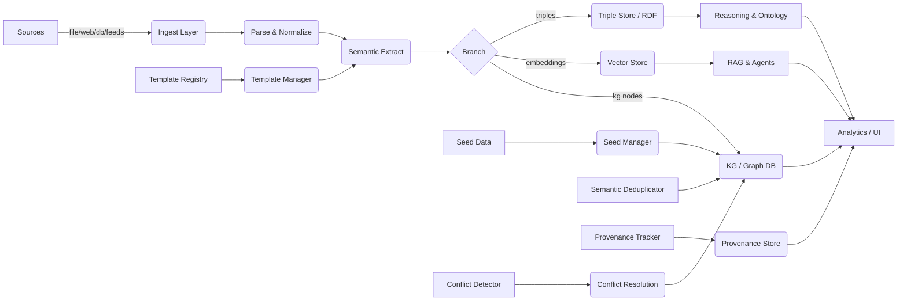

# SemantiCore — Modules, Features, Roadmap & Visuals

> **Purpose:** A concise engineering guide listing every module, feature, responsibilities, recommended tech, and visual diagrams to help you design, implement, and ship the SemantiCore open‑source semantic toolkit.

---

## 1. High-level overview

SemantiCore transforms raw, multi-format input into semantic knowledge (triples, ontologies, graphs, embeddings) suitable for RAG, multi-agent systems, GraphRAG, and domain-specific AI pipelines. The architecture is modular, pluggable, and cloud-native.

---

## 2. Modules (catalog)

Each module is a self-contained package with a clear public API.

1. **core**

   * Responsibilities: orchestration, pipeline runner, configuration, plugin registry, lifecycle management.
   * Exports: `SemantiCore`, `PipelineBuilder`, `Config`, `PluginManager`.

2. **ingest**

   * Submodules: `file`, `web`, `feed`, `stream`, `repo`, `email`, `db_export`.
   * Features: format detection, connector registry, backpressure support, incremental ingestion, resume tokens.

3. **parse**

   * Submodules: `pdf`, `docx`, `pptx`, `excel`, `html`, `jsonl`, `csv`, `latex`, `images`, `tables`.
   * Features: layout-aware extraction, OCR integration (Tesseract/Google Vision), table extraction (Camelot, Tabula), figure extraction.

4. **normalize**

   * Responsibilities: text cleaning, language detection, encoding normalization, named entity canonicalization, date normalization.

5. **split**

   * Chunking strategies: sliding window, semantic chunking, structural (section-aware), table-aware splitting.
   * Preserves provenance for each chunk.

6. **semantic_extract**

   * Capabilities: NER, relation extraction, event detection, co-reference resolution, entity linking, triple extraction.
   * Backends: spaCy, Stanza, HuggingFace pipelines, LLM prompts (for complex relations).

7. **ontology**

   * OntologyGenerator: infer classes/properties, generate OWL/RDF, map to base ontologies (schema.org, FOAF, DC), versioning.

8. **triple_store**

   * Adapters: Blazegraph, Apache Jena, RDF4J, GraphDB, Virtuoso — export/import, bulk load.

9. **kg** (knowledge graph)

   * Graph builder, entity resolution, deduplication, seed manager, provenance, conflict detector, conflict resolution UI hooks.

10. **embeddings**

     * SemanticEmbedder: multi-modal embeddings, context windows, pooling strategies, embedding provider adapters (OpenAI, BGE, Llama‑embeddings).

11. **vector_store**

     * Adapters: Pinecone, FAISS, Milvus, Weaviate, Qdrant. Features: namespace, metadata store, hybrid search.

12. **reasoning**

     * Inference rules, SPARQL-based reasoning, Rete-like rule engine hooks, abductive/deductive inference.

13. **pipeline**

     * PipelineBuilder, failure/retry semantics, parallelism strategies, resource scheduling.

14. **streaming**

     * Integration: Kafka, Pulsar, RabbitMQ, Kinesis; exactly-once semantics where feasible; checkpoints.

15. **domains**

     * Domain-specific processors (cybersecurity, biomedical, finance, legal). Each provides templates, mapping rules, ontologies, and extractors.

16. **qa_rag**

     * RAG-optimised tools: semantic chunker, prompt templates, retrieval policies, answer justification, provenance-aware answer builder.

17. **agents**

     * Agent manager & orchestration for multiagent workflows, tools for tool‑use, orchestration policies, cost-awareness, sandboxing.

18. **ui**

     * Web dashboard components: ingestion monitor, KG viewer (graph UI), conflict resolver, analytics dashboard, pipeline editor.

19. **monitoring**

     * Metrics, traces (OpenTelemetry), alerts, SLAs, data quality metrics, semantic quality score.

20. **quality**

     * QA, validation engine, schema validation, unit tests for extracted triples, confidence thresholds.

21. **security**

     * Access control (RBAC), data masking, PII redaction, audit logs, encryption helpers.

22. **deploy**

     * K8s manifests, Helm charts, Dockerfiles, autoscaling policies, GPU scheduling guides.

23. **cli**

     * Lightweight CLI for quick ingestion, building KB, exporting triples, running QA checks.

24. **examples**

     * Cookbooks and minimal reproducible examples across domains.

25. **docs**

     * Sphinx/ReadTheDocs-ready documentation with tutorials and API reference.

### 🆕 **NEW MODULES TO TACKLE KNOWLEDGE GRAPH PROBLEMS**

26. **template_manager**

    * **Purpose:** Enforce fixed templates and predefined schemas to prevent AI from inventing entities/relationships.
    * **Features:** 
      - Schema validation against predefined templates
      - Template registry with versioning
      - Constraint enforcement (required fields, data types, relationships)
      - Template inheritance and composition
      - Domain-specific template libraries (finance, healthcare, legal)
    * **Exports:** `TemplateRegistry`, `SchemaValidator`, `ConstraintEngine`, `TemplateBuilder`.

27. **seed_manager**

    * **Purpose:** Initialize Knowledge Graph with existing, known data to build on "foundation of truth".
    * **Features:**
      - Seed data import from CSV, JSON, databases
      - Known entity registration (products, departments, employees)
      - Seed data validation and conflict detection
      - Incremental seed data updates
      - Seed data provenance tracking
    * **Exports:** `SeedManager`, `SeedValidator`, `SeedImporter`, `SeedRegistry`.

28. **semantic_deduplicator**

    * **Purpose:** Clean up and merge semantically similar entities to prevent graph messiness.
    * **Features:**
      - Semantic similarity detection using embeddings
      - Fuzzy matching algorithms (Levenshtein, Jaro-Winkler)
      - Entity clustering and grouping
      - Merge strategies and conflict resolution
      - Duplicate detection confidence scoring
      - Batch deduplication with rollback support
    * **Exports:** `SemanticDeduplicator`, `SimilarityEngine`, `MergeEngine`, `ClusterAnalyzer`.

29. **conflict_detector**

    * **Purpose:** Flag disagreements when different sources provide conflicting information.
    * **Features:**
      - Multi-source conflict detection
      - Conflict severity classification (minor, moderate, critical)
      - Source document tracking and highlighting
      - Conflict resolution workflow
      - Conflict history and audit trail
      - Automated conflict alerts and notifications
    * **Exports:** `ConflictDetector`, `ConflictResolver`, `ConflictTracker`, `AlertManager`.

30. **provenance_tracker**

    * **Purpose:** Track the exact source of every piece of information for transparency and investigation.
    * **Features:**
      - Source document linking (file, page, paragraph, line)
      - Extraction timestamp and confidence scores
      - Processing pipeline tracking
      - Source credibility scoring
      - Provenance visualization in UI
      - Export capabilities for audit purposes
    * **Exports:** `ProvenanceTracker`, `SourceLinker`, `CredibilityScorer`, `ProvenanceExporter`.

---

## 3. Features (by user story)

* **As a data engineer** I want pluggable ingestors so I can add new connectors quickly.
* **As an ontology engineer** I want automatic ontology suggestions and human-in-the-loop refinement.
* **As an analyst** I want a KG browser that shows provenance and conflict highlights.
* **As an ML engineer** I want RAG-ready semantic chunks with embeddings and retrieval tuning.
* **As a security engineer** I want PII detection and masking before storing embeddings.

### 🆕 **NEW USER STORIES FOR KNOWLEDGE GRAPH PROBLEMS**

* **As a knowledge engineer** I want to enforce fixed templates so the AI doesn't invent new entities or relationships.
* **As a domain expert** I want to seed the Knowledge Graph with known data so the AI builds on existing knowledge.
* **As a data quality analyst** I want automatic deduplication to merge semantically similar entities and keep the graph clean.
* **As a compliance officer** I want to see exactly where conflicting information comes from so I can investigate discrepancies.
* **As a business user** I want to trust that the Knowledge Graph represents the single source of truth without duplicates or conflicts.

---

## 4. Recommended tech stack (per module)

* Language: Python 3.10+ (type hints, pydantic models)
* Async: `asyncio` + `anyio` for I/O bound ingestion
* Parsing: `pdfplumber`, `PyMuPDF`, `python-docx`, `openpyxl`, `beautifulsoup4`
* OCR: `tesserocr` / Google Vision or AWS Textract adapters
* NLP: `spaCy`, `transformers`, `flair`, LLM adapters
* Vector stores: FAISS (local), Pinecone / Qdrant / Milvus
* KG: Neo4j for property graph + RDF store for triples
* Streaming: Kafka / Pulsar
* Infra: Docker + Kubernetes + Helm
* Monitoring: Prometheus + Grafana + OpenTelemetry
* CI/CD: GitHub Actions, dependabot

### 🆕 **NEW TECH STACK FOR KNOWLEDGE GRAPH MODULES**

* **Template Management:** JSON Schema, Pydantic, Cerberus for validation
* **Semantic Deduplication:** SentenceTransformers, FAISS, scikit-learn clustering
* **Conflict Detection:** Fuzzy matching with `fuzzywuzzy`, `rapidfuzz`
* **Provenance Tracking:** GraphQL, Neo4j Cypher, RDF/SPARQL

---

## 5. Architecture — dataflow diagram (Mermaid)



---

## 6. Roadmap (quarterly milestones)

```text
Q1 — MVP
 - core, ingest(file/web), parse(pdf/docx/html), split, embeddings(local FAISS), basic vector_store adapter
 - simple CLI

Q2 — KG + Triples
 - triple_extractor, ontology generator, triple store adapter, deduplication
 - basic KG UI

Q3 — Streaming & Domains
 - streaming connectors, feed processor, domain processors (cyber, biomedical)
 - monitoring & QA

Q4 — Agents & Enterprise
 - multi-agent orchestration, advanced reasoning, RBAC, production K8s charts, enterprise docs

🆕 Q5 — Knowledge Graph Quality & Trust
 - template_manager, seed_manager, semantic_deduplicator, conflict_detector
 - provenance_tracker, advanced conflict resolution UI
 - template libraries for common domains

🆕 Q6 — Enterprise Knowledge Graph Features
 - multi-tenant template management, advanced conflict workflows
 - compliance reporting, audit trails, enterprise integrations
```

---

## 7. Visual charts

### 7.1 Module size and priority (simple bar chart)

```
Modules Priority
core           ██████████ 10
ingest         █████████  9
parse          ████████   8
semantic_extract ████████ 8
embeddings     ███████    7
vector_store   ███████    7
kg             ████████   8
ontology       ██████     6
ui             █████      5
monitoring     █████      5
agents         ████       4
🆕 template_manager ████████ 8
🆕 seed_manager     ███████  7
🆕 semantic_deduplicator ████████ 8
🆕 conflict_detector     ████████ 8
🆕 provenance_tracker    ███████  7
```

### 7.2 Gantt-style timeline (Mermaid)

```mermaid
gantt
    dateFormat  YYYY-MM-DD
    title SemantiCore high-level roadmap
    section MVP
    Core & Ingest       :done, a1, 2025-01-01, 45d
    Parsing & Chunking  :done, a2, after a1, 30d
    Embeddings & FAISS  :done, a3, after a2, 20d
    section KG
    Triple extractor    :a4, after a3, 30d
    Ontology generator  :a5, after a4, 20d
    section Scale
    Streaming & Domains :a6, after a5, 60d
    Monitoring & QA     :a7, after a6, 30d
    Agents & Enterprise :a8, after a7, 60d
    🆕 section KG Quality
    Template Manager    :a9, after a8, 45d
    Seed Manager        :a10, after a9, 30d
    Semantic Deduplicator :a11, after a10, 45d
    Conflict Detector   :a12, after a11, 45d
    Provenance Tracker  :a13, after a12, 30d
```

---

## 8. Design notes & implementation guidance

* **Start small**: implement `core`, `ingest.file`, `parse.pdf`, `split` and `embeddings` with local FAISS. Aim for *end-to-end* pipeline that takes a PDF and returns embeddings + triples.
* **Provenance-first**: every chunk, triple, and entity MUST carry source, offset, and confidence.
* **Schema-first approach**: let teams register Pydantic models (business entities) early — this simplifies downstream validation and UX.
* **Human-in-loop**: provide UIs for ontology review, conflict resolution, and triple acceptance.
* **Test coverage**: unit tests for extractors, golden files for parsers, and integration tests that simulate full pipelines.
* **Performance**: make parsing idempotent and resumable; add caching at the ingest and embedder layers.

### 🆕 **NEW DESIGN PRINCIPLES FOR KNOWLEDGE GRAPH QUALITY**

* **Template-first**: Define schemas before ingestion to prevent AI invention of entities/relationships.
* **Seed-before-extract**: Always start with known data to establish foundation of truth.
* **Conflict-aware**: Design for conflict detection from day one, not as an afterthought.
* **Provenance-everywhere**: Track source of every piece of information for transparency.
* **Deduplication-continuous**: Implement semantic deduplication as a continuous process, not just during ingestion.

---

## 9. CI/CD, release & contributor guidelines

* Monorepo with packages under `packages/` using `poetry` or `flit`.
* Pre-commit hooks (black, isort, ruff, mypy), unit tests on GitHub Actions, release automation for PyPI and DockerHub.
* CONTRIBUTING.md with code style, PR checklist, and issue template.

---

## 10. Deliverables (file list for initial repo scaffolding)

```
/README.md
/pyproject.toml
/packages/core/
/packages/ingest/
/packages/parse/
/packages/split/
/packages/semantic_extract/
/packages/embeddings/
/packages/vector_store/
/packages/kg/
/packages/ontology/
/packages/cli/
/docs/
/examples/
/infra/k8s/
/helm/semanticore/
/.github/workflows/

🆕 /packages/template_manager/
🆕 /packages/seed_manager/
🆕 /packages/semantic_deduplicator/
🆕 /packages/conflict_detector/
🆕 /packages/provenance_tracker/
```

---

## 11. Starter tasks (first sprint — 2 weeks)

1. Scaffold repo and package layout.
2. Implement `core` and a `file` ingestor that accepts local directories and single files.
3. Implement `pdf` parser using `pdfplumber` that returns structured blocks and simple tables.
4. Implement `split` with structural and sliding-window modes.
5. Implement `SemanticEmbedder` with local huggingface mini-embedding and persist to FAISS.
6. Add basic unit tests and a demo notebook that shows E2E from PDF -> embeddings -> search.

### 🆕 **NEW STARTER TASKS FOR KNOWLEDGE GRAPH QUALITY**

7. Implement `template_manager` with basic JSON schema validation.
8. Create `seed_manager` for importing known entities from CSV/JSON.
9. Build `semantic_deduplicator` using sentence transformers for similarity detection.
10. Develop `conflict_detector` to identify source disagreements.
11. Add `provenance_tracker` to link all information to source documents.

---

## 12. Example API usage (reference)

```python
from semanticore import SemantiCore

core = SemantiCore(
    config_path="./config.yaml",
    llm_provider="local",
    vector_store="faiss"
)

kb = core.build_knowledge_base(["./sample_docs/"])
print(kb.search("key trends"))
```

### 🆕 **NEW API EXAMPLES FOR KNOWLEDGE GRAPH QUALITY**

```python
from semanticore import SemantiCore
from semanticore.template_manager import TemplateRegistry
from semanticore.seed_manager import SeedManager
from semanticore.semantic_deduplicator import SemanticDeduplicator
from semanticore.conflict_detector import ConflictDetector

# Initialize with quality modules
core = SemantiCore(
    config_path="./config.yaml",
    template_manager=TemplateRegistry("./templates/"),
    seed_manager=SeedManager("./seed_data/"),
    deduplicator=SemanticDeduplicator(),
    conflict_detector=ConflictDetector()
)

# Load predefined template
template = core.template_manager.load_template("financial_report")

# Seed with known data
core.seed_manager.load_seed_data("departments.csv", "employees.json")

# Build knowledge base with quality controls
kb = core.build_knowledge_base(
    ["./documents/"],
    template=template,
    enable_deduplication=True,
    enable_conflict_detection=True
)

# Check for conflicts
conflicts = core.conflict_detector.get_conflicts()
for conflict in conflicts:
    print(f"Conflict: {conflict.description}")
    print(f"Sources: {conflict.sources}")
    print(f"Severity: {conflict.severity}")

# Get provenance for any entity
provenance = core.provenance_tracker.get_provenance("Q1_Sales_Report")
print(f"Source: {provenance.source_document}")
print(f"Extracted: {provenance.extraction_timestamp}")
print(f"Confidence: {provenance.confidence_score}")
```

---

## 13. Next steps / how I can help

If you want, I can:

* Expand each module into a `README.md` + `__init__.py` template for the repo scaffold.
* Generate a prioritized ticket backlog (Jira/GitHub issues format).
* Create starter code for `core`, `file` ingestor, `pdf` parser and a demo notebook.

### 🆕 **NEW NEXT STEPS FOR KNOWLEDGE GRAPH QUALITY**

* Create detailed specifications for the 5 new Knowledge Graph quality modules.
* Design the conflict resolution workflow and UI components.
* Develop template libraries for common domains (finance, healthcare, legal).
* Build integration examples showing how these modules work together.
* Create quality metrics and validation frameworks for Knowledge Graph trustworthiness.


