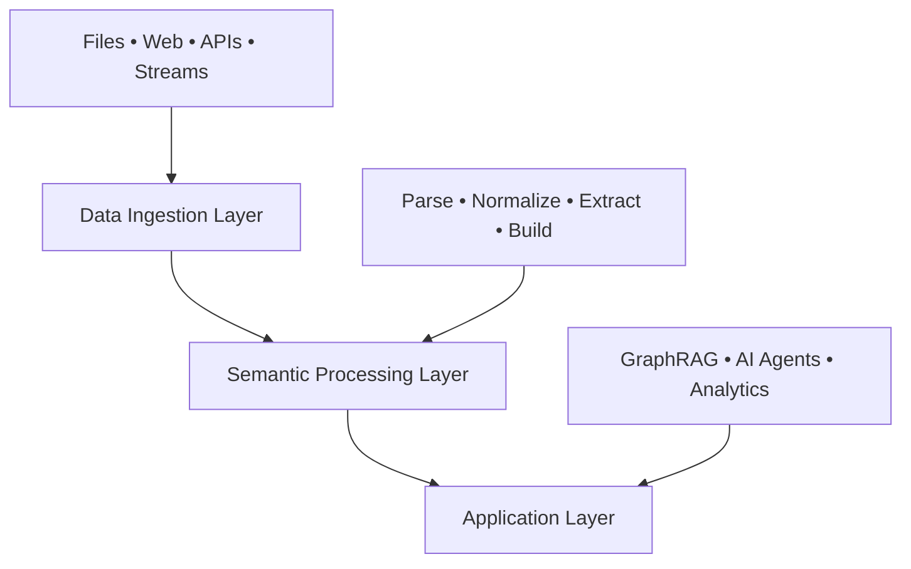

# Architecture

Semantica's modular, extensible framework for semantic intelligence and knowledge engineering.

---

## Design Principles

- **Modular**: Independent, reusable components
- **Extensible**: Easy to add new functionality
- **Scalable**: Handle large-scale data processing
- **Maintainable**: Clear separation of concerns

---

## System Architecture



### Three-Layer Architecture

**1. Data Ingestion Layer**
- 50+ file formats (PDF, DOCX, JSON, CSV, etc.)
- Web scraping and APIs
- Real-time streams (Kafka, RabbitMQ)
- Database connectors (SQL, NoSQL)

**2. Semantic Processing Layer**
- Document parsing and normalization
- Entity and relationship extraction
- Embedding generation
- Knowledge graph construction
- Quality assurance and deduplication

**3. Application Layer**
- GraphRAG for enhanced retrieval
- AI agent memory and context
- Multi-agent systems
- Analytics and visualization

---

## Core Modules

### Orchestration
- **`semantica.core`** - Main framework class and coordination
- **`semantica.pipeline`** - Pipeline management and execution

### Data Processing
- **`semantica.ingest`** - Universal data ingestion
- **`semantica.parse`** - Document parsing
- **`semantica.normalize`** - Data cleaning and normalization

### Semantic Intelligence
- **`semantica.semantic_extract`** - Entity and relationship extraction
- **`semantica.embeddings`** - Vector embedding generation
- **`semantica.ontology`** - Ontology generation and management

### Knowledge Graphs
- **`semantica.kg`** - Knowledge graph construction
- **`semantica.vector_store`** - Vector storage (Pinecone, Weaviate, FAISS)
- **`semantica.triplet_store`** - RDF triplet storage (Jena, Blazegraph)
- **`semantica.graph_store`** - Property graphs (Neo4j, FalkorDB)

### Quality Assurance
- **`semantica.deduplication`** - Entity deduplication
- **`semantica.conflicts`** - Conflict detection and resolution

---

## Data Flow

```
1. Ingestion → Raw data from sources
2. Parsing → Structured content extraction
3. Normalization → Cleaned data
4. Semantic Extraction → Entities, relationships, events
5. Graph Construction → Entity resolution, conflict resolution
6. Quality Assurance → Deduplication, validation
7. Storage → Vector, triplet, and graph stores
8. Application → GraphRAG, agents, analytics
```

---

## Extension Points

### Custom Ingestors

```python
from semantica.ingest import BaseIngestor

class CustomIngestor(BaseIngestor):
    def ingest(self, source):
        # Custom ingestion logic
        pass
```

### Custom Extractors

```python
from semantica.semantic_extract import BaseExtractor

class CustomExtractor(BaseExtractor):
    def extract(self, text):
        # Custom extraction logic
        pass
```

### Custom Validators

Validators can be implemented within domain-specific modules (e.g., graph or ontology) as needed.

---

## Design Decisions

### Modularity
Independent components that can be used standalone or together. Easy to test, maintain, and extend.

### Plugin System
Extensible architecture allowing custom functionality without modifying core code.

### Configuration Management
Centralized configuration with environment variable support for different deployment environments.

### Error Handling
Comprehensive error handling with graceful degradation and recovery mechanisms.

---

## Performance

**Scalability**
- Parallel processing support
- Streaming for large datasets
- Efficient memory usage
- Intelligent caching

**Optimization**
- Lazy loading
- Batch processing
- Connection pooling
- Query optimization

---

## Security

**Data Security**
- Secure credential handling
- Input validation and output sanitization
- Audit logging

**Access Control**
- Authentication and authorization
- API key management
- Role-based access control

---

## Future Roadmap

- Distributed processing
- Real-time streaming improvements
- Advanced reasoning capabilities
- Multi-modal expansion
- Enhanced visualization

---

For detailed module documentation, see [Modules Guide](modules.md)
