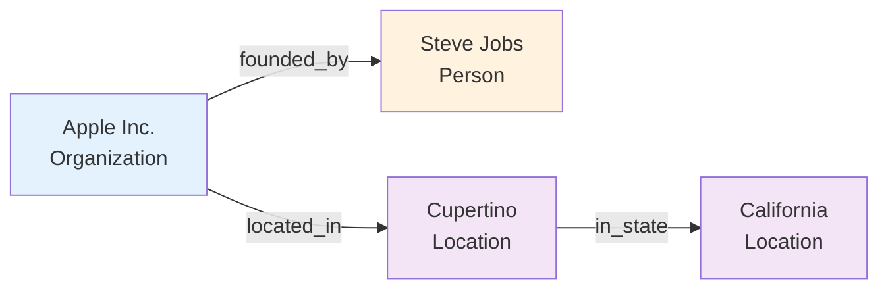
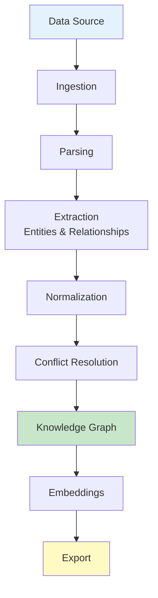

# Core Concepts

Understand the fundamental concepts behind Semantica.

## What is a Knowledge Graph?

A knowledge graph is a structured representation of information where:

- **Entities** are the nodes (people, places, concepts, etc.)
- **Relationships** are the edges connecting entities
- **Properties** describe attributes of entities

## Semantic Layer

A semantic layer provides:

- **Structured meaning** from unstructured data
- **Contextual relationships** between concepts
- **Queryable knowledge** for AI systems
- **Quality-assured data** with conflict resolution

## Key Components

### 1. Data Ingestion

Import data from various sources:

- Documents (PDF, DOCX, HTML)
- Databases
- APIs and web content
- Structured data (JSON, CSV)

### 2. Entity Extraction

Identify and extract:

- **Named Entities**: People, organizations, locations
- **Concepts**: Ideas, topics, themes
- **Events**: Actions, occurrences
- **Relations**: Connections between entities

### 3. Relationship Extraction

Discover relationships:

- **Explicit**: Directly stated in text
- **Implicit**: Inferred from context
- **Temporal**: Time-based relationships
- **Causal**: Cause-and-effect connections

### 4. Knowledge Graph Construction

Build structured graphs:

- **Node creation**: Entities as nodes
- **Edge creation**: Relationships as edges
- **Property assignment**: Attributes and metadata
- **Graph validation**: Quality checks

### 5. Conflict Resolution

Handle conflicting information:

- **Multiple sources**: Same entity, different facts
- **Resolution strategies**: Voting, credibility, recency
- **Quality assurance**: Validation and verification

### 6. Embedding Generation

Create vector representations:

- **Text embeddings**: Semantic text vectors
- **Graph embeddings**: Node and edge vectors
- **Multimodal**: Text, image, audio embeddings

## Workflow

Typical Semantica workflow:

## Use Cases

### GraphRAG

Enhance RAG systems with knowledge graphs:

- **Context expansion**: Follow relationships
- **Multi-hop reasoning**: Traverse graph paths
- **Structured queries**: Query graph directly

### AI Agents

Provide agents with:

- **Persistent memory**: Knowledge graph as memory
- **Context understanding**: Semantic relationships
- **Action validation**: Check against knowledge

### Data Integration

Unify data from multiple sources:

- **Schema mapping**: Automatic schema discovery
- **Entity resolution**: Match entities across sources
- **Conflict resolution**: Handle contradictions

## Best Practices

### 1. Start Small

Begin with a single document or small dataset to understand the workflow.

### 2. Iterate

Build knowledge graphs incrementally, refining as you learn.

### 3. Validate

Always validate extracted entities and relationships.

### 4. Resolve Conflicts

Use appropriate conflict resolution strategies for your use case.

### 5. Export Regularly

Export your knowledge graphs for backup and analysis.

## Next Steps

- **[Quick Start](quickstart.md)** - Build your first knowledge graph
- **[Examples](examples.md)** - See real-world applications
- **[API Reference](api.md)** - Explore the full API

