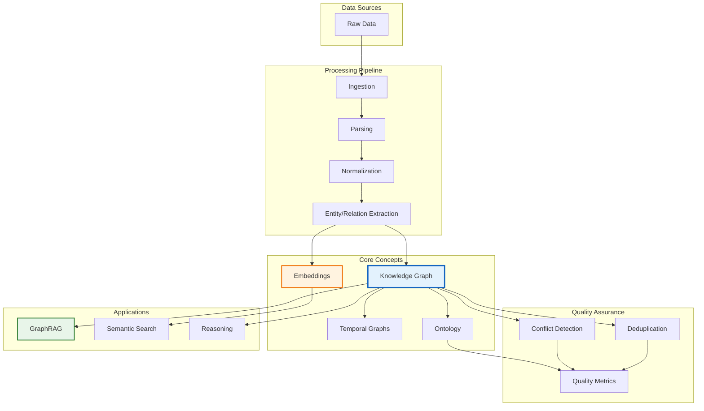
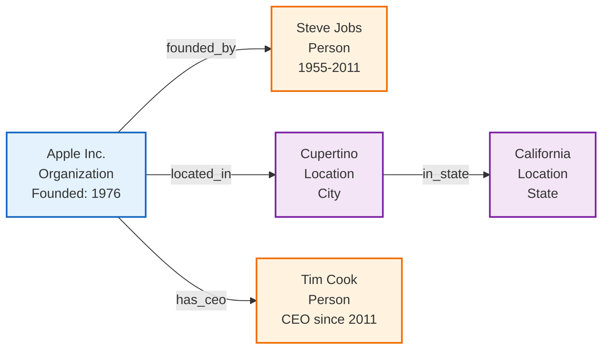
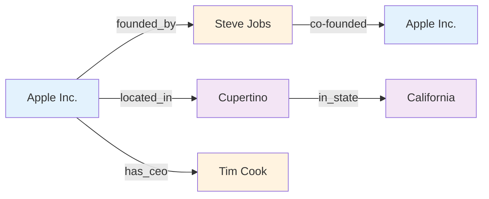
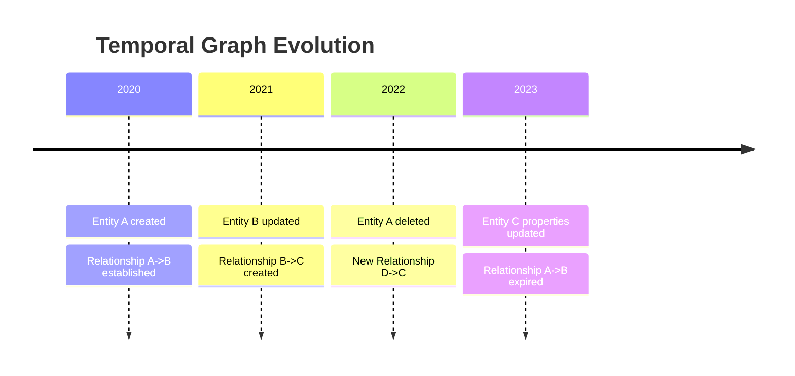
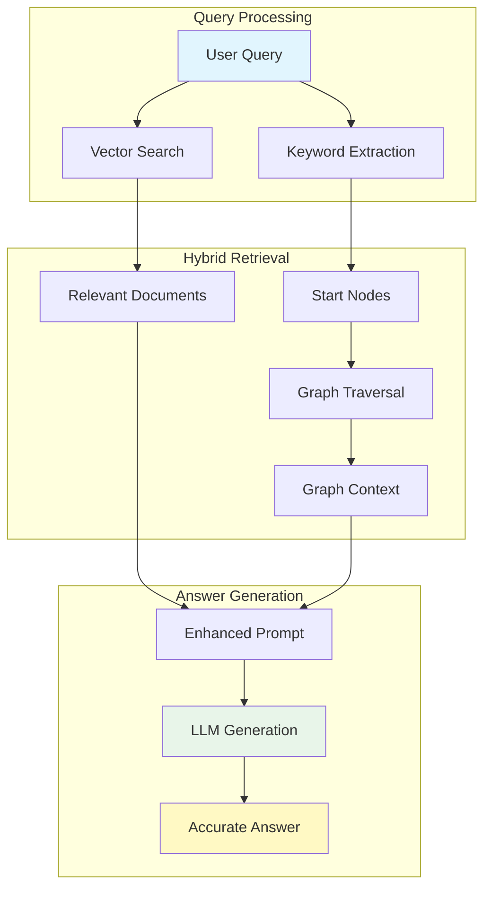
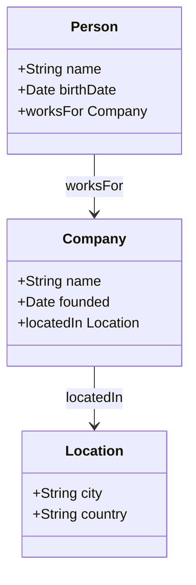
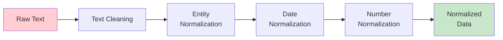

# Core Concepts

Understand the fundamental concepts behind Semantica. This guide covers the theoretical foundations, key components, and best practices for building semantic applications.

!!! info "About This Guide"
    This guide provides a comprehensive overview of the core concepts in Semantica. Each concept includes definitions, visual diagrams, practical examples, and guidance on when to use them.

---

## Table of Contents

- [Prerequisites](#prerequisites)
- [Learning Objectives](#learning-objectives)
- [Concept Map](#concept-map)
- [Core Concepts](#core-concepts)
  - [Knowledge Graphs](#1-knowledge-graphs)
  - [Entity Extraction (NER)](#2-entity-extraction-ner)
  - [Relationship Extraction](#3-relationship-extraction)
  - [Embeddings](#4-embeddings)
  - [Temporal Graphs](#5-temporal-graphs)
  - [GraphRAG](#6-graphrag)
  - [Ontology](#7-ontology)
  - [Quality Assurance](#8-quality-assurance)
  - [Deduplication & Entity Resolution](#9-deduplication--entity-resolution)
  - [Data Normalization](#10-data-normalization)
  - [Conflict Detection](#11-conflict-detection)
- [Comparison Tables](#comparison-tables)
- [Best Practices](#best-practices)
- [Troubleshooting](#troubleshooting)

---

## Prerequisites

Before diving into the core concepts, you should have:

- Basic understanding of Python programming
- Familiarity with data structures (lists, dictionaries, graphs)
- General knowledge of machine learning concepts (helpful but not required)
- Understanding of text processing basics

!!! tip "New to Knowledge Graphs?"
    If you're completely new to knowledge graphs, start with the [Getting Started Guide](getting-started.md) and [Quickstart Tutorial](quickstart.md) before reading this guide.

---

## Learning Objectives

By the end of this guide, you will understand:

- What knowledge graphs are and how they represent information
- How entity and relationship extraction works
- The role of embeddings in semantic understanding
- How temporal graphs track changes over time
- How GraphRAG enhances LLM applications
- The importance of ontologies and quality assurance
- How to resolve conflicts and deduplicate entities
- When to use each concept in your applications

---

## Concept Map

The following diagram shows how the core concepts in Semantica relate to each other:



---

## Core Concepts

### 1. Knowledge Graphs

!!! abstract "Definition"
    A **knowledge graph** is a structured representation of entities (nodes) and their relationships (edges) with properties and attributes. It transforms unstructured data into a queryable, interconnected knowledge base.

**Key Components**:

- **Nodes (Entities)**: Represent real-world objects, concepts, or events
    - Examples: People, Organizations, Locations, Concepts
- **Edges (Relationships)**: Represent connections between entities
    - Examples: `works_for`, `located_in`, `founded_by`, `causes`
- **Properties**: Attributes of entities and relationships
    - Examples: Name, Date, Confidence Score, Source
- **Metadata**: Additional information about the data
    - Examples: Source documents, timestamps, extraction methods

??? info "Deep Dive: Graph Theory Basics"
    At its core, a knowledge graph is a directed multigraph $G = (V, E)$ where:
    - $V$ is a set of vertices (entities)
    - $E$ is a set of edges (relationships)
    - Edges are directed: $(u, v) \in E$ implies a relationship from $u$ to $v$
    - Multigraph property allows multiple edges between the same pair of vertices (e.g., "Friend" and "Colleague")

**Visual Example**:



**Practical Example**:

```python
from semantica import Semantica

# Initialize Semantica
semantica = Semantica()

# Build knowledge graph from document
result = semantica.build_knowledge_base(
    sources=["company_report.pdf"],
    embeddings=True,
    graph=True
)

kg = result["knowledge_graph"]

# Access entities and relationships
print(f"Entities: {len(kg['entities'])}")
print(f"Relationships: {len(kg['relationships'])}")

# Query the graph
for entity in kg['entities'][:5]:
    print(f"- {entity.get('text', 'N/A')}: {entity.get('type', 'N/A')}")
```

**When to Use**:

- You need to model complex relationships between entities
- You want to query data using graph patterns
- You need to track how information changes over time
- You're building a semantic search or RAG application
- You need to integrate data from multiple sources

**Related Modules**:

- [`kg` Module](reference/kg.md) - Knowledge graph construction and management
- [`graph_store` Module](reference/graph_store.md) - Persistent graph storage
- [`visualization` Module](reference/visualization.md) - Graph visualization

---

### 2. Entity Extraction (NER)

!!! abstract "Definition"
    **Named Entity Recognition (NER)** is the process of identifying and classifying named entities in text into predefined categories such as persons, organizations, locations, dates, and more.

**Entity Types**:

| Entity Type      | Description                    | Example                          |
| :--------------- | :----------------------------- | :------------------------------- |
| **Person**       | Names of people                | Steve Jobs, Elon Musk, Marie Curie |
| **Organization** | Companies, institutions       | Apple Inc., NASA, MIT            |
| **Location**     | Places, geographic entities   | Cupertino, Mars, Pacific Ocean  |
| **Date/Time**    | Temporal expressions           | 1976, next Monday, Q1 2024      |
| **Money**        | Monetary values                | $100 million, €50,000            |
| **Event**        | Events and occurrences         | WWDC 2024, World War II          |
| **Product**      | Products and services          | iPhone 15, Tesla Model S         |
| **Technology**   | Technologies and methods       | Machine Learning, Python         |

!!! tip "Custom Entities"
    Semantica allows you to define custom entity types via the [`Ontology`](reference/ontology.md) module. You aren't limited to the standard set!

**Extraction Methods**:

=== "Rule-based"
    Uses pattern matching (regex) to identify entities.
    
    **Pros**: Fast, deterministic, no training data needed
    
    **Cons**: Limited to predefined patterns, less flexible
    
    ```python
    from semantica.semantic_extract import NamedEntityRecognizer
    
    ner = NamedEntityRecognizer(method="rule-based")
    entities = ner.extract_entities("Apple Inc. was founded in 1976.")
    ```

=== "Machine Learning"
    Uses trained models (spaCy, transformers) for extraction.
    
    **Pros**: More accurate, handles variations
    
    **Cons**: Requires training data, slower than rules
    
    ```python
    ner = NamedEntityRecognizer(method="spacy")
    entities = ner.extract_entities(text)
    ```

=== "LLM-based"
    Uses large language models (GPT-4, Claude) for extraction.
    
    **Pros**: Most accurate, understands context
    
    **Cons**: Slower, requires API access, costs money
    
    ```python
    ner = NamedEntityRecognizer(method="llm", model="gpt-4")
    entities = ner.extract_entities(text)
    ```

**Practical Example**:

```python
from semantica.semantic_extract import NamedEntityRecognizer

# Initialize NER
ner = NamedEntityRecognizer()

# Extract entities from text
text = """
Apple Inc. was founded by Steve Jobs in Cupertino, California in 1976.
The company designs and manufactures consumer electronics and software.
Tim Cook is the current CEO of Apple.
"""

entities = ner.extract_entities(text)

print("Extracted Entities:")
for entity in entities:
    print(f"  - {entity.text} ({entity.label}) - Confidence: {entity.confidence:.2f}")
```

**When to Use**:

- You need to identify key entities in unstructured text
- You're building a knowledge graph from documents
- You want to extract structured information from text
- You need to categorize mentions in your data

**Related Modules**:
- [`semantic_extract` Module](reference/semantic_extract.md) - Entity and relationship extraction
- [`ontology` Module](reference/ontology.md) - Custom entity type definitions

---

### 3. Relationship Extraction

!!! abstract "Definition"
    **Relationship Extraction** is the process of identifying and extracting semantic relationships between entities in text. It connects entities to form meaningful knowledge structures.

**Relationship Types**:

=== "Semantic Relationships"
    Relationships that define meaning and connection between entities.
    
    - `works_for` - Employment relationships
    - `located_in` - Geographic relationships
    - `founded_by` - Creation relationships
    - `owns` - Ownership relationships
    - `part_of` - Hierarchical relationships
    
    ```python
    # Example: "Tim Cook works for Apple Inc."
    # Extracted: (Tim Cook) --[works_for]--> (Apple Inc.)
    ```

=== "Temporal Relationships"
    Relationships defined by time and sequence.
    
    - `happened_before` - Temporal precedence
    - `happened_after` - Temporal succession
    - `during` - Temporal containment
    - `overlaps_with` - Temporal overlap
    
    ```python
    # Example: "WWDC 2023 happened before WWDC 2024"
    # Extracted: (WWDC 2023) --[happened_before]--> (WWDC 2024)
    ```

=== "Causal Relationships"
    Cause and effect relationships.
    
    - `causes` - Direct causation
    - `results_in` - Outcome relationships
    - `prevents` - Prevention relationships
    - `influences` - Indirect influence
    
    ```python
    # Example: "High inflation causes economic instability"
    # Extracted: (High inflation) --[causes]--> (Economic instability)
    ```

**Visual Example**:



**Practical Example**:

```python
from semantica.semantic_extract import NamedEntityRecognizer, RelationExtractor

# Extract entities first
ner = NamedEntityRecognizer()
entities = ner.extract_entities(text)

# Extract relationships
rel_extractor = RelationExtractor()
relationships = rel_extractor.extract_relations(text, entities=entities)

print("Extracted Relationships:")
for rel in relationships:
    print(f"  {rel.subject.text} --[{rel.predicate}]--> {rel.object.text}")
    print(f"    Confidence: {rel.confidence:.2f}, Source: {rel.source}")
```

**When to Use**:

- You need to connect entities in your knowledge graph
- You want to understand how entities relate to each other
- You're building a semantic network
- You need to model complex relationships

**Related Modules**:
- [`semantic_extract` Module](reference/semantic_extract.md) - Relationship extraction
- [`kg` Module](reference/kg.md) - Building graphs from relationships

---

### 4. Embeddings

!!! abstract "Definition"
    **Embeddings** are dense vector representations of text, images, or other data that capture semantic meaning in a continuous vector space. They enable machines to understand similarity and meaning.

!!! note "The Bridge Between Language and Understanding"
    Embeddings are the bridge between human language and machine understanding. They convert text into numerical vectors that preserve semantic relationships.

**How Embeddings Work**:

Embeddings convert text into numerical vectors that capture semantic meaning. Similar texts have similar vectors, enabling semantic search and similarity calculations.

**Example**:

```python
Text: "machine learning"
Embedding: [0.123, -0.456, 0.789, ..., 0.234]  # (vector of 1536 dimensions)

# Similar texts will have similar vectors
"artificial intelligence" → [0.145, -0.432, 0.801, ..., 0.221]  # Close in vector space
"cooking recipes" → [-0.234, 0.567, -0.123, ..., -0.456]  # Far in vector space
```

**Embedding Providers**:

| Provider | Model | Dimensions | Speed | Cost | Best For |
| :--- | :--- | :--- | :--- | :--- | :--- |
| **OpenAI** | text-embedding-3-large | 3072 | Fast | Paid | Production, high accuracy |
| **OpenAI** | text-embedding-3-small | 1536 | Fast | Paid | Balanced performance |
| **Cohere** | embed-english-v3.0 | 1024 | Fast | Paid | Multilingual support |
| **HuggingFace** | sentence-transformers | 384-768 | Medium | Free | Development, open source |
| **Local** | Various | Variable | Slow | Free | Privacy, offline use |

**Practical Example**:

```python
from semantica.embeddings import EmbeddingGenerator

# Initialize embedding generator
generator = EmbeddingGenerator(
    provider="openai",
    model="text-embedding-3-small"
)

# Generate embeddings
texts = [
    "Machine learning is a subset of artificial intelligence",
    "Deep learning uses neural networks",
    "Python is a programming language"
]

embeddings = generator.generate(texts)

# Find similar texts
similarity = generator.similarity(embeddings[0], embeddings[1])
print(f"Similarity: {similarity:.2f}")  # High similarity
```

**When to Use**:

- You need semantic search capabilities
- You want to find similar documents or concepts
- You're building a RAG application
- You need to cluster or classify text
- You want to measure semantic similarity

**Related Modules**:
- [`embeddings` Module](reference/embeddings.md) - Embedding generation
- [`vector_store` Module](reference/vector_store.md) - Vector storage and search

---

### 5. Temporal Graphs

!!! abstract "Definition"
    **Temporal Graphs** are knowledge graphs that track changes over time, allowing queries about the state of the graph at specific time points. They enable time-aware reasoning and analysis.

**Key Features**:

- **Time-stamped Entities**: Entities have creation and modification timestamps
- **Time-stamped Relationships**: Relationships have validity periods
- **Historical Queries**: Query the graph state at any point in time
- **Change Tracking**: Track how entities and relationships evolve

**Visual Timeline**:



**Practical Example**:

```python
from semantica import Semantica

semantica = Semantica(temporal=True)

# Build temporal knowledge graph
result = semantica.build_knowledge_base(
    sources=["historical_data.pdf"],
    temporal=True
)

kg = result["knowledge_graph"]

# Query graph at specific time
historical_state = semantica.kg.query_at_time(
    kg,
    timestamp="2022-01-01",
    query="MATCH (e:Entity) RETURN e"
)

# Track entity changes
changes = semantica.kg.get_entity_history(
    kg,
    entity_id="entity_123",
    start_time="2020-01-01",
    end_time="2023-12-31"
)
```

**When to Use**:

- You need to track how information changes over time
- You're analyzing historical data
- You need to query past states of your knowledge
- You're building time-aware applications
- You need to detect trends and patterns over time

**Related Modules**:
- [`kg` Module](reference/kg.md) - Temporal graph support
- [`visualization` Module](reference/visualization.md) - Temporal visualization

---

### 6. GraphRAG

!!! abstract "Definition"
    **GraphRAG (Graph-Augmented Retrieval Augmented Generation)** is an advanced RAG approach that combines vector search with knowledge graph traversal to provide more accurate and contextually relevant information to LLMs.

**How GraphRAG Works**:



**Advantages over Traditional RAG**:

| Feature | Traditional RAG | GraphRAG |
| :--- | :--- | :--- |
| **Query Understanding** | Keyword matching | Semantic + structural |
| **Context Retrieval** | Document chunks | Documents + relationships |
| **Answer Accuracy** | Good | Better (grounded in graph) |
| **Hallucination Risk** | Medium | Lower |
| **Complex Queries** | Limited | Excellent |
| **Relationship Awareness** | No | Yes |

**Practical Example**:

```python
from semantica import Semantica

semantica = Semantica()

# Build knowledge base with graph
result = semantica.build_knowledge_base(
    sources=["documents/"],
    embeddings=True,
    graph=True
)

# Use GraphRAG for querying
answer = semantica.graphrag.query(
    query="What is the relationship between Company A and Company B?",
    knowledge_graph=result["knowledge_graph"],
    embeddings=result["embeddings"],
    top_k=5
)

print(answer)
```

**When to Use**:

- You're building a RAG application
- You need accurate, context-aware answers
- You want to reduce LLM hallucinations
- You need to answer complex, multi-hop questions
- You need relationship-aware retrieval

**Related Modules**:
- [`kg` Module](reference/kg.md) - Knowledge graph construction
- [`vector_store` Module](reference/vector_store.md) - Vector search
- [`reasoning` Module](reference/reasoning.md) - Graph reasoning

---

### 7. Ontology

!!! abstract "Definition"
    An **Ontology** is a formal specification of concepts, relationships, and constraints in a domain, typically expressed in OWL (Web Ontology Language). It defines the schema and structure of your knowledge domain.

**Key Components**:

- **Classes**: Categories of entities (e.g., `Person`, `Company`, `Location`)
- **Properties**: Relationships and attributes (e.g., `worksFor`, `hasName`)
- **Individuals**: Specific instances (e.g., `John Doe`, `Apple Inc.`)
- **Axioms**: Rules and constraints (e.g., "A Person can only workFor one Company")

**Ontology Structure**:



**Practical Example**:

```python
from semantica.ontology import OntologyGenerator

# Generate ontology from knowledge graph
generator = OntologyGenerator()

ontology = generator.generate_from_graph(
    knowledge_graph=kg,
    base_uri="https://example.org/ontology/"
)

# Validate ontology
validator = generator.validate(ontology)

# Export to OWL
generator.export_owl(ontology, "output.owl")
```

**When to Use**:

- You need to define a consistent schema for your domain
- You want to ensure data consistency
- You're integrating with other systems
- You need to enforce constraints and rules
- You want to enable reasoning

**Related Modules**:
- [`ontology` Module](reference/ontology.md) - Ontology generation and management
- [`kg` Module](reference/kg.md) - Knowledge graph construction

---

### 8. Quality Assurance

!!! abstract "Definition"
    **Quality Assurance** encompasses processes and metrics to ensure knowledge graph quality, including completeness, consistency, accuracy, and coverage validation.

**Quality Dimensions**:

| Dimension | Description | Metrics |
| :--- | :--- | :--- |
| **Completeness** | Percentage of entities with required properties | Property coverage, missing fields |
| **Consistency** | Absence of contradictions | Conflict count, validation errors |
| **Accuracy** | Correctness of extracted information | Precision, recall, F1-score |
| **Coverage** | Breadth of domain coverage | Entity diversity, relationship types |
| **Freshness** | How up-to-date the data is | Last update timestamp, staleness |

**Quality Metrics Example**:

```python
from semantica.kg_qa import KGQualityAssessor

# Assess knowledge graph quality
assessor = KGQualityAssessor()
metrics = assessor.assess(kg)

print(f"Completeness: {metrics.completeness:.2%}")
print(f"Consistency: {metrics.consistency:.2%}")
print(f"Accuracy: {metrics.accuracy:.2%}")
print(f"Coverage: {metrics.coverage:.2%}")

# Get quality report
report = assessor.generate_report(kg)
print(report)
```

**When to Use**:

- You need to validate your knowledge graph
- You want to ensure data quality
- You're preparing data for production
- You need to identify data issues
- You want to measure improvement over time

**Related Modules**:
- [`kg_qa` Module](reference/evals.md) - Quality assurance and evaluation
- [`conflicts` Module](../semantica/conflicts/conflicts_usage.md) - Conflict detection

---

### 9. Deduplication & Entity Resolution

!!! abstract "Definition"
    **Deduplication** and **Entity Resolution** are processes that identify and merge duplicate entities in a knowledge graph, ensuring that the same real-world entity is represented by a single node.

**Why It Matters**:

- Multiple sources may refer to the same entity differently
- "Apple Inc." vs "Apple" vs "Apple Computer" → Same entity
- Prevents graph fragmentation and improves query accuracy

**Resolution Process**:

Deduplication works by calculating similarity between entities. If similarity exceeds a threshold, entities are merged; otherwise, they remain separate.

**Practical Example**:

```python
from semantica.deduplication import Deduplicator

# Initialize deduplicator
deduplicator = Deduplicator(
    similarity_threshold=0.85,
    method="embedding"
)

# Detect duplicates
duplicates = deduplicator.detect_duplicates(kg)

# Merge duplicates
merged_kg = deduplicator.merge(kg, duplicates)

print(f"Original entities: {len(kg['entities'])}")
print(f"Merged entities: {len(merged_kg['entities'])}")
print(f"Duplicates found: {len(duplicates)}")
```

**When to Use**:

- You're integrating data from multiple sources
- You have variations in entity names
- You want to reduce graph redundancy
- You need to improve query accuracy
- You're cleaning your knowledge graph

**Related Modules**:
- [`deduplication` Module](../semantica/deduplication/deduplication_usage.md) - Deduplication and merging
- [`embeddings` Module](reference/embeddings.md) - Similarity calculation

---

### 10. Data Normalization

!!! abstract "Definition"
    **Data Normalization** is the process of cleaning and standardizing data into a consistent format, ensuring uniformity across your knowledge graph.

**Normalization Steps**:

1. **Text Cleaning**: Remove noise, fix encoding issues
2. **Entity Normalization**: Standardize entity names and formats
3. **Date Normalization**: Convert dates to ISO format
4. **Number Normalization**: Standardize numeric formats
5. **Language Detection**: Identify and handle multiple languages

**Normalization Pipeline**:



**Practical Example**:

```python
from semantica.normalize import TextNormalizer

# Initialize normalizer
normalizer = TextNormalizer()

# Normalize text
raw_text = "Apple Inc. was founded on April 1, 1976 in Cupertino, CA."
normalized = normalizer.normalize(raw_text)

# Normalize entities
entities = [
    {"text": "Apple Inc.", "type": "ORG"},
    {"text": "apple inc", "type": "ORG"},  # Duplicate with different case
]

normalized_entities = normalizer.normalize_entities(entities)
# Result: Both normalized to "Apple Inc."
```

**When to Use**:

- You have inconsistent data formats
- You're processing data from multiple sources
- You need to standardize entity names
- You want to improve extraction accuracy
- You're preparing data for deduplication

**Related Modules**:
- [`normalize` Module](reference/normalize.md) - Data normalization
- [`parse` Module](reference/parse.md) - Document parsing

---

### 11. Conflict Detection

!!! abstract "Definition"
    **Conflict Detection** identifies contradictory information in a knowledge graph, such as conflicting facts about the same entity from different sources.

**Conflict Types**:

| Type | Description | Example |
| :--- | :--- | :--- |
| **Value Conflict** | Different values for same property | "Founded: 1976" vs "Founded: 1977" |
| **Relationship Conflict** | Conflicting relationships | "CEO: Tim Cook" vs "CEO: Steve Jobs" |
| **Type Conflict** | Different entity types | "Apple: Company" vs "Apple: Product" |
| **Temporal Conflict** | Conflicting time information | "Active: 2020-2023" vs "Active: 2021-2024" |

**Conflict Resolution Strategies**:

=== "Voting"
    Use the most common value across sources.
    
    ```python
    resolver = ConflictResolver(strategy="voting")
    resolved = resolver.resolve(conflicts)
    ```

=== "Highest Confidence"
    Use the value with the highest confidence score.
    
    ```python
    resolver = ConflictResolver(strategy="highest_confidence")
    resolved = resolver.resolve(conflicts)
    ```

=== "Most Recent"
    Use the most recently updated value.
    
    ```python
    resolver = ConflictResolver(strategy="most_recent")
    resolved = resolver.resolve(conflicts)
    ```

=== "Source Priority"
    Use values from trusted sources first.
    
    ```python
    resolver = ConflictResolver(
        strategy="source_priority",
        source_priority=["trusted_source", "other_source"]
    )
    resolved = resolver.resolve(conflicts)
    ```

**Practical Example**:

```python
from semantica.conflicts import ConflictDetector, ConflictResolver

# Detect conflicts
detector = ConflictDetector()
conflicts = detector.detect(kg)

print(f"Found {len(conflicts)} conflicts")

# Resolve conflicts
resolver = ConflictResolver(strategy="voting")
resolved_kg = resolver.resolve_conflicts(kg, conflicts)

# Investigate specific conflicts
for conflict in conflicts[:5]:
    print(f"Conflict: {conflict.entity}")
    print(f"  Sources: {conflict.sources}")
    print(f"  Values: {conflict.values}")
```

**When to Use**:

- You're integrating data from multiple sources
- You have conflicting information
- You need to ensure data consistency
- You want to track data provenance
- You're building a reliable knowledge base

**Related Modules**:
- [`conflicts` Module](../semantica/conflicts/conflicts_usage.md) - Conflict detection and resolution
- [`kg_qa` Module](reference/evals.md) - Quality assurance

---

## Comparison Tables

### Embedding Providers Comparison

| Provider | Model | Dimensions | Speed | Cost | Accuracy | Best For |
| :--- | :--- | :--- | :--- | :--- | :--- | :--- |
| Provider      | Model                  | Dimensions | Speed   | Cost  | Accuracy | Best For                    |
| :------------ | :--------------------- | :--------- | :------ | :---- | :------- | :-------------------------- |
| **OpenAI**    | text-embedding-3-large  | 3072       | Fast    | Paid  | High     | Production, high accuracy   |
| **OpenAI**    | text-embedding-3-small  | 1536       | Fast    | Paid  | High     | Balanced performance        |
| **Cohere**    | embed-english-v3.0      | 1024       | Fast    | Paid  | High     | Multilingual support        |
| **HuggingFace**| all-MiniLM-L6-v2       | 384        | Medium  | Free  | Medium   | Development, open source    |
| **Local**     | sentence-transformers   | 384-768    | Slow    | Free  | Medium   | Privacy, offline use        |

### Graph Backend Comparison

| Backend | Type | Speed | Scalability | Query Language | Best For |
| :--- | :--- | :--- | :--- | :--- | :--- |
| Backend    | Type        | Speed     | Scalability | Query Language | Best For                          |
| :--------- | :---------- | :-------- | :---------- | :------------- | :-------------------------------- |
| **NetworkX**| In-memory  | Fast      | Small-medium| Python API     | Development, small graphs         |
| **Neo4j**   | Database   | Medium    | Large       | Cypher         | Production, complex queries       |
| **KuzuDB**  | Embedded   | Fast      | Medium      | Cypher         | Embedded applications             |
| **FalkorDB**| Redis-based| Very Fast | Large       | Cypher         | Real-time, high throughput        |

---

## Best Practices

Following these practices will help you build high-quality knowledge graphs and avoid common pitfalls.

### 1. Start Small

!!! tip "Iterative Approach"
    Don't try to model the entire world at once. Start with a small, well-defined domain and expand incrementally.

**Example**:
```python
# Start with a single document
kg1 = semantica.build_knowledge_base(["doc1.pdf"])

# Validate and refine
quality = assessor.assess(kg1)

# Then expand
kg2 = semantica.build_knowledge_base(["doc2.pdf", "doc3.pdf"])
merged = semantica.kg.merge([kg1, kg2])
```

### 2. Configure Properly

- Use environment variables for sensitive data
- Set up proper logging
- Configure appropriate model sizes
- Use configuration files for complex setups

```python
# Good: Use environment variables
import os
api_key = os.getenv("OPENAI_API_KEY")

# Good: Use config files
from semantica import Config
config = Config.from_file("config.yaml")
semantica = Semantica(config=config)
```

### 3. Validate Data

!!! warning "Garbage In, Garbage Out"
    Always validate extracted entities. A knowledge graph with incorrect facts is worse than no graph at all.

**Validation Checklist**:
- Check entity extraction accuracy
- Validate relationships make sense
- Verify confidence scores
- Review source attribution
- Test with sample queries

### 4. Handle Errors

- Implement error handling
- Use retry mechanisms
- Log errors for debugging
- Gracefully handle API failures

```python
from semantica import Semantica
import logging

logging.basicConfig(level=logging.INFO)
semantica = Semantica()

try:
    result = semantica.build_knowledge_base(["doc.pdf"])
except Exception as e:
    logging.error(f"Error building KG: {e}")
    # Handle error appropriately
```

### 5. Optimize Performance

- Use batch processing for large datasets
- Enable parallel processing where possible
- Cache embeddings and results
- Use appropriate backend for your scale

```python
# Batch processing
sources = ["doc1.pdf", "doc2.pdf", ..., "doc100.pdf"]
batch_size = 10

for i in range(0, len(sources), batch_size):
    batch = sources[i:i+batch_size]
    result = semantica.build_knowledge_base(batch)
    # Process and save results
```

### 6. Document Workflows

- Document data sources
- Track processing steps
- Maintain metadata
- Version your knowledge graphs

---

## Troubleshooting

Common issues and solutions:

!!! failure "Import Errors"
    **Solution**:
    - Ensure Semantica is properly installed: `pip install semantica`
    - Check Python version (3.8+): `python --version`
    - Verify virtual environment is activated
    - Install missing dependencies: `pip install -r requirements.txt`

!!! failure "API Key Errors"
    **Solution**:
    - Set environment variables: `export OPENAI_API_KEY=your_key`
    - Check config file for correct key format
    - Verify API key is valid and has sufficient credits
    - Test API connection: `curl https://api.openai.com/v1/models`

!!! failure "Memory Issues"
    **Solution**:
    - Process documents in batches
    - Use smaller embedding models
    - Enable garbage collection
    - Consider using streaming for large datasets
    - Use graph store backends (Neo4j, KuzuDB) instead of in-memory

!!! failure "Low Quality Extractions"
    **Solution**:
    - Preprocess and normalize text
    - Use domain-specific models
    - Adjust extraction parameters
    - Validate and clean extracted entities
    - Use LLM-based extraction for better accuracy
    - Fine-tune models on your domain

!!! failure "Slow Processing"
    **Solution**:
    - Enable parallel processing
    - Use GPU acceleration if available
    - Cache embeddings and results
    - Optimize batch sizes
    - Use faster embedding models
    - Consider using local models for development

!!! failure "Graph Too Large"
    **Solution**:
    - Use graph store backends (Neo4j, KuzuDB) instead of NetworkX
    - Implement graph partitioning
    - Use incremental building
    - Filter entities by confidence threshold
    - Remove low-value relationships

---

## Next Steps

Now that you understand the core concepts:

1. **[Getting Started](getting-started.md)** - Set up Semantica and build your first knowledge graph
2. **[Modules Guide](modules.md)** - Learn about the available modules
3. **[Use Cases](use-cases.md)** - Explore real-world applications
4. **[Examples](examples.md)** - See practical code examples
5. **[API Reference](reference/core.md)** - Detailed API documentation

---

!!! info "Contribute"
    Found an issue or want to improve this guide? [Contribute on GitHub](https://github.com/Hawksight-AI/semantica)

**Last Updated**: 2024
