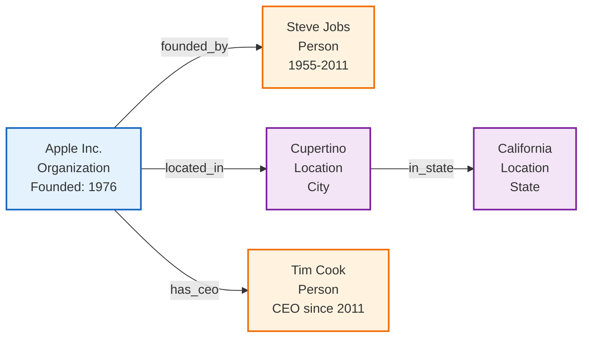
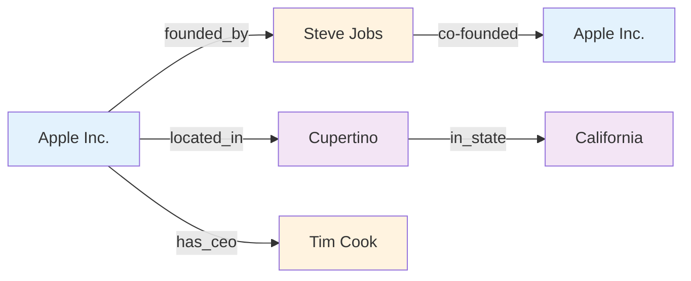
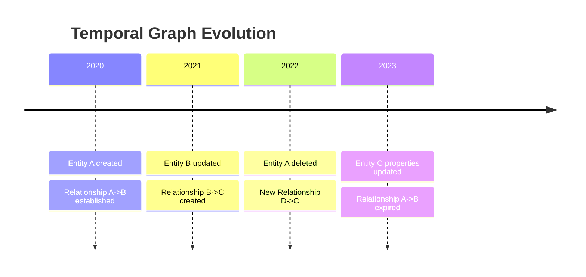
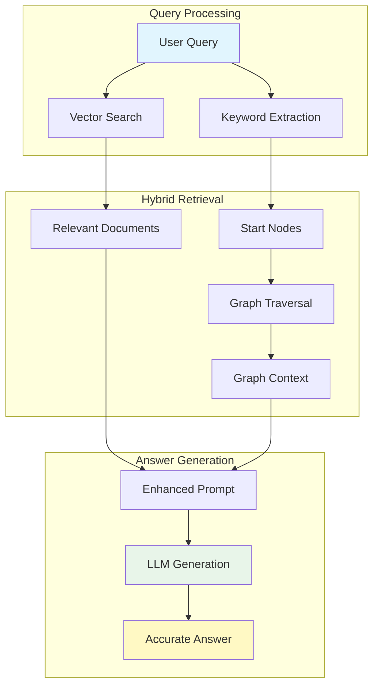
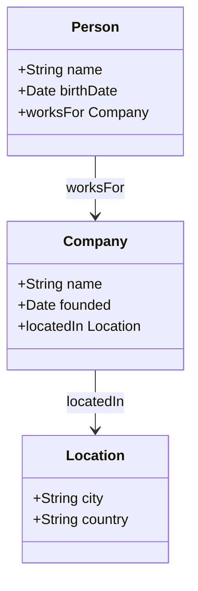
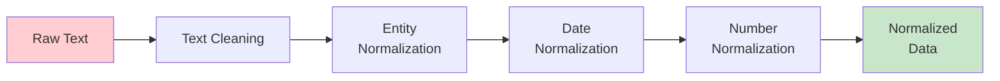

# Core Concepts

Understand the fundamental concepts behind Semantica. This guide covers the theoretical foundations, key components, and best practices for building semantic applications.

!!! info "About This Guide"
    This guide provides a comprehensive overview of the core concepts in Semantica. Each concept includes definitions, visual diagrams, practical examples, and guidance on when to use them.

---

[TOC]


## Core Concepts

### 1. Knowledge Graphs

!!! abstract "Definition"
    A **knowledge graph** is a structured representation of entities (nodes) and their relationships (edges) with properties and attributes. It transforms unstructured data into a queryable, interconnected knowledge base.

<div class="grid cards" markdown>

-   **Nodes (Entities)**
    ---
    Represent real-world objects, concepts, or events.
    *Examples*: People, Organizations, Locations, Concepts

-   **Edges (Relationships)**
    ---
    Represent connections between entities.
    *Examples*: `works_for`, `located_in`, `founded_by`, `causes`

-   **Properties**
    ---
    Attributes of entities and relationships.
    *Examples*: Name, Date, Confidence Score, Source

-   **Metadata**
    ---
    Additional information about the data.
    *Examples*: Source documents, timestamps, extraction methods

</div>

**Visual Example**:




**Practical Examples**:

=== "Basic Usage"
    Build a knowledge graph from a document with just a few lines:
    
    ```python
    from semantica.core import Semantica

    # Initialize Semantica with default settings
    semantica = Semantica()

    # Build knowledge graph from a PDF document
    result = semantica.build_knowledge_base(
        sources=["company_report.pdf"],
        embeddings=True,  # Generate vector embeddings
        graph=True        # Build knowledge graph
    )

    kg = result["knowledge_graph"]

    print(f"Extracted {len(kg['entities'])} entities")
    print(f"Found {len(kg['relationships'])} relationships")

    for entity in kg['entities'][:5]:
        print(f"  {entity['text']} ({entity['type']})")
    ```
=== "Direct KG Module Usage"
    Use the `kg` module directly for more control:
    
    ```python
    from semantica.kg import GraphBuilder

    # Option 1: Using the convenience function (semantica.kg.build)
    kg = build(
        sources=[
            {
                "entities": [
                    {"id": "e1", "text": "Apple Inc.", "type": "Organization"},
                    {"id": "e2", "text": "Tim Cook", "type": "Person"},
                    {"id": "e3", "text": "Cupertino", "type": "Location"}
                ],
                "relationships": [
                    {"source": "e2", "target": "e1", "type": "CEO_OF"},
                    {"source": "e1", "target": "e3", "type": "LOCATED_IN"}
                ]
            }
        ],
        merge_entities=True,
        resolve_conflicts=True
    )

    print(f"Graph built: {kg['metadata']['num_entities']} entities, "
          f"{kg['metadata']['num_relationships']} relationships")

    # Option 2: Using GraphBuilder for advanced configuration
    builder = GraphBuilder(
        merge_entities=True,
        entity_resolution_strategy="fuzzy",  # "exact", "fuzzy", or "semantic"
        resolve_conflicts=True,
        enable_temporal=True,  # Enable time-aware edges
        temporal_granularity="day"
    )
    kg = builder.build(sources)
    ```
=== "Multi-Source Integration"
    Merge knowledge from multiple data sources:
    
    ```python
    from semantica.core import Semantica

    semantica = Semantica()

    # Build graphs from different sources
    kg_news = semantica.build_knowledge_base(
        sources=["news_articles/"],
        normalize=True
    )["knowledge_graph"]

    kg_reports = semantica.build_knowledge_base(
        sources=["financial_reports/"],
        normalize=True
    )["knowledge_graph"]

    # Merge into a unified knowledge graph
    from semantica.kg import GraphBuilder
    builder = GraphBuilder(
        merge_entities=True,
        entity_resolution_strategy="semantic"  # Use embeddings for matching
    )

    unified_kg = builder.merge([kg_news, kg_reports])
    
    print(f"Merged graph: {len(unified_kg['entities'])} unique entities")
    print(f"Deduplicated from {len(kg_news['entities']) + len(kg_reports['entities'])} total")
    ```
=== "Graph Analytics"
    Analyze the structure and properties of your knowledge graph:
    
    ```python
    from semantica.kg import (
        GraphAnalyzer, 
        CentralityCalculator,
        CommunityDetector,
        ConnectivityAnalyzer,
        analyze_graph,
        calculate_centrality,
        detect_communities,
        analyze_connectivity
    )

    # Method 1: Using convenience functions
    analysis = analyze_graph(kg, method="default")
    centrality_scores = calculate_centrality(kg, method="degree")
    communities = detect_communities(kg, method="louvain")
    connectivity = analyze_connectivity(kg, method="default")

    # Method 2: Using classes for more control
    analyzer = GraphAnalyzer()
    centrality_calc = CentralityCalculator()
    community_detector = CommunityDetector()
    connectivity_analyzer = ConnectivityAnalyzer()

    # Run comprehensive analysis
    analysis = analyzer.analyze(kg)
    print(f"Graph density: {analysis['density']:.3f}")
    print(f"Average degree: {analysis['avg_degree']:.2f}")

    # Calculate centrality measures
    degree_centrality = centrality_calc.calculate(kg, method="degree")
    betweenness = centrality_calc.calculate(kg, method="betweenness")
    print(f"Top entities by degree: {list(degree_centrality.items())[:3]}")

    # Detect communities
    communities = community_detector.detect(kg, method="louvain")
    print(f"Found {len(communities)} communities")

    # Analyze connectivity
    conn = connectivity_analyzer.analyze(kg)
    print(f"Connected components: {conn['num_components']}")
    print(f"Largest component: {conn['largest_component_size']} nodes")
    ```


**Related Modules**:

- [`kg` Module](reference/kg.md) - Knowledge graph construction and management
- [`graph_store` Module](reference/graph_store.md) - Persistent graph storage
- [`visualization` Module](reference/visualization.md) - Graph visualization

---

### 2. Entity Extraction (NER)

!!! abstract "Definition"
    **Named Entity Recognition (NER)** is the process of identifying and classifying named entities in text into predefined categories such as persons, organizations, locations, dates, and more.

**Entity Types**:

| Entity Type      | Description                    | Example                          |
| :--------------- | :----------------------------- | :------------------------------- |
| **Person**       | Names of people                | Steve Jobs, Elon Musk, Marie Curie |
| **Organization** | Companies, institutions       | Apple Inc., NASA, MIT            |
| **Location**     | Places, geographic entities   | Cupertino, Mars, Pacific Ocean  |
| **Date/Time**    | Temporal expressions           | 1976, next Monday, Q1 2024      |
| **Money**        | Monetary values                | $100 million, €50,000            |
| **Event**        | Events and occurrences         | WWDC 2024, World War II          |
| **Product**      | Products and services          | iPhone 15, Tesla Model S         |
| **Technology**   | Technologies and methods       | Machine Learning, Python         |

!!! tip "Custom Entities"
    Semantica allows you to define custom entity types via the [`Ontology`](reference/ontology.md) module. You aren't limited to the standard set!

**Extraction Methods**:


=== "Quick Start"
    Extract entities from text using the convenience function:

    
    ```python
    from semantica.semantic_extract import NamedEntityRecognizer
    

    text = """
    Apple Inc. was founded by Steve Jobs, Steve Wozniak, and Ronald Wayne 
    in Cupertino, California on April 1, 1976. The company is now worth 
    over $3 trillion and employs more than 160,000 people worldwide.
    """
    
    # Initialize the NER extractor
    ner = NamedEntityRecognizer()
    
    # Extract entities
    entities = ner.extract_entities(text)
    
    print(f"Extracted {len(entities)} entities:")
    for entity in entities:
        print(f"  {entity['text']:20} | Type: {entity['type']:15} | "
              f"Confidence: {entity.get('confidence', 0.0):.2f}")
    ```
=== "Named Entity Recognizer"
    Use the `NamedEntityRecognizer` class for advanced control:
    
    ```python
    from semantica.semantic_extract import NamedEntityRecognizer
    
    # Initialize with custom configuration
    ner = NamedEntityRecognizer(
        methods=["spacy", "rule-based"],  # Use multiple methods
        confidence_threshold=0.7,
        merge_overlapping=True
    )
    
    text = "Elon Musk announced that Tesla will invest $10B in Texas."
    
    # Extract entities with detailed output
    entities = ner.extract_entities(text)
    
    for entity in entities:
        print(f"""
    Entity: {entity['text']}
      Type: {entity['type']}
      Start: {entity['start_char']}, End: {entity['end_char']}
      Confidence: {entity['confidence']:.2f}
      Method: {entity.get('extraction_method', 'N/A')}
    """)
    ```
=== "Custom Entity Types"
    Define and extract custom entity types for your domain:
    
    ```python
    from semantica.semantic_extract import (
        NamedEntityRecognizer, 
        CustomEntityDetector
    )
    
    # Define custom entity patterns for a medical domain
    custom_detector = CustomEntityDetector(
        patterns={
            "Drug": [
                r"\b(aspirin|ibuprofen|acetaminophen)\b",
                r"\b\w+(?:mycin|cillin|phen)\b"  # Common drug suffixes
            ],
            "Dosage": [
                r"\d+\s*(?:mg|ml|g|mcg)\b",
                r"\b(?:once|twice|three times)\s+(?:daily|weekly)\b"
            ],
            "Condition": [
                r"\b(?:diabetes|hypertension|arthritis)\b",
                r"\b\w+itis\b"  # Inflammation conditions
            ]
        }
    )
    
    ner = NamedEntityRecognizer(
        custom_detectors=[custom_detector],
        include_standard_types=True  # Also extract Person, Org, etc.
    )
    
    medical_text = """
    Patient prescribed ibuprofen 400mg twice daily for arthritis.
    Previous treatment with amoxicillin was discontinued.
    """
    
    entities = ner.extract_entities(medical_text)
    
    # Group by type
    from collections import defaultdict
    by_type = defaultdict(list)
    for e in entities:
        by_type[e['type']].append(e['text'])
    
    for entity_type, items in by_type.items():
        print(f"{entity_type}: {', '.join(items)}")
    
    # Output:
    # Drug: ibuprofen, amoxicillin
    # Dosage: 400mg, twice daily
    # Condition: arthritis
    ```
=== "LLM-Enhanced Extraction"
    Use LLMs for context-aware, high-accuracy extraction:
    
    ```python
    from semantica.semantic_extract import (
        NamedEntityRecognizer,
        LLMExtraction,
        create_provider
    )
    
    # Create LLM provider (supports OpenAI, Anthropic, Groq, Ollama)
    provider = create_provider(
        provider_type="openai",
        model="gpt-4o",
        api_key="your-api-key"  # Or use OPENAI_API_KEY env var
    )
    
    # Initialize LLM-enhanced NER
    enhancer = LLMEnhancer(provider=provider)
    ner = NamedEntityRecognizer(
        llm_enhancer=enhancer,
        use_llm_verification=True  # Verify with LLM
    )
    
    # Extract with LLM enhancement for ambiguous cases
    text = """
    Apple reported record revenue. Tim said the new Apple Watch 
    and the partnership with Goldman Sachs exceeded expectations.
    """
    
    entities = ner.extract_entities(
        text,
        context="Financial earnings report"  # Provide context for better accuracy
    )
    
    # LLM helps distinguish:
    # - "Apple" (company) vs "apple" (fruit)
    # - "Tim" (person - Tim Cook) from context
    # - "Goldman Sachs" (organization)
    # - "Apple Watch" (product vs organization)
    ```
=== "Batch Processing"
    Process multiple documents efficiently:
    
    ```python
    from semantica.semantic_extract import NamedEntityRecognizer
    
    ner = NamedEntityRecognizer(batch_size=32)
    
    documents = [
        "Microsoft acquired Activision for $69 billion.",
        "Google announced Gemini AI at their Mountain View headquarters.",
        "Amazon's Andy Jassy unveiled new AWS services in Seattle.",
        # ... hundreds more documents
    ]
    
    # Process in batches for efficiency
    all_entities = []
    for i, doc in enumerate(documents):
        entities = ner.extract_entities(doc)
        all_entities.extend([
            {**e, "doc_id": i} for e in entities
        ])
        
        if (i + 1) % 100 == 0:
            print(f"Processed {i + 1}/{len(documents)} documents")
    
    from collections import Counter
    entity_types = Counter(e['type'] for e in all_entities)
    print(f"Entity Distribution:")
    for etype, count in entity_types.most_common():
        print(f"  {etype}: {count}")

    ```

**Related Modules**:
- [`semantic_extract` Module](reference/semantic_extract.md) - Entity and relationship extraction
- [`ontology` Module](reference/ontology.md) - Custom entity type definitions

---

### 3. Relationship Extraction

!!! abstract "Definition"
    **Relationship Extraction** is the process of identifying and extracting semantic relationships between entities in text. It connects entities to form meaningful knowledge structures.

**Relationship Types**:

=== "Semantic Relationships"
    Relationships that define meaning and connection between entities.
    
    - `works_for` - Employment relationships
    - `located_in` - Geographic relationships
    - `founded_by` - Creation relationships
    - `owns` - Ownership relationships
    - `part_of` - Hierarchical relationships
    
    ```python
    # Example: "Tim Cook works for Apple Inc."
    # Extracted: (Tim Cook) --[works_for]--> (Apple Inc.)
    ```
=== "Temporal Relationships"
    Relationships defined by time and sequence.
    
    - `happened_before` - Temporal precedence
    - `happened_after` - Temporal succession
    - `during` - Temporal containment
    - `overlaps_with` - Temporal overlap
    
    ```python
    # Example: "WWDC 2023 happened before WWDC 2024"
    # Extracted: (WWDC 2023) --[happened_before]--> (WWDC 2024)
    ```
=== "Causal Relationships"
    Cause and effect relationships.
    
    - `causes` - Direct causation
    - `results_in` - Outcome relationships
    - `prevents` - Prevention relationships
    - `influences` - Indirect influence
    
    ```python
    # Example: "High inflation causes economic instability"
    # Extracted: (High inflation) --[causes]--> (Economic instability)
    ```

**Visual Example**:




**Practical Examples**:

=== "Basic Relation Extraction"
    Extract relationships between entities:
    
    ```python
    from semantica.semantic_extract import RelationExtractor, NamedEntityRecognizer
    
    text = """
    Tim Cook became CEO of Apple Inc. in 2011, succeeding Steve Jobs.
    Apple is headquartered in Cupertino, California. The company
    acquired Beats Electronics in 2014 for $3 billion.
    """
    
    # First extract entities
    ner = NamedEntityRecognizer()
    entities = ner.extract_entities(text)
    
    # Then extract relationships
    rel_extractor = RelationExtractor()
    relations = rel_extractor.extract_relations(text, entities=entities)
    
    print("Extracted Relationships:")
    for rel in relations:
        print(f"  ({rel['source']}) --[{rel['type']}]--> ({rel['target']})")
        print(f"     Confidence: {rel.get('confidence', 0.0):.2f}")
    ```
=== "RelationExtractor Class"
    Use the `RelationExtractor` for advanced control:
    
    ```python
    from semantica.semantic_extract import (
        RelationExtractor,
        NamedEntityRecognizer
    )
    
    # First extract entities
    ner = NamedEntityRecognizer()
    text = """
    Dr. Sarah Chen published her research on quantum computing at MIT.
    Her work was funded by DARPA and received the ACM Award in 2023.
    """
    entities = ner.extract_entities(text)
    
    # Then extract relationships
    rel_extractor = RelationExtractor(
        relation_types=["works_at", "funded_by", "received", "published"],
        bidirectional=False,
        confidence_threshold=0.6
    )
    
    relations = rel_extractor.extract_relations(text, entities=entities)
    
    print("Knowledge Graph Edges:")
    for rel in relations:
        arrow = "<->" if rel.get('bidirectional') else "->"
        print(f"  {rel['source_text']} {arrow} {rel['target_text']}")
        print(f"    Relation: {rel['type']}")
    ```
=== "Triplet Extraction (RDF)"
    Extract subject-predicate-object triplets for RDF/semantic web:
    
    ```python
    from semantica.semantic_extract import (
        TripletExtractor,
        RDFSerializer,
        TripletValidator
    )
    
    text = """
    Albert Einstein was born in Ulm, Germany in 1879. He developed 
    the theory of relativity and won the Nobel Prize in Physics in 1921.
    Einstein worked at Princeton University until his death in 1955.
    """
    
    # Extract RDF-style triplets
    extractor = TripletExtractor(
        include_temporal=True,  # Include time information
        include_provenance=True  # Track source sentences
    )
    
    triplets = extractor.extract_triplets(text)
    
    print("Extracted Triplets (Subject-Predicate-Object):")
    for triplet in triplets:
        print(f"  Subject:   {triplet['subject']}")
        print(f"  Predicate: {triplet['predicate']}")
        print(f"  Object:    {triplet['object']}")
        if triplet.get('temporal'):
            print(f"  When:      {triplet['temporal']}")
        print()
    
    validator = TripletValidator()
    validation = validator.validate(triplets)
    print(f"Valid triplets: {validation['valid_count']}/{len(triplets)}")
    
    serializer = RDFSerializer(format="turtle")
    turtle_output = serializer.serialize(
        triplets,
        base_uri="https://example.org/knowledge/"
    )
    print("Turtle Output:")
    print(turtle_output)
    ```
=== "Event Detection"
    Extract events with temporal information:
    
    ```python
    from semantica.semantic_extract import (
        EventDetector,
        TemporalEventProcessor
    )
    
    news_text = """
    On March 15, 2024, SpaceX successfully launched Starship from 
    Boca Chica, Texas. The rocket reached orbit before splashing down 
    in the Indian Ocean. CEO Elon Musk announced plans for a Mars 
    mission by 2026.
    """
    
    # Detect events
    detector = EventDetector(
        event_types=["launch", "announcement", "achievement"],
        extract_participants=True,
        extract_location=True,
        extract_time=True
    )
    
    events = detector.detect_events(news_text)
    
    print("Detected Events:")
    for event in events:
        print(f"  Event: {event['description']}")
        print(f"    Type: {event['type']}")
        print(f"    When: {event.get('datetime', 'Unknown')}")
        print(f"    Where: {event.get('location', 'Unknown')}")
        print(f"    Who: {', '.join(event.get('participants', []))}")
        print()
    
    # Process temporal relationships between events
    temporal = TemporalEventProcessor()
    timeline = temporal.build_timeline(events)
    
    print("Event Timeline:")
    for i, evt in enumerate(timeline, 1):
        print(f"  {i}. {evt['datetime']}: {evt['description']}")
    ```
=== "Coreference Resolution"
    Resolve pronouns and entity references:
    
    ```python
    from semantica.semantic_extract import CoreferenceResolver
    
    text = """
    Apple Inc. announced their new iPhone. The company said it would 
    be available in September. Tim Cook presented the device at their 
    headquarters. He emphasized its improved camera capabilities.
    """
    
    resolver = CoreferenceResolver()
    result = resolver.resolve(text)
    
    print("Coreference Chains:")
    for chain in result['chains']:
        print(f"  Entity: {chain['canonical']}")
        print(f"  Mentions: {', '.join(chain['mentions'])}")
        print()
    
    resolved_text = resolver.get_resolved_text(text)
    print("Resolved Text:")
    print(resolved_text)
    ```


**Related Modules**:
- [`semantic_extract` Module](reference/semantic_extract.md) - Relationship extraction
- [`kg` Module](reference/kg.md) - Building graphs from relationships

---

### 4. Embeddings

!!! abstract "Definition"
    **Embeddings** are dense vector representations of text, images, or other data that capture semantic meaning in a continuous vector space. They enable machines to understand similarity and meaning.

!!! note "The Bridge Between Language and Understanding"
    Embeddings are the bridge between human language and machine understanding. They convert text into numerical vectors that preserve semantic relationships.

**How Embeddings Work**:

Embeddings convert text into numerical vectors that capture semantic meaning. Similar texts have similar vectors, enabling semantic search and similarity calculations.

**Example**:

```python
Text: "machine learning"
Embedding: [0.123, -0.456, 0.789, ..., 0.234]  # (vector of 1536 dimensions)

# Similar texts will have similar vectors
"artificial intelligence" → [0.145, -0.432, 0.801, ..., 0.221]  # Close in vector space
"cooking recipes" → [-0.234, 0.567, -0.123, ..., -0.456]  # Far in vector space
```

**Embedding Providers**:

| Provider | Model | Dimensions | Speed | Cost | Best For |
| :--- | :--- | :--- | :--- | :--- | :--- |
| **OpenAI** | text-embedding-3-large | 3072 | Fast | Paid | Production, high accuracy |
| **OpenAI** | text-embedding-3-small | 1536 | Fast | Paid | Balanced performance |
| **Cohere** | embed-english-v3.0 | 1024 | Fast | Paid | Multilingual support |
| **HuggingFace** | sentence-transformers | 384-768 | Medium | Free | Development, open source |
| **Local** | Various | Variable | Slow | Free | Privacy, offline use |


**Practical Examples**:

=== "Quick Start"
    Generate embeddings in one call:
    
    ```python
    from semantica.embeddings import EmbeddingGenerator, embed_text
    
    # Using EmbeddingGenerator class
    texts = [
        "Machine learning is transforming industries",
        "Artificial intelligence powers modern applications", 
        "Deep learning enables image recognition",
        "Cooking recipes are delicious"  # Different topic
    ]
    
    generator = EmbeddingGenerator()
    
    # Generate embeddings for multiple texts
    embeddings = []
    for text in texts:
        emb = generator.generate_embeddings(text, data_type="text")
        embeddings.append(emb)
    
    print(f"Generated {len(embeddings)} embeddings")
    print(f"Dimensions: {embeddings[0].shape}")
    
    # Or use the convenience function for single text
    embedding = embed_text("Hello, world!", method="sentence_transformers")
    print(f"Single embedding shape: {embedding.shape}")
    ```
=== "Similarity Search"
    Calculate semantic similarity between texts:
    
    ```python
    from semantica.embeddings import (
        EmbeddingGenerator,
        calculate_similarity
    )
    import numpy as np
    
    generator = EmbeddingGenerator()
    
    # Generate embeddings
    query = "How does photosynthesis work?"
    documents = [
        "Plants convert sunlight into energy through photosynthesis",
        "The process of photosynthesis occurs in chloroplasts",
        "Dogs are popular household pets",
        "Solar panels convert sunlight to electricity",
        "Chlorophyll absorbs light for photosynthesis"
    ]
    
    query_emb = generator.generate_embeddings(query, data_type="text")
    doc_embs = [generator.generate_embeddings(d, data_type="text") for d in documents]
    
    print("Semantic Similarity Search:")
    print(f"Query: \"{query}\"")
    
    similarities = []
    for i, doc_emb in enumerate(doc_embs):
        sim = calculate_similarity(query_emb, doc_emb, method="cosine")
        similarities.append((sim, documents[i]))
    
    for sim, doc in sorted(similarities, reverse=True):
        relevance = "HIGH" if sim > 0.6 else "MED" if sim > 0.3 else "LOW"
        print(f"  [{relevance}] {sim:.3f}: {doc[:50]}...")
    ```
=== "Multiple Embedding Types"
    Work with text, image, and audio embeddings:
    
    ```python
    from semantica.embeddings import (
        TextEmbedder,
        ImageEmbedder,
        AudioEmbedder,
        MultimodalEmbedder
    )
    
    text_embedder = TextEmbedder(model="all-MiniLM-L6-v2")
    text_emb = text_embedder.embed("A beautiful sunset over the ocean")
    print(f"Text embedding: {text_emb.shape}")
    
    image_embedder = ImageEmbedder(model="clip")
    image_emb = image_embedder.embed("sunset_photo.jpg")
    print(f"Image embedding: {image_emb.shape}")
    
    audio_embedder = AudioEmbedder()
    audio_emb = audio_embedder.embed("ocean_waves.mp3")
    print(f"Audio embedding: {audio_emb.shape}")
    
    multimodal = MultimodalEmbedder()
    combined = multimodal.embed(
        text="sunset over ocean",
        image="sunset_photo.jpg",
        strategy="concatenate"
    )
    print(f"Combined embedding: {combined.shape}")
    
    from semantica.embeddings import calculate_similarity
    text_query = text_embedder.embed("beach at sunset")
    images = ["beach.jpg", "mountain.jpg", "city.jpg"]
    
    for img in images:
        img_emb = image_embedder.embed(img)
        sim = calculate_similarity(text_query, img_emb, method="cosine")
        print(f"  {img}: {sim:.3f}")
    ```
=== "Embedding Optimization"
    Optimize embeddings for storage and performance:
    
    ```python
    from semantica.embeddings import EmbeddingOptimizer
    import numpy as np
    
    optimizer = EmbeddingOptimizer()
    
    # Generate some embeddings
    embeddings = np.random.randn(1000, 768).astype(np.float32)
    print(f"Original size: {embeddings.nbytes / 1024:.1f} KB")
    
    # Dimension reduction with PCA
    reduced = optimizer.reduce_dimensions(
        embeddings,
        method="pca",
        target_dims=256
    )
    print(f"After PCA (256d): {reduced.nbytes / 1024:.1f} KB")
    
    # Quantization for storage efficiency
    quantized = optimizer.quantize(
        embeddings,
        bits=8  # 8-bit quantization
    )
    print(f"After 8-bit quantization: {quantized.nbytes / 1024:.1f} KB")
    
    # Normalize for cosine similarity
    normalized = optimizer.normalize(embeddings, method="l2")
    print(f"Normalized: unit vectors ready for dot product")
    ```
=== "Pooling Strategies"
    Aggregate embeddings using different strategies:
    
    ```python
    from semantica.embeddings import (
        MeanPooling,
        MaxPooling,
        AttentionPooling,
        HierarchicalPooling
    )
    import numpy as np
    
    # Simulate token-level embeddings (e.g., from a transformer)
    # Shape: (sequence_length, embedding_dim)
    token_embeddings = np.random.randn(128, 768)
    
    # Mean pooling - average all tokens
    mean_pool = MeanPooling()
    mean_result = mean_pool.pool(token_embeddings)
    print(f"Mean pooling: {mean_result.shape}")  # (768,)
    
    # Max pooling - take max across tokens
    max_pool = MaxPooling()
    max_result = max_pool.pool(token_embeddings)
    print(f"Max pooling: {max_result.shape}")  # (768,)
    
    # Attention-based pooling - learned weights
    attn_pool = AttentionPooling(hidden_dim=768)
    attn_result = attn_pool.pool(token_embeddings)
    print(f"Attention pooling: {attn_result.shape}")  # (768,)
    
    # Hierarchical pooling for long documents
    hier_pool = HierarchicalPooling(chunk_size=32)
    document_embeddings = np.random.randn(10, 128, 768)  # 10 paragraphs
    hier_result = hier_pool.pool(document_embeddings)
    print(f"Hierarchical pooling: {hier_result.shape}")  # (768,)
    ```
=== "Context Management"
    Handle long texts with context windows:
    
    ```python
    from semantica.embeddings import ContextManager, EmbeddingGenerator
    
    # Long document that exceeds model context
    long_document = "..." * 10000  # Very long text
    
    # Manage context windows
    context_manager = ContextManager(
        max_window_size=512,  # Tokens per window
        overlap=50,           # Overlap between windows
        preserve_sentences=True
    )
    
    windows = context_manager.split(long_document)
    print(f"Split into {len(windows)} windows")
    
    # Generate embeddings for each window
    generator = EmbeddingGenerator()
    window_embeddings = []
    
    for i, window in enumerate(windows):
        emb = generator.generate_embeddings(window.text, data_type="text")
        window_embeddings.append({
            'embedding': emb,
            'start_char': window.start_char,
            'end_char': window.end_char
        })
    
    # Merge windows for document-level embedding
    from semantica.embeddings import pool_embeddings
    import numpy as np
    
    all_embs = np.array([w['embedding'] for w in window_embeddings])
    doc_embedding = pool_embeddings(all_embs, method="mean")
    print(f"Document embedding shape: {doc_embedding.shape}")
    ```


**Related Modules**:
- [`embeddings` Module](reference/embeddings.md) - Embedding generation
- [`vector_store` Module](reference/vector_store.md) - Vector storage and search

---

### 5. Temporal Graphs

!!! abstract "Definition"
    **Temporal Graphs** are knowledge graphs that track changes over time, allowing queries about the state of the graph at specific time points. They enable time-aware reasoning and analysis.

**Key Features**:

- **Time-stamped Entities**: Entities have creation and modification timestamps
- **Time-stamped Relationships**: Relationships have validity periods
- **Historical Queries**: Query the graph state at any point in time
- **Change Tracking**: Track how entities and relationships evolve

**Visual Timeline**:




**Practical Examples**:

=== "Building Temporal Graphs"
    Create a knowledge graph with time-aware edges:
    
    ```python
    from semantica.kg import GraphBuilder
    from datetime import datetime, timedelta
    
    # Build a temporal knowledge graph
    builder = GraphBuilder(
        enable_temporal=True,
        temporal_granularity="day",  # day, hour, minute, second
        track_history=True,
        version_snapshots=True
    )
    
    # Add time-stamped data
    sources = [{
        "entities": [
            {
                "id": "e1", 
                "text": "Satya Nadella", 
                "type": "Person",
                "valid_from": "2014-02-04"  # Became CEO
            },
            {
                "id": "e2", 
                "text": "Microsoft", 
                "type": "Organization"
            },
            {
                "id": "e3", 
                "text": "Steve Ballmer", 
                "type": "Person",
                "valid_from": "2000-01-13",
                "valid_until": "2014-02-04"  # Was CEO until
            }
        ],
        "relationships": [
            {
                "source": "e1",
                "target": "e2",
                "type": "CEO_OF",
                "valid_from": "2014-02-04",
                "valid_until": None  # Still active
            },
            {
                "source": "e3",
                "target": "e2",
                "type": "CEO_OF",
                "valid_from": "2000-01-13",
                "valid_until": "2014-02-04"
            }
        ]
    }]
    
    kg = builder.build(sources)
    print(f"Built temporal graph with {kg['metadata']['num_entities']} entities")
    ```
=== "Temporal Queries"
    Query the graph at specific points in time:
    
    ```python
    from semantica.kg import TemporalGraphQuery
    from datetime import datetime
    
    # Initialize temporal query engine
    temporal_query = TemporalGraphQuery(kg)
    
    # Query 1: Who was CEO in 2010?
    state_2010 = temporal_query.query_at_time(
        datetime(2010, 6, 1),
        query_type="relationships",
        relationship_type="CEO_OF"
    )
    print(f"CEO in 2010: {state_2010['results']}")
    
    state_2020 = temporal_query.query_at_time(
        datetime(2020, 6, 1),
        query_type="relationships", 
        relationship_type="CEO_OF"
    )
    print(f"CEO in 2020: {state_2020['results']}")
    
    ceo_history = temporal_query.query_time_range(
        start_time=datetime(2000, 1, 1),
        end_time=datetime(2024, 1, 1),
        relationship_type="CEO_OF"
    )
    
    print("CEO History:")
    for rel in ceo_history['results']:
        print(f"  {rel['source']} -> {rel['valid_from']} to {rel.get('valid_until', 'present')}")
    ```
=== "Pattern Detection"
    Detect temporal patterns in your graph:
    
    ```python
    from semantica.kg import TemporalPatternDetector
    
    # Initialize pattern detector
    detector = TemporalPatternDetector(kg)
    
    # Detect sequences: A happened, then B, then C
    sequences = detector.detect_sequences(
        event_types=["HIRED", "PROMOTED", "RESIGNED"],
        max_gap_days=365  # Events must be within 1 year
    )
    
    print("Detected Sequences:")
    for seq in sequences:
        print(f"  {' -> '.join(seq['events'])}")
        print(f"    Entity: {seq['entity']}")
        print(f"    Duration: {seq['duration_days']} days")
    
    cycles = detector.detect_cycles(
        min_occurrences=2,
        relationship_types=["QUARTERLY_REPORT"]
    )
    
    print("Detected Cycles:")
    for cycle in cycles:
        print(f"  Pattern: {cycle['pattern']}")
        print(f"  Period: {cycle['period_days']} days")
        print(f"  Occurrences: {cycle['count']}")
    
    trends = detector.detect_trends(
        metric="employee_count",
        entity_type="Organization",
        window_days=90
    )
    
    for trend in trends:
        direction = "UP" if trend['direction'] == 'increasing' else "DOWN"
        print(f"[{direction}] {trend['entity']}: {trend['change_percent']:.1f}% over {trend['period']}")
    ```

=== "Version Management"
    Track and manage graph versions over time:
    
    ```python
    from semantica.kg import TemporalVersionManager
    from datetime import datetime
    
    # Initialize version manager
    version_mgr = TemporalVersionManager(kg)
    
    # Create a snapshot of current state
    snapshot_id = version_mgr.create_snapshot(
        description="Q4 2024 knowledge graph",
        timestamp=datetime.now()
    )
    print(f"Created snapshot: {snapshot_id}")
    
    diff = version_mgr.compare_versions(
        version_a=snapshot_id,
        version_b="current"
    )
    
    print("Changes since snapshot:")
    print(f"  Added entities: {len(diff['added_entities'])}")
    print(f"  Removed entities: {len(diff['removed_entities'])}")
    print(f"  Modified entities: {len(diff['modified_entities'])}")
    print(f"  Added relationships: {len(diff['added_relationships'])}")
    print(f"  Removed relationships: {len(diff['removed_relationships'])}")
    
    evolution = version_mgr.analyze_evolution(
        start_date=datetime(2024, 1, 1),
        end_date=datetime(2024, 12, 31)
    )
    
    print("Graph Evolution (2024):")
    print(f"  Total snapshots: {evolution['snapshot_count']}")
    print(f"  Net entity growth: {evolution['entity_growth']}")
    print(f"  Net relationship growth: {evolution['relationship_growth']}")
    ```

=== "Graph Evolution Analysis"
    Analyze how your knowledge graph changes over time:
    
    ```python
    from semantica.kg import GraphAnalyzer
    
    analyzer = GraphAnalyzer()
    
    # Analyze temporal evolution
    evolution = analyzer.analyze_temporal_evolution(
        kg,
        time_periods=[
            ("2022-01-01", "2022-06-30"),
            ("2022-07-01", "2022-12-31"),
            ("2023-01-01", "2023-06-30"),
            ("2023-07-01", "2023-12-31")
        ]
    )
    
    print("Graph Evolution Analysis:")
    for period in evolution['periods']:
        print(f"Period: {period['start']} to {period['end']}")
        print(f"  Entities: {period['entity_count']} (+{period['entity_growth']})")
        print(f"  Relationships: {period['relationship_count']} (+{period['rel_growth']})")
        print(f"  Density: {period['density']:.4f}")
        print(f"  New entity types: {period['new_types']}")
        print()
    
    stability = analyzer.calculate_stability(kg, window_days=30)
    print(f"Graph Stability Score: {stability['score']:.2f}")
    print(f"  Most stable entities: {stability['most_stable'][:3]}")
    print(f"  Most volatile entities: {stability['most_volatile'][:3]}")
    ```


**Related Modules**:
- [`kg` Module](reference/kg.md) - Temporal graph support
- [`visualization` Module](reference/visualization.md) - Temporal visualization

---

### 6. GraphRAG

!!! abstract "Definition"
    **GraphRAG (Graph-Augmented Retrieval Augmented Generation)** is an advanced RAG approach that combines vector search with knowledge graph traversal to provide more accurate and contextually relevant information to LLMs.

**How GraphRAG Works**:



**Advantages over Traditional RAG**:

| Feature | Traditional RAG | GraphRAG |
| :--- | :--- | :--- |
| **Query Understanding** | Keyword matching | Semantic + structural |
| **Context Retrieval** | Document chunks | Documents + relationships |
| **Answer Accuracy** | Good | Better (grounded in graph) |
| **Hallucination Risk** | Medium | Lower |
| **Complex Queries** | Limited | Excellent |
| **Relationship Awareness** | No | Yes |


**Practical Examples**:

=== "Basic GraphRAG"
    Build a knowledge base and query with GraphRAG:
    
    ```python
    from semantica.core import Semantica
    from semantica.vector_store import VectorStore, store_vectors, search_vectors
    from semantica.semantic_extract import NamedEntityRecognizer
    from semantica.embeddings import embed_text
    
    # Initialize Semantica
    semantica = Semantica()
    
    # Build knowledge base from documents
    result = semantica.build_knowledge_base(
        sources=["company_docs/", "research_papers/"],
        embeddings=True,
        graph=True
    )
    
    kg = result["knowledge_graph"]
    embeddings_data = result["embeddings"]
    
    # Initialize vector store
    vector_store = VectorStore(backend="faiss", dimension=768)
    
    # Store embeddings
    vector_ids = vector_store.store_vectors(
        vectors=embeddings_data["vectors"],
        metadata=embeddings_data["metadata"]
    )
    
    # Initialize NER for query processing
    ner = NamedEntityRecognizer()
    
    # Process a query
    query = "Who is the CEO of Apple?"
    
    # Get query embedding and search
    query_embedding = embed_text(query, method="sentence_transformers")
    vector_results = vector_store.search(query_embedding, k=5)
    
    # Extract entities from query
    query_entities = ner.extract_entities(query)
    
    # Get graph context for query entities
    graph_context = []
    for entity in query_entities:
        for rel in kg["relationships"]:
            if entity["text"].lower() in rel.get("source_text", "").lower():
                graph_context.append(rel)
    
    print(f"Vector results: {len(vector_results)}")
    print(f"Graph context: {len(graph_context)} relevant relationships")
    ```

=== "Context Retrieval"
    Use the context module for agent memory and retrieval:
    
    ```python
    from semantica.context import (
        ContextRetriever,
        AgentMemory,
        ContextGraphBuilder,
        build_context
    )
    from semantica.vector_store import VectorStore
    
    # Initialize vector store
    vector_store = VectorStore(backend="faiss", dimension=768)
    
    # Build context graph
    context_result = build_context(
        entities=kg["entities"],
        relationships=kg["relationships"],
        vector_store=vector_store,
        knowledge_graph=kg,
        store_initial_memories=True
    )
    
    print(f"Built context with {context_result['statistics']['graph'].get('node_count', 0)} nodes")
    
    # Initialize agent memory
    memory = AgentMemory(
        vector_store=vector_store,
        knowledge_graph=kg
    )
    
    # Store facts in memory
    memory_id = memory.store(
        "Tim Cook is the CEO of Apple Inc.",
        metadata={"type": "fact", "source": "document"}
    )
    print(f"Stored memory: {memory_id}")
    
    # Initialize context retriever
    retriever = ContextRetriever(
        vector_store=vector_store,
        knowledge_graph=kg
    )
    
    # Retrieve relevant context
    results = retriever.retrieve(
        query="Who leads Apple?",
        max_results=10
    )
    
    print("Retrieved context:")
    for r in results:
        print(f"  {r.content} (score: {r.score:.2f})")
    ```

=== "Hybrid Search"
    Combine vector and metadata search:
    
    ```python
    from semantica.vector_store import (
        VectorStore,
        HybridSearch,
        MetadataFilter,
        MetadataStore
    )
    from semantica.embeddings import embed_text
    
    # Initialize stores
    vector_store = VectorStore(backend="faiss", dimension=768)
    metadata_store = MetadataStore()
    hybrid_search = HybridSearch()
    
    # Generate query embedding
    query_embedding = embed_text("Apple CEO responsibilities", method="sentence_transformers")
    
    # Create metadata filter
    metadata_filter = MetadataFilter()
    metadata_filter.eq("entity_type", "Person")
    metadata_filter.eq("relationship", "CEO_OF")
    
    # Get stored data
    all_vectors = vector_store.get_all_vectors()
    all_metadata = metadata_store.get_all()
    all_ids = vector_store.get_all_ids()
    
    # Perform hybrid search
    results = hybrid_search.search(
        query_vector=query_embedding,
        vectors=all_vectors,
        metadata=all_metadata,
        vector_ids=all_ids,
        filter=metadata_filter,
        top_k=10
    )
    
    print("Hybrid search results:")
    for result in results:
        print(f"  ID: {result['id']}, Score: {result['score']:.3f}")
    ```

        conclusions=["?person WORKS_FOR ?company"],
        priority=1
    ))
    
    rule_manager.add_rule(Rule(
        name="transitivity",
        conditions=["?a PART_OF ?b", "?b PART_OF ?c"],
        conclusions=["?a PART_OF ?c"],
        priority=2
    ))
    
    # Define facts
    facts = [
        {"subject": "Tim Cook", "predicate": "CEO_OF", "object": "Apple"},
        {"subject": "iPhone", "predicate": "PART_OF", "object": "Apple"},
        {"subject": "A15 Chip", "predicate": "PART_OF", "object": "iPhone"}
    ]
    
    # Run inference
    inferred = engine.infer(
        facts=facts,
        rules=rule_manager.get_rules(),
        strategy="forward"
    )
    
    print(f"Original facts: {len(facts)}")
    print(f"After inference: {len(inferred.facts)}")
    
    # Generate explanations
    explainer = ExplanationGenerator()
    for new_fact in inferred.new_facts:
        explanation = explainer.generate_explanation(
            conclusion=new_fact,
            reasoning_path=inferred.reasoning_path
        )
        print(f"  {new_fact}: {explanation.summary}")
    ```

=== "LLM-Enhanced Retrieval"
    Integrate with LLM providers for answer generation:
    
    ```python
    from semantica.core import Semantica
    from semantica.semantic_extract import create_provider, OpenAIProvider
    from semantica.context import ContextRetriever
    from semantica.vector_store import VectorStore
    
    # Initialize components
    vector_store = VectorStore(backend="faiss", dimension=768)
    
    # Create LLM provider
    provider = create_provider(
        provider_type="openai",
        model="gpt-4o"
    )
    
    # Initialize context retriever
    retriever = ContextRetriever(
        vector_store=vector_store,
        knowledge_graph=kg
    )
    
    # Define question
    question = "What products does Apple manufacture?"
    
    # Retrieve relevant context
    context = retriever.retrieve(query=question, max_results=5)
    
    # Format context for prompt
    context_text = "\n".join([
        f"- {c.content}" for c in context
    ])
    
    # Build prompt
    prompt = f"""Based on this context, answer the question.

Context:
{context_text}

Question: {question}

Answer:"""
    
    # Generate response
    response = provider.generate(prompt)
    print(f"Answer: {response}")
    ```


**Related Modules**:
- [`kg` Module](reference/kg.md) - Knowledge graph construction
- [`vector_store` Module](reference/vector_store.md) - Vector search
- [`reasoning` Module](reference/reasoning.md) - Graph reasoning

---

### 7. Ontology

!!! abstract "Definition"
    An **Ontology** is a formal specification of concepts, relationships, and constraints in a domain, typically expressed in OWL (Web Ontology Language). It defines the schema and structure of your knowledge domain.

**Key Components**:

- **Classes**: Categories of entities (e.g., `Person`, `Company`, `Location`)
- **Properties**: Relationships and attributes (e.g., `worksFor`, `hasName`)
- **Individuals**: Specific instances (e.g., `John Doe`, `Apple Inc.`)
- **Axioms**: Rules and constraints (e.g., "A Person can only workFor one Company")

**Ontology Structure**:




**Practical Examples**:

=== "Automatic Ontology Generation"
    Generate an ontology from your knowledge graph:
    
    ```python
    from semantica.ontology import OntologyGenerator, generate_ontology
    
    # Your knowledge graph data
    kg_data = {
        "entities": [
            {"id": "e1", "text": "Apple Inc.", "type": "Company"},
            {"id": "e2", "text": "Tim Cook", "type": "Person"},
            {"id": "e3", "text": "iPhone", "type": "Product"},
            {"id": "e4", "text": "Cupertino", "type": "Location"}
        ],
        "relationships": [
            {"source": "e2", "target": "e1", "type": "CEO_OF"},
            {"source": "e1", "target": "e3", "type": "MANUFACTURES"},
            {"source": "e1", "target": "e4", "type": "HEADQUARTERED_IN"}
        ]
    }
    
    # Method 1: Using convenience function
    ontology = generate_ontology(kg_data, method="default")
    print(f"Quick generation: {len(ontology.get('classes', []))} classes")
    
    # Method 2: Using OntologyGenerator class for more control
    generator = OntologyGenerator(
        base_uri="https://example.org/ontology/",
        version="1.0.0"
    )
    
    ontology = generator.generate_ontology(kg_data)
    
    print(f"Generated Ontology:")
    print(f"  Classes: {len(ontology['classes'])}")
    print(f"  Properties: {len(ontology['properties'])}")
    print(f"  Axioms: {len(ontology.get('axioms', []))}")
    
    # Display class details
    print("Classes:")
    for cls in ontology['classes']:
        print(f"  {cls['name']}")
        print(f"    URI: {cls['uri']}")
        if cls.get('parent'):
            print(f"    Parent: {cls['parent']}")
    ```

=== "Class and Property Inference"
    Automatically infer classes and properties from data:
    
    ```python
    from semantica.ontology import (
        ClassInferrer,
        PropertyGenerator,
        infer_classes,
        infer_properties
    )
    
    # Sample entities
    entities = [
        {"text": "Apple", "type": "Company"},
        {"text": "Microsoft", "type": "Company"},
        {"text": "Google", "type": "Company"},
        {"text": "Tim Cook", "type": "Person"},
        {"text": "Satya Nadella", "type": "Person"},
        {"text": "iPhone", "type": "Product"},
        {"text": "Windows", "type": "Product"},
    ]
    
    # Method 1: Using convenience function
    classes = infer_classes(entities, method="default")
    
    # Method 2: Using ClassInferrer for more control
    class_inferrer = ClassInferrer(
        min_occurrence=2,  # Minimum entities to create a class
        merge_similar=True,
        similarity_threshold=0.8
    )
    
    classes = class_inferrer.infer_classes(entities)
    
    print("Inferred Classes:")
    for cls in classes:
        print(f"  {cls['name']}: {cls['instance_count']} instances")
    
    # Infer properties from relationships
    relationships = [
        {"source_type": "Person", "target_type": "Company", "type": "CEO_OF"},
        {"source_type": "Company", "target_type": "Product", "type": "MANUFACTURES"},
        {"source_type": "Person", "target_type": "Company", "type": "WORKS_FOR"},
    ]
    
    # Using PropertyGenerator
    prop_generator = PropertyGenerator()
    properties = prop_generator.infer_properties(entities, relationships, classes)
    
    print("Inferred Properties:")
    for prop in properties:
        print(f"  {prop['name']}")
        print(f"    Domain: {prop['domain']} -> Range: {prop['range']}")
        print(f"    Type: {prop['property_type']}")
    ```

=== "OWL/RDF Generation"
    Generate OWL ontologies in various formats:
    
    ```python
    from semantica.ontology import OWLGenerator, generate_owl
    
    # Initialize OWL generator
    owl_gen = OWLGenerator(
        base_uri="https://example.org/onto/",
        output_format="turtle"  # turtle, rdf-xml, json-ld, n3
    )
    
    # Define ontology classes
    owl_gen.add_class("Person", parent="Thing")
    owl_gen.add_class("Company", parent="Thing")
    owl_gen.add_class("CEO", parent="Person")
    
    # Add object properties
    owl_gen.add_object_property(
        name="worksFor",
        domain="Person",
        range="Company"
    )
    
    owl_gen.add_object_property(
        name="isCEOOf",
        domain="CEO",
        range="Company",
        functional=True  # A CEO can only be CEO of one company
    )
    
    # Add data properties
    owl_gen.add_data_property(
        name="hasName",
        domain="Person",
        range="xsd:string"
    )
    
    owl_gen.add_data_property(
        name="foundedYear",
        domain="Company",
        range="xsd:integer"
    )
    
    # Add axioms/constraints
    owl_gen.add_axiom(
        class_name="CEO",
        axiom="SubClassOf: worksFor exactly 1 Company"
    )
    
    # Generate Turtle output
    turtle_output = owl_gen.serialize()
    print(turtle_output)
    
    # Example output:
    # @prefix : <https://example.org/onto/> .
    # @prefix owl: <http://www.w3.org/2002/07/owl#> .
    # :Person a owl:Class .
    # :Company a owl:Class .
    # :CEO a owl:Class ; rdfs:subClassOf :Person .
    
    # Save to file
    owl_gen.save("company_ontology.ttl")
    print("Ontology saved to company_ontology.ttl")
    ```

=== "Competency Questions"
    Define and evaluate competency questions:
    
    ```python
    from semantica.ontology import (
        CompetencyQuestionsManager,
        CompetencyQuestion,
        OntologyEvaluator
    )
    
    # Initialize competency questions manager
    cq_manager = CompetencyQuestionsManager()
    
    # Add questions your ontology should be able to answer
    cq_manager.add_question(CompetencyQuestion(
        question="Who is the CEO of a given company?",
        category="organizational",
        priority=1,  # 1=high, 2=medium, 3=low
        expected_elements=["Person", "Company", "isCEOOf"]
    ))
    
    cq_manager.add_question(CompetencyQuestion(
        question="What products does a company manufacture?",
        category="products",
        priority=1,
        expected_elements=["Company", "Product", "manufactures"]
    ))
    
    cq_manager.add_question(CompetencyQuestion(
        question="Where is a company headquartered?",
        category="location",
        priority=2,
        expected_elements=["Company", "Location", "headquarteredIn"]
    ))
    
    # Get all questions
    questions = cq_manager.get_questions()
    print(f"Defined {len(questions)} competency questions")
    
    # Evaluate ontology against competency questions
    evaluator = OntologyEvaluator()
    evaluation = evaluator.evaluate(
        ontology="company_ontology.ttl",
        competency_questions=questions
    )
    
    print(f"Ontology Evaluation:")
    print(f"  Coverage Score: {evaluation.coverage_score:.1%}")
    print(f"  Completeness Score: {evaluation.completeness_score:.1%}")
    
    print("Question Coverage:")
    for result in evaluation.question_results:
        status = "YES" if result['answerable'] else "NO"
        print(f"  [{status}] {result['question']}")
        if not result['answerable'] and result.get('missing_elements'):
            print(f"    Missing: {', '.join(result['missing_elements'])}")
    ```

=== "Domain Ontologies"
    Use pre-built domain ontologies:
    
    ```python
    from semantica.ontology import DomainOntologies, OWLGenerator
    
    # Access pre-built domain ontologies
    domains = DomainOntologies()
    
    # List available domains
    print("Available Domain Ontologies:")
    for domain in domains.list_domains():
        print(f"  - {domain['name']}: {domain['description']}")
    
    # Load healthcare ontology
    healthcare_onto = domains.load("healthcare")
    
    print(f"Healthcare Ontology:")
    print(f"  Classes: {len(healthcare_onto.get('classes', []))}")
    print(f"  Properties: {len(healthcare_onto.get('properties', []))}")
    
    # Extend the ontology
    owl_gen = OWLGenerator(base_uri="https://example.org/healthcare/")
    owl_gen.add_class("MedicalDevice", parent="Equipment")
    
    # Load and merge multiple ontologies
    finance_onto = domains.load("finance")
    merged = domains.merge([healthcare_onto, finance_onto])
    
    print(f"Merged ontology: {len(merged.get('classes', []))} classes")
    
    # Find alignments between ontologies
    alignments = domains.find_alignments(
        healthcare_onto, 
        finance_onto,
        similarity_threshold=0.7
    )
    
    print(f"Found {len(alignments)} concept alignments:")
    for align in alignments[:5]:
        print(f"  {align['source']} ~ {align['target']} ({align['similarity']:.2f})")
    ```


**Related Modules**:
- [`ontology` Module](reference/ontology.md) - Ontology generation and management
- [`kg` Module](reference/kg.md) - Knowledge graph construction

---


---

### 9. Deduplication & Entity Resolution

!!! abstract "Definition"
    **Deduplication** and **Entity Resolution** are processes that identify and merge duplicate entities in a knowledge graph, ensuring that the same real-world entity is represented by a single node.

**Why It Matters**:

- Multiple sources may refer to the same entity differently
- "Apple Inc." vs "Apple" vs "Apple Computer" → Same entity
- Prevents graph fragmentation and improves query accuracy

**Resolution Process**:

Deduplication works by calculating similarity between entities. If similarity exceeds a threshold, entities are merged; otherwise, they remain separate.


**Practical Examples**:

=== "Entity Resolution"
    Identify and resolve duplicate entities:
    
    ```python
    from semantica.kg import EntityResolver, Deduplicator, resolve_entities
    
    # Sample entities with potential duplicates
    entities = [
        {"id": "e1", "text": "Apple Inc.", "type": "Organization"},
        {"id": "e2", "text": "Apple", "type": "Organization"},
        {"id": "e3", "text": "Apple Computer, Inc.", "type": "Organization"},
        {"id": "e4", "text": "Microsoft", "type": "Organization"},
        {"id": "e5", "text": "MSFT", "type": "Organization"},
        {"id": "e6", "text": "Microsoft Corporation", "type": "Organization"},
    ]
    
    # Method 1: Using convenience function
    resolved = resolve_entities(entities, method="fuzzy")
    
    # Method 2: Using EntityResolver class for more control
    resolver = EntityResolver(
        strategy="fuzzy",  # "exact", "fuzzy", or "semantic"
        similarity_threshold=0.85,
        use_embeddings=True
    )
    
    # Find duplicate groups
    duplicate_groups = resolver.find_duplicates(entities)
    
    print("Duplicate Groups Found:")
    for i, group in enumerate(duplicate_groups, 1):
        print(f"Group {i}:")
        for entity in group['entities']:
            print(f"  - {entity['text']} (id: {entity['id']})")
        print(f"  Confidence: {group['confidence']:.2f}")
    ```

=== "Semantic Matching"
    Use embeddings for semantic similarity matching:
    
    ```python
    from semantica.kg import EntityResolver
    from semantica.embeddings import EmbeddingGenerator
    
    # Initialize with semantic matching
    generator = EmbeddingGenerator()
    
    resolver = EntityResolver(
        strategy="semantic",
        embedding_generator=generator,
        similarity_threshold=0.8
    )
    
    # Entities with semantic variations
    entities = [
        {"id": "e1", "text": "Chief Executive Officer", "type": "Title"},
        {"id": "e2", "text": "CEO", "type": "Title"},
        {"id": "e3", "text": "Managing Director", "type": "Title"},
        {"id": "e4", "text": "Head of the Company", "type": "Title"},
        {"id": "e5", "text": "Software Developer", "type": "Title"},
        {"id": "e6", "text": "Programmer", "type": "Title"},
    ]
    
    # Find semantically similar entities
    semantic_matches = resolver.find_semantic_matches(entities)
    
    print("Semantic Matches:")
    for match in semantic_matches:
        print(f"  {match['entity1']['text']} ~ {match['entity2']['text']}")
        print(f"    Similarity: {match['similarity']:.3f}")
    
    clusters = resolver.cluster_entities(
        entities,
        method="semantic",
        min_cluster_size=2
    )
    
    print(f"Found {len(clusters)} semantic clusters")
    ```

=== "Graph Deduplication"
    Deduplicate an entire knowledge graph:
    
    ```python
    from semantica.kg import Deduplicator, deduplicate_graph
    
    # Method 1: Using convenience function
    dedup_result = deduplicate_graph(kg, method="default")
    
    # Method 2: Using Deduplicator class for more control
    deduplicator = Deduplicator(
        entity_similarity_threshold=0.85,
        relationship_merge_strategy="union",  # "union", "intersection", "first"
        preserve_provenance=True
    )
    
    # Deduplicate the knowledge graph
    dedup_result = deduplicator.deduplicate(kg)
    
    print("Deduplication Results:")
    print(f"  Original entities: {dedup_result['original_entity_count']}")
    print(f"  After dedup: {dedup_result['final_entity_count']}")
    print(f"  Duplicates merged: {dedup_result['merged_count']}")
    print(f"  Reduction: {dedup_result['reduction_percent']:.1f}%")
    
    # Get deduplicated graph
    clean_kg = dedup_result['graph']
    
    print("Merge Details:")
    for merge in dedup_result['merges'][:5]:
        print(f"  Merged {len(merge['source_ids'])} entities -> {merge['canonical_id']}")
        print(f"    Canonical: {merge['canonical_text']}")
        print(f"    Aliases: {', '.join(merge['aliases'])}")
    ```

=== "Custom Matching Rules"
    Define custom matching rules for your domain:
    
    ```python
    from semantica.kg import EntityResolver
    
    # Define custom matching rules
    custom_rules = {
        "Organization": {
            "normalize": [
                ("Inc.", ""),
                ("Corp.", ""),
                ("Corporation", ""),
                ("LLC", ""),
                ("Ltd.", ""),
            ],
            "abbreviations": {
                "IBM": "International Business Machines",
                "GE": "General Electric",
                "HP": "Hewlett-Packard",
            },
            "threshold": 0.8
        },
        "Person": {
            "match_fields": ["name", "email"],
            "normalize_case": True,
            "threshold": 0.9
        },
        "Location": {
            "normalize": [
                ("St.", "Street"),
                ("Ave.", "Avenue"),
                ("Blvd.", "Boulevard"),
            ],
            "threshold": 0.85
        }
    }
    
    resolver = EntityResolver(
        strategy="rule_based",
        custom_rules=custom_rules
    )
    
    # Apply custom rules
    entities = [
        {"id": "e1", "text": "Apple Inc.", "type": "Organization"},
        {"id": "e2", "text": "Apple Corporation", "type": "Organization"},
        {"id": "e3", "text": "International Business Machines", "type": "Organization"},
        {"id": "e4", "text": "IBM", "type": "Organization"},
    ]
    
    matches = resolver.find_duplicates(entities)
    
    print("Rule-Based Matches:")
    for match in matches:
        print(f"  {match['entities'][0]['text']} = {match['entities'][1]['text']}")
        print(f"    Rule: {match['matched_rule']}")
    ```

=== "Merge Strategies"
    Control how entities are merged:
    
    ```python
    from semantica.kg import EntityResolver
    
    resolver = EntityResolver(strategy="fuzzy", similarity_threshold=0.85)
    
    # Define merge strategy
    merged_entity = resolver.merge_entities(
        entities=[
            {"id": "e1", "text": "Apple", "properties": {"founded": 1976}},
            {"id": "e2", "text": "Apple Inc.", "properties": {"ceo": "Tim Cook"}},
            {"id": "e3", "text": "Apple Computer", "properties": {"founded": 1976, "industry": "Tech"}}
        ],
        strategy={
            "id": "keep_first",  # Use first entity's ID
            "text": "most_complete",  # Use longest/most complete text
            "properties": "merge_all",  # Combine all properties
            "conflicts": "keep_latest"  # For conflicting values, keep latest
        }
    )
    
    print("Merged Entity:")
    print(f"  ID: {merged_entity['id']}")
    print(f"  Text: {merged_entity['text']}")
    print(f"  Properties: {merged_entity['properties']}")
    print(f"  Source IDs: {merged_entity['source_ids']}")
    ```


**Related Modules**:
- [`deduplication` Module](reference/deduplication.md) - Deduplication and merging
- [`embeddings` Module](reference/embeddings.md) - Similarity calculation

---

### 10. Data Normalization

!!! abstract "Definition"
    **Data Normalization** is the process of cleaning and standardizing data into a consistent format, ensuring uniformity across your knowledge graph.

**Normalization Pipeline**:




**Practical Examples**:

=== "Text Normalization"
    Clean and normalize text data:
    
    ```python
    from semantica.normalize import TextNormalizer
    
    normalizer = TextNormalizer(
        lowercase=True,
        remove_punctuation=False,
        remove_extra_whitespace=True,
        unicode_normalize=True,
        expand_contractions=True
    )
    
    # Normalize text
    raw_texts = [
        "  Apple Inc.   was founded   in 1976!!  ",
        "The iPhone's really great, isn't it?",
        "Microsoft™ announced Windows® 11",
        "café, naïve, résumé — special chars"
    ]
    
    for raw in raw_texts:
        normalized = normalizer.normalize(raw)
        print(f"Before: {raw!r}")
        print(f"After:  {normalized!r}\n")
    
    # Batch normalization
    normalized_batch = normalizer.normalize_batch(raw_texts)
    ```

=== "Entity Normalization"
    Standardize entity names and types:
    
    ```python
    from semantica.normalize import EntityNormalizer
    
    normalizer = EntityNormalizer(
        case_style="title",  # "title", "upper", "lower", "preserve"
        remove_suffixes=["Inc.", "Corp.", "LLC", "Ltd."],
        remove_prefixes=["The"],
        normalize_whitespace=True
    )
    
    # Normalize entity names
    entities = [
        {"text": "  THE apple INC.  ", "type": "Organization"},
        {"text": "MICROSOFT CORPORATION", "type": "Organization"},
        {"text": "tim cook", "type": "Person"},
        {"text": "  new   york   city  ", "type": "Location"}
    ]
    
    normalized = normalizer.normalize_entities(entities)
    
    print("Normalized Entities:")
    for orig, norm in zip(entities, normalized):
        print(f"  {orig['text']!r} -> {norm['text']!r}")
    ```

=== "Date Normalization"
    Parse and normalize date formats:
    
    ```python
    from semantica.normalize import DateNormalizer
    
    normalizer = DateNormalizer(
        output_format="ISO8601",  # "ISO8601", "US", "EU", "unix"
        infer_missing=True,
        handle_relative=True
    )
    
    # Various date formats
    dates = [
        "January 15, 2024",
        "15/01/2024",
        "01-15-2024",
        "2024-01-15",
        "last Tuesday",
        "3 days ago",
        "Q1 2024",
        "mid-2023",
    ]
    
    print("Date Normalization:")
    for date_str in dates:
        result = normalizer.normalize(date_str)
        print(f"  {date_str:20} -> {result['normalized']}")
        if result.get('is_range'):
            print(f"    Range: {result['start']} to {result['end']}")
    ```

=== "Number Normalization"
    Standardize numeric formats:
    
    ```python
    from semantica.normalize import NumberNormalizer
    
    normalizer = NumberNormalizer(
        output_format="numeric",  # "numeric", "text", "scientific"
        handle_currencies=True,
        handle_percentages=True
    )
    
    # Various number formats
    numbers = [
        "1,234,567",
        "one million",
        "$3.5 billion",
        "45%",
        "1.5M",
        "three hundred twenty-one",
        "€50,000",
        "12.5 percent"
    ]
    
    print("Number Normalization:")
    for num_str in numbers:
        result = normalizer.normalize(num_str)
        print(f"  {num_str:25} -> {result['value']:>15,.2f}")
        if result.get('currency'):
            print(f"    Currency: {result['currency']}")
        if result.get('is_percentage'):
            print(f"    Percentage: {result['decimal']:.4f}")
    ```

=== "Full Pipeline"
    Run complete normalization pipeline:
    
    ```python
    from semantica.normalize import (
        TextNormalizer,
        EntityNormalizer,
        DateNormalizer,
        NumberNormalizer
    )
    
    # Initialize normalizers
    text_norm = TextNormalizer(remove_extra_whitespace=True)
    entity_norm = EntityNormalizer(case_style="title", remove_suffixes=["Inc.", "Corp."])
    date_norm = DateNormalizer(output_format="ISO8601")
    number_norm = NumberNormalizer(handle_currencies=True)
    
    # Raw knowledge graph data
    raw_kg = {
        "entities": [
            {"id": "e1", "text": "  APPLE INC.  ", "type": "Organization", 
             "properties": {"founded": "April 1, 1976", "revenue": "$394.3 billion"}},
            {"id": "e2", "text": "tim cook", "type": "Person"},
        ],
        "relationships": [
            {"source": "e2", "target": "e1", "type": "CEO_OF", 
             "properties": {"since": "August 24, 2011"}}
        ]
    }
    
    # Normalize entities
    normalized_entities = []
    for entity in raw_kg['entities']:
        norm_entity = entity.copy()
        
        # Normalize text
        norm_entity['text'] = text_norm.normalize(entity['text'])
        norm_entity['text'] = entity_norm.normalize_entity_name(
            norm_entity['text'], 
            entity_type=entity['type']
        )
        
        # Normalize properties
        if 'properties' in entity:
            props = entity['properties'].copy()
            if 'founded' in props:
                props['founded'] = date_norm.normalize(props['founded'])['normalized']
            if 'revenue' in props:
                props['revenue'] = number_norm.normalize(props['revenue'])
            norm_entity['properties'] = props
        
        normalized_entities.append(norm_entity)
    
    # Normalize relationship properties
    normalized_rels = []
    for rel in raw_kg['relationships']:
        norm_rel = rel.copy()
        if 'properties' in rel and 'since' in rel['properties']:
            norm_rel['properties']['since'] = date_norm.normalize(
                rel['properties']['since']
            )['normalized']
        normalized_rels.append(norm_rel)
    
    normalized_kg = {
        "entities": normalized_entities,
        "relationships": normalized_rels
    }
    
    print("Normalized Knowledge Graph:")
    for entity in normalized_kg['entities']:
        print(f"  Entity: {entity['text']}")
        for key, value in entity.get('properties', {}).items():
            print(f"    {key}: {value}")
    ```


**Related Modules**:
- [`normalize` Module](reference/normalize.md) - Data normalization
- [`parse` Module](reference/parse.md) - Document parsing

---

### 11. Conflict Detection

!!! abstract "Definition"
    **Conflict Detection** identifies contradictory information in a knowledge graph, such as conflicting facts about the same entity from different sources.

**Conflict Types**:

| Type | Description | Example |
| :--- | :--- | :--- |
| **Value Conflict** | Different values for same property | "Founded: 1976" vs "Founded: 1977" |
| **Relationship Conflict** | Conflicting relationships | "CEO: Tim Cook" vs "CEO: Steve Jobs" |
| **Type Conflict** | Different entity types | "Apple: Company" vs "Apple: Product" |
| **Temporal Conflict** | Conflicting time information | "Active: 2020-2023" vs "Active: 2021-2024" |


**Practical Examples**:

=== "Detecting Conflicts"
    Find conflicts in your knowledge graph:
    
    ```python
    from semantica.conflicts import ConflictAnalyzer, ConflictDetector
    
    # Sample knowledge graph with conflicts
    kg = {
        "entities": [
            {
                "id": "e1",
                "text": "Apple Inc.",
                "type": "Organization",
                "founded": "1976",
                "employees": "160000",
                "source": "wikipedia"
            },
            {
                "id": "e1",
                "text": "Apple Inc.",
                "type": "Organization",
                "founded": "1977",
                "employees": "164000",
                "source": "bloomberg"
            },
        ],
        "relationships": [
            {"source": "p1", "target": "e1", "type": "CEO_OF", 
             "properties": {"since": "2011"}, "data_source": "sec_filing"},
            {"source": "p2", "target": "e1", "type": "CEO_OF", 
             "properties": {"since": "2011"}, "data_source": "news"}
        ]
    }
    
    detector = ConflictDetector()
    all_conflicts = detector.detect_value_conflicts(kg["entities"], "founded")
    
    print(f"Found {len(all_conflicts)} conflicts:")
    for conflict in all_conflicts:
        print(f"  Type: {conflict.conflict_type.value}")
        print(f"  Entity: {conflict.entity_id}")
        print(f"  Property: {conflict.property_name}")
        print(f"  Values: {conflict.conflicting_values}")
        print(f"  Sources: {conflict.sources}")
    
    # Analyze conflicts
    analyzer = ConflictAnalyzer()
    analysis = analyzer.analyze_conflicts(all_conflicts)
    
    print(f"Conflict Analysis:")
    print(f"  Total conflicts: {analysis['total_conflicts']}")
    print(f"  By type: {analysis.get('by_type', {}).get('counts')}")
    print(f"  By severity: {analysis.get('by_severity', {}).get('counts')}")
    ```

=== "Resolution Strategies"
    Resolve conflicts using different strategies:
    
    ```python
    from semantica.conflicts import (
        ConflictResolver,
        Conflict,
        ConflictType
    )
    
    # Create sample conflicts
    conflicts = [
        Conflict(
            conflict_id="c1",
            entity_id="e1",
            conflict_type=ConflictType.VALUE_CONFLICT,
            property_name="founded",
            conflicting_values=["1976", "1976", "1977"],
            sources=[
                {"document": "wikipedia", "confidence": 0.95},
                {"document": "sec_filing", "confidence": 0.99},
                {"document": "news_article", "confidence": 0.70},
            ],
        )
    ]
    
    # Strategy 1: Voting (most common value wins)
    resolver = ConflictResolver()
    resolved_voting = resolver.resolve_conflicts(conflicts, strategy="voting")
    
    print("Voting Resolution:")
    for r in resolved_voting:
        print(f"  {r.conflict_id}: {r.resolved_value} (confidence: {r.confidence:.2f})")
    
    # Strategy 2: Highest confidence
    resolved_conf = resolver.resolve_conflicts(conflicts, strategy="highest_confidence")
    
    print("Highest Confidence Resolution:")
    for r in resolved_conf:
        print(f"  {r.conflict_id}: {r.resolved_value} (confidence: {r.confidence:.2f})")
    
    # Strategy 3: Credibility weighted
    resolved_cred = resolver.resolve_conflicts(conflicts, strategy="credibility_weighted")
    
    print("Credibility Weighted Resolution:")
    for r in resolved_cred:
        print(f"  {r.conflict_id}: {r.resolved_value} (confidence: {r.confidence:.2f})")
    ```

=== "Custom Resolution Rules"
    Define custom resolution rules per property:
    
    ```python
    from semantica.conflicts import ConflictResolver
    
    # Define property-specific resolution rules
    resolution_config = {
        "founded": {
            "strategy": "highest_confidence",
        },
        "revenue": {
            "strategy": "most_recent",
        },
        "employees": {
            "strategy": "voting",
        },
        "ceo": {
            "strategy": "highest_confidence",
        }
    }
    
    resolver = ConflictResolver()
    
    # Resolve conflicts for each property
    resolved_values = {}
    for property_name, config in resolution_config.items():
        # Get conflicts for this property
        property_conflicts = [c for c in conflicts if c.property_name == property_name]
        
        if property_conflicts:
            results = resolver.resolve_conflicts(property_conflicts, strategy=config["strategy"])
            for result in results:
                resolved_values[property_name] = {
                    "value": result.resolved_value,
                    "strategy": config["strategy"],
                    "confidence": result.confidence
                }
    
    print("Resolved Values:")
    for prop, info in resolved_values.items():
        print(f"  {prop}: {info['value']} (via {info['strategy']})")
    ```

=== "Source Tracking"
    Track the origin of resolved values:
    
    ```python
    from semantica.conflicts import SourceTracker, SourceReference
    from datetime import datetime
    
    # Initialize source tracker
    tracker = SourceTracker()
    
    tracker.track_property_source(
        "e1",
        "founded",
        "1976",
        SourceReference(document="wikipedia", confidence=0.95, timestamp=datetime(2024, 1, 15)),
    )
    tracker.track_property_source(
        "e1",
        "founded",
        "1976",
        SourceReference(document="sec_filing", confidence=0.99, timestamp=datetime(2024, 3, 1)),
    )
    tracker.track_property_source(
        "e1",
        "founded",
        "1977",
        SourceReference(document="news_article", confidence=0.70, timestamp=datetime(2024, 2, 20)),
    )
    
    sources = tracker.get_entity_sources("e1")
    
    print("Entity Sources:")
    for source in sources:
        print(f"  Source: {source.document}")
        print(f"  Confidence: {source.confidence}")
    
    # Get property-specific sources
    property_sources = tracker.get_property_sources("e1", "founded")
    
    print("Property Sources for 'founded':")
    if property_sources:
        print(f"  Value: {property_sources.value}")
        for ps in property_sources.sources:
            print(f"  {ps.document} ({ps.timestamp})")
    ```

=== "Conflict Investigation"
    Deep dive into specific conflicts:
    
    ```python
    from semantica.conflicts import (
        InvestigationGuideGenerator,
        Conflict,
        ConflictType
    )
    
    # Initialize investigation guide generator
    guide_generator = InvestigationGuideGenerator()
    
    # Create a conflict object
    conflict = Conflict(
        conflict_id="c1",
        entity_id="e1",
        conflict_type=ConflictType.VALUE_CONFLICT,
        property_name="founded",
        conflicting_values=["1976", "1977"],
        sources=[
            {"document": "wikipedia", "confidence": 0.95},
            {"document": "news", "confidence": 0.70},
        ],
        severity="medium"
    )
    
    # Generate investigation guide
    guide = guide_generator.generate_guide(conflict)
    
    print("Conflict Investigation Guide:")
    print(f"  Conflict ID: {guide.conflict_id}")
    print(f"  Title: {guide.title}")
    print(f"  Summary: {guide.conflict_summary}")
    
    print("Investigation Steps:")
    for i, step in enumerate(guide.investigation_steps, 1):
        print(f"  {i}. {step.description}")
        if step.expected_outcome:
            print(f"     Expected: {step.expected_outcome}")
    print(f"  Value count: {len(conflict.conflicting_values)}")

    ```

**Related Modules**:
- [`conflicts` Module](reference/conflicts.md) - Conflict detection and resolution
- [`kg_qa` Module](reference/evals.md) - Quality assurance

---

## Comparison Tables

### Embedding Providers Comparison

| Provider | Model | Dimensions | Speed | Cost | Accuracy | Best For |
| :--- | :--- | :--- | :--- | :--- | :--- | :--- |
| **OpenAI** | text-embedding-3-large | 3072 | Fast | Paid | High | Production, high accuracy |
| **OpenAI** | text-embedding-3-small | 1536 | Fast | Paid | High | Balanced performance |
| **Cohere** | embed-english-v3.0 | 1024 | Fast | Paid | High | Multilingual support |
| **HuggingFace** | all-MiniLM-L6-v2 | 384 | Medium | Free | Medium | Development, open source |
| **Local** | sentence-transformers | 384-768 | Slow | Free | Medium | Privacy, offline use |

### Graph Backend Comparison

| Backend | Type | Speed | Scalability | Query Language | Best For |
| :--- | :--- | :--- | :--- | :--- | :--- |
| **NetworkX**| In-memory | Fast | Small-medium | Python API | Development, small graphs |
| **Neo4j** | Database | Medium | Large | Cypher | Production, complex queries |
| **FalkorDB**| Redis-based| Very Fast | Large | Cypher | Real-time, high throughput |

---

## Best Practices

Following these practices will help you build high-quality knowledge graphs and avoid common pitfalls.

### 1. Start Small

!!! tip "Iterative Approach"
    Don't try to model the entire world at once. Start with a small, well-defined domain and expand incrementally.

**Example**:
```python
# Start with a single document
kg1 = semantica.build_knowledge_base(["doc1.pdf"])

# Validate and refine
quality = assessor.assess(kg1)

# Then expand
kg2 = semantica.build_knowledge_base(["doc2.pdf", "doc3.pdf"])
merged = semantica.kg.merge([kg1, kg2])
```

### 2. Configure Properly

- Use environment variables for sensitive data
- Set up proper logging
- Configure appropriate model sizes
- Use configuration files for complex setups

```python
# Good: Use environment variables
import os
api_key = os.getenv("OPENAI_API_KEY")

# Good: Use config files
from semantica.core import Config
config = Config.from_file("config.yaml")
semantica = Semantica(config=config)
```

### 3. Validate Data

!!! warning "Garbage In, Garbage Out"
    Always validate extracted entities. A knowledge graph with incorrect facts is worse than no graph at all.

**Validation Checklist**:
- Check entity extraction accuracy
- Validate relationships make sense
- Verify confidence scores
- Review source attribution
- Test with sample queries

### 4. Handle Errors

- Implement error handling
- Use retry mechanisms
- Log errors for debugging
- Gracefully handle API failures

```python
from semantica.core import Semantica
import logging

logging.basicConfig(level=logging.INFO)
semantica = Semantica()

try:
    result = semantica.build_knowledge_base(["doc.pdf"])
except Exception as e:
    logging.error(f"Error building KG: {e}")
    # Handle error appropriately
```

### 5. Optimize Performance

- Use batch processing for large datasets
- Enable parallel processing where possible
- Cache embeddings and results
- Use appropriate backend for your scale

```python
# Batch processing
sources = ["doc1.pdf", "doc2.pdf", ..., "doc100.pdf"]
batch_size = 10

for i in range(0, len(sources), batch_size):
    batch = sources[i:i+batch_size]
    result = semantica.build_knowledge_base(batch)
    # Process and save results
```

### 6. Document Workflows

- Document data sources
- Track processing steps
- Maintain metadata
- Version your knowledge graphs

---


## Next Steps

Now that you understand the core concepts:

1. **[Getting Started](getting-started.md)** - Set up Semantica and build your first knowledge graph
2. **[Modules Guide](modules.md)** - Learn about the available modules
3. **[Use Cases](use-cases.md)** - Explore real-world applications
4. **[Examples](examples.md)** - See practical code examples
5. **[API Reference](reference/core.md)** - Detailed API documentation

---

!!! info "Contribute"
    Found an issue or want to improve this guide? [Contribute on GitHub](https://github.com/Hawksight-AI/semantica)

**Last Updated**: 2024
