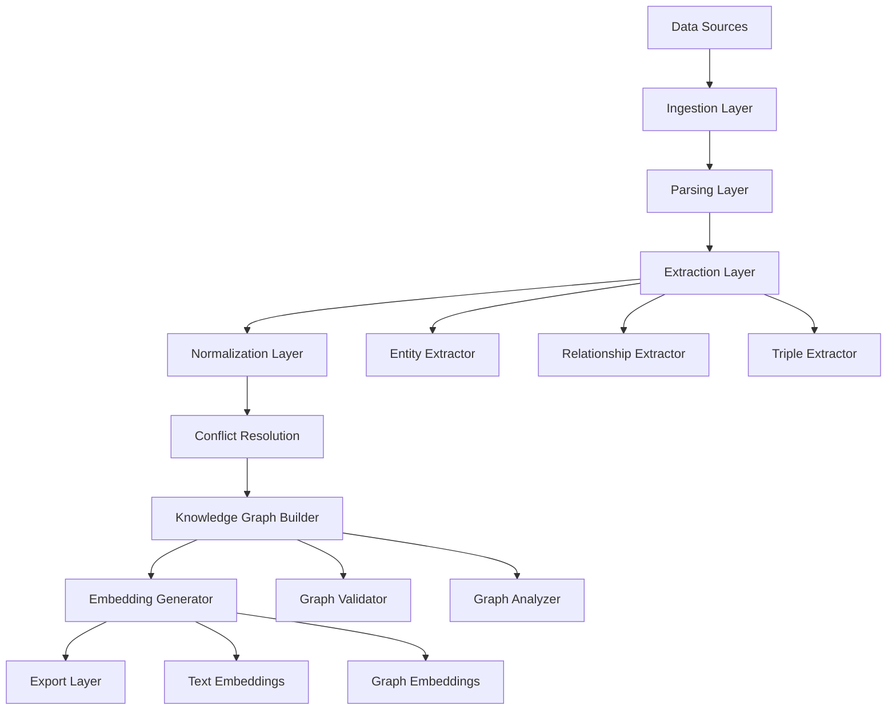
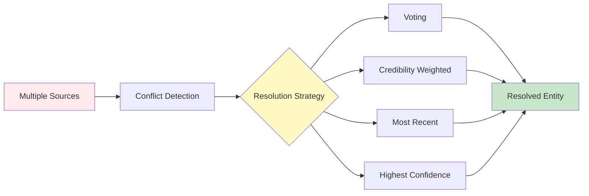
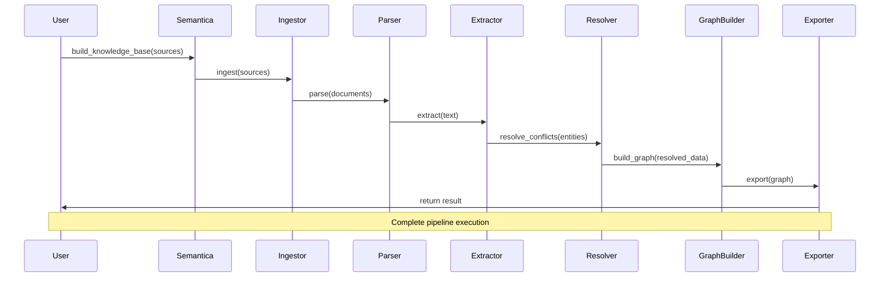

# Deep Dive

Advanced topics, architecture, and internals of Semantica.

## Architecture Overview

Semantica follows a modular, extensible architecture:



## System Components

### 1. Ingestion Layer

Handles data input from various sources:

- **File Ingestor**: PDF, DOCX, HTML, JSON, CSV
- **Web Ingestor**: URLs, web scraping
- **Database Ingestor**: SQL databases
- **Stream Ingestor**: Real-time data streams

### 2. Parsing Layer

Converts raw data into structured format:

- Document parsing (PDF, Word, etc.)
- Text extraction
- Metadata extraction
- Format normalization

### 3. Extraction Layer

Core semantic extraction:

```python
# Entity extraction pipeline
text → Tokenization → NER → Entity Linking → Entity Validation
```

**Components:**
- Named Entity Recognition (NER)
- Relationship Extraction
- Triple Extraction
- Coreference Resolution

### 4. Normalization Layer

Standardizes extracted data:

- Entity normalization
- Date/time normalization
- Number normalization
- Text cleaning

### 5. Conflict Resolution

Handles conflicting information:



### 6. Knowledge Graph Builder

Constructs the knowledge graph:

- Node creation (entities)
- Edge creation (relationships)
- Property assignment
- Graph validation
- Quality checks

### 7. Embedding Generator

Generates vector representations:

- Text embeddings (sentence transformers)
- Graph embeddings (node2vec, GraphSAGE)
- Multimodal embeddings

## Data Flow



## Advanced Concepts

### Entity Resolution

Matching entities across sources:

```python
# Entity resolution algorithm
def resolve_entities(entities):
    clusters = []
    for entity in entities:
        matched = False
        for cluster in clusters:
            if similarity(entity, cluster.representative) > threshold:
                cluster.add(entity)
                matched = True
                break
        if not matched:
            clusters.append(EntityCluster(entity))
    return clusters
```

### Relationship Inference

Inferring implicit relationships:

- Transitive relationships
- Temporal relationships
- Causal relationships
- Hierarchical relationships

### Graph Optimization

Optimizing knowledge graph structure:

- Node deduplication
- Edge consolidation
- Path compression
- Index optimization

## Performance Considerations

### Scalability

- **Horizontal Scaling**: Process multiple documents in parallel
- **Vertical Scaling**: Use GPU acceleration
- **Caching**: Cache embeddings and parsed documents
- **Lazy Loading**: Load components on demand

### Memory Management

```python
# Process large datasets efficiently
def process_large_dataset(sources, batch_size=100):
    for i in range(0, len(sources), batch_size):
        batch = sources[i:i+batch_size]
        result = semantica.build_knowledge_base(batch)
        # Save and clear memory
        save_result(result)
        del result
        gc.collect()
```

## Extension Points

### Custom Plugins

Create custom plugins:

```python
from semantica.core import Plugin

class CustomPlugin(Plugin):
    def process(self, data):
        # Your custom processing
        return processed_data
```

### Custom Extractors

Implement custom extractors:

```python
from semantica.semantic_extract import BaseExtractor

class DomainSpecificExtractor(BaseExtractor):
    def extract_entities(self, text):
        # Domain-specific extraction logic
        return entities
```

## Internal APIs

### Core APIs

- `Semantica.build_knowledge_base()` - Main entry point
- `KGBuilder.build()` - Graph construction
- `ConflictResolver.resolve()` - Conflict resolution
- `EmbeddingGenerator.generate()` - Embedding generation

### Extension APIs

- Plugin registration
- Custom extractor registration
- Custom exporter registration
- Event hooks

## Design Decisions

### Why Modular Architecture?

- **Extensibility**: Easy to add new features
- **Testability**: Components can be tested independently
- **Maintainability**: Clear separation of concerns
- **Flexibility**: Swap implementations easily

### Why Conflict Resolution?

- **Data Quality**: Ensures consistent knowledge
- **Multi-Source**: Handles conflicting information
- **Flexibility**: Multiple resolution strategies
- **Transparency**: Track resolution decisions

## Future Enhancements

Planned improvements:

- Distributed processing
- Real-time streaming
- Advanced reasoning
- Multi-modal support expansion
- Enhanced visualization

## Contributing to Core

Interested in contributing to Semantica's core? See our [Contributing Guide](https://github.com/Hawksight-AI/semantica/blob/main/CONTRIBUTING.md).

---

For more information:
- **[API Reference](api.md)** - Detailed API documentation
- **[Learning More](learning-more.md)** - Additional resources
- **[GitHub Repository](https://github.com/Hawksight-AI/semantica)** - Source code

