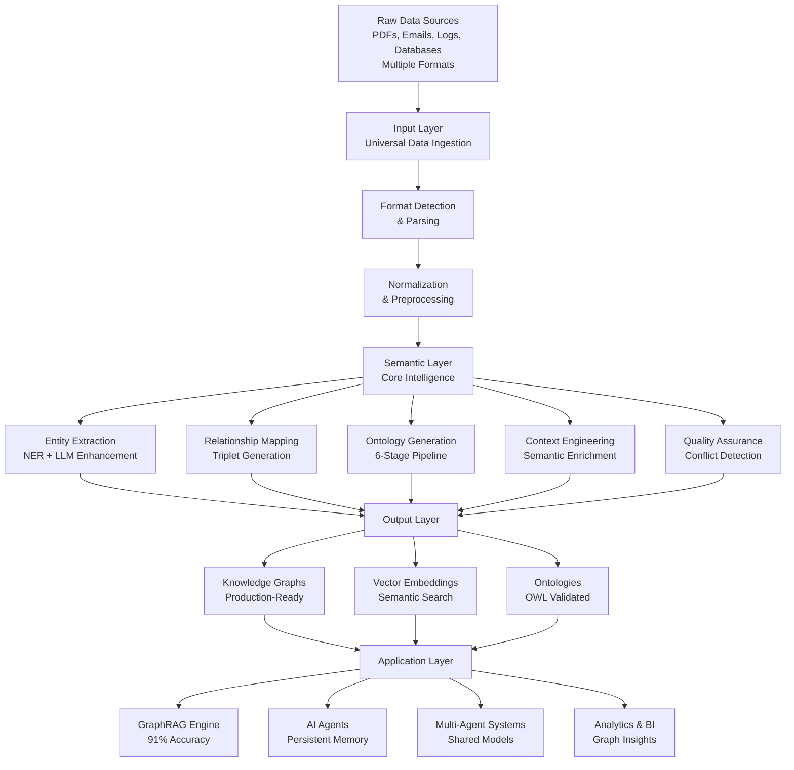

<div align="center">
  
  
  <h1>🧠 Semantica</h1>
  
  <a href="https://www.python.org/downloads/"></a>
  <a href="https://opensource.org/licenses/MIT"></a>
  <a href="https://badge.fury.io/py/semantica"></a>
  <a href="https://pepy.tech/project/semantica"></a>
  <a href="https://semantica.readthedocs.io/"></a>
  <a href="https://discord.gg/semantica"></a>
  
  <p><strong>Open Source Framework for Semantic Layer & Knowledge Engineering</strong></p>
  
  <p><strong>Transform chaotic data into intelligent knowledge.</strong></p>
  
  <p><em>The missing fabric between raw data and AI engineering. A comprehensive open-source framework for building semantic layers and knowledge engineering systems that transform unstructured data into AI-ready knowledge — powering Knowledge Graph-Powered RAG (GraphRAG), AI Agents, Multi-Agent Systems, and AI applications with structured semantic knowledge.</em></p>
  
  <p>🆓 <strong>100% Open Source</strong> • 📜 <strong>MIT Licensed</strong> • 🚀 <strong>Production Ready</strong> • 🌍 <strong>Community Driven</strong></p>
  
  <p>
    <a href="getting-started/" class="md-button md-button--primary">Get Started</a>
    <a href="https://github.com/Hawksight-AI/semantica" class="md-button">View on GitHub</a>
  </p>
</div>

---

## 🌟 What is Semantica?

Semantica bridges the gap between raw data chaos and AI-ready knowledge. It's a **semantic intelligence platform** that transforms unstructured data into structured, queryable knowledge graphs powering GraphRAG, AI agents, and multi-agent systems.

### What Makes Semantica Different?

Unlike traditional approaches that process isolated documents and extract text into vectors, Semantica understands **semantic relationships across all content**, provides **automated ontology generation**, and builds a **unified semantic layer** with **production-grade QA**.

| **Traditional Approaches** | **Semantica's Approach** |
|:---------------------------|:-------------------------|
| Process data as isolated documents | **Understands semantic relationships across all content** |
| Extract text and store vectors | **Builds knowledge graphs with meaningful connections** |
| Generic entity recognition | **General-purpose ontology generation and validation** |
| Manual schema definition | **Automatic semantic modeling from content patterns** |
| Disconnected data silos | **Unified semantic layer across all data sources** |
| Basic quality checks | **Production-grade QA with conflict detection & resolution** |

---

## 🎯 The Problem We Solve

### The Semantic Gap

Organizations today face a **fundamental mismatch** between how data exists and how AI systems need it.

#### The Semantic Gap: Problem vs. Solution

Organizations have **unstructured data** (PDFs, emails, logs), **messy data** (inconsistent formats, duplicates, conflicts), and **disconnected silos** (no shared context, missing relationships). AI systems need **clear rules** (formal ontologies), **structured entities** (validated, consistent), and **relationships** (semantic connections, context-aware reasoning).

| **What Organizations Have** | **What AI Systems Require** |
|:------------------------------|:------------------------------|
| **Unstructured Data** | **Clear Rules** |
| PDFs, emails, logs | Formal ontologies |
| Mixed schemas | Graphs & Networks |
| Conflicting facts | |
| **Messy, Noisy Data** | **Structured Entities** |
| Inconsistent formats | Validated entities |
| Duplicate records | Domain Knowledge |
| Missing relationships | |
| **Disconnected, Siloed Data** | **Relationships** |
| Data in separate systems | Semantic connections |
| No shared context | Context-Aware Reasoning |
| Isolated knowledge | |

### What Happens Without Semantics?

**They Break** — Systems crash due to inconsistent formats and missing structure.

**They Hallucinate** — AI models generate false information without semantic context to validate outputs.

**They Fail Silently** — Systems return wrong answers without warnings, leading to bad decisions.

**Why?** Systems have data — not semantics. They can't connect concepts, understand relationships, validate against domain rules, or detect conflicts.

### The Semantica Framework

Semantica operates through three integrated layers that transform raw data into AI-ready knowledge:

**Input Layer** — Universal ingestion from multiple data formats (PDFs, DOCX, HTML, JSON, CSV, databases, live feeds, APIs, streams, archives, multi-modal content) into a unified pipeline.

**Semantic Layer** — Core intelligence engine performing entity extraction, relationship mapping, ontology generation, context engineering, and quality assurance. Includes **advanced entity deduplication** (Jaro-Winkler, disjoint property handling) to ensure a clean single source of truth.

**Output Layer** — Production-ready knowledge graphs, vector embeddings, and validated ontologies that power GraphRAG systems, AI agents, and multi-agent systems.

**Powers: GraphRAG, AI Agents, Multi-Agent Systems**

#### Semantica Processing Flow



---

## 💡 The Semantica Solution

**Semantica** is an **open-source framework** that closes the semantic gap between real-world messy data and the structured semantic layers required by advanced AI systems — GraphRAG, agents, multi-agent systems, reasoning models, and more.

### How Semantica Solves These Problems

<div class="grid cards" markdown>

-   :material-lightning-bolt: **Efficient Embeddings**
    ---
    Uses **FastEmbed** by default for high-performance, lightweight local embedding generation (faster than sentence-transformers).

-   :material-database-import: **Universal Data Ingestion**
    ---
    Handles multiple formats (PDF, DOCX, HTML, JSON, CSV, databases, APIs, streams) with unified pipeline, no custom parsers needed.

-   :material-brain: **Automated Semantic Extraction**
    ---
    NER, relationship extraction, and triplet generation with LLM enhancement discovers entities and relationships automatically.

-   :material-graph: **Knowledge Graph Construction**
    ---
    Production-ready graphs with entity resolution, temporal support, and graph analytics. Queryable knowledge ready for AI applications.

-   :material-robot: **GraphRAG Engine**
    ---
    Hybrid vector + graph retrieval achieves **91% accuracy** (30% improvement) via semantic search + graph traversal for multi-hop reasoning.

-   :material-account-cog: **AI Agent Context Engineering**
    ---
    Persistent memory with RAG + knowledge graphs enables context maintenance, action validation, and structured knowledge access.

-   :material-book-open-variant: **Automated Ontology Generation**
    ---
    6-stage LLM pipeline generates validated OWL ontologies with HermiT/Pellet validation, eliminating manual engineering.

-   :material-shield-check: **Production-Grade QA**
    ---
    Conflict detection, deduplication, quality scoring, and provenance tracking ensure trusted, production-ready knowledge graphs.

-   :material-cog-transfer: **Pipeline Orchestration**
    ---
    Flexible pipeline builder with parallel execution enables scalable processing via orchestrator-worker pattern.

</div>

### Core Features at a Glance

| **Feature Category** | **Capabilities** | **Key Benefits** |
|:---------------------|:-----------------|:------------------|
| **Data Ingestion** | Multiple formats (PDF, DOCX, HTML, JSON, CSV, databases, APIs, streams, archives) | Universal ingestion, no custom parsers needed |
| **Semantic Extraction** | NER, relationship extraction, triplet generation, LLM enhancement | Automated discovery of entities and relationships |
| **Knowledge Graphs** | Entity resolution, temporal support, graph analytics, query interface | Production-ready, queryable knowledge structures |
| **Ontology Generation** | 6-stage LLM pipeline, OWL generation, HermiT/Pellet validation | Automated ontology creation from documents |
| **GraphRAG** | Hybrid vector + graph retrieval, multi-hop reasoning | 91% accuracy, 30% improvement over vector-only |
| **Agent Memory** | Persistent memory (Save/Load), Hybrid Retrieval (Vector+Graph), FastEmbed support | Context-aware agents with semantic understanding |
| **Pipeline Orchestration** | Parallel execution, custom steps, orchestrator-worker pattern | Scalable, flexible data processing |
| **Quality Assurance** | Conflict detection, deduplication, quality scoring, provenance | Trusted knowledge graphs ready for production |

---

## ✨ Core Capabilities

### 1. 📊 Universal Data Ingestion

Process **multiple file formats** with intelligent semantic extraction:

<div class="grid cards" markdown>

-   __📄 Documents__
    ---
    - PDF (with OCR)
    - DOCX, XLSX, PPTX
    - TXT, RTF, ODT
    - EPUB, LaTeX, Markdown

-   __🌐 Web & Feeds__
    ---
    - HTML, XHTML, XML
    - RSS, Atom feeds
    - JSON-LD, RDFa
    - Web scraping

-   __💾 Structured Data__
    ---
    - JSON, YAML, TOML
    - CSV, TSV, Excel
    - Parquet, Avro, ORC
    - SQL/NoSQL databases

-   __📧 Communication__
    ---
    - EML, MSG, MBOX
    - PST archives
    - Email threads
    - Attachment extraction

-   __🗜️ Archives__
    ---
    - ZIP, TAR, RAR, 7Z
    - Recursive processing
    - Multi-level extraction

-   __🔬 Scientific__
    ---
    - BibTeX, EndNote, RIS
    - JATS XML
    - PubMed formats
    - Citation networks

</div>

### 2. 🧠 Semantic Intelligence Engine

Transform raw text into structured semantic knowledge with state-of-the-art NLP and AI models:

- **Named Entity Recognition (NER)**: Extract people, organizations, locations, dates, and custom entities
- **Relationship Extraction**: Identify semantic, temporal, and causal relationships
- **Event Detection**: Detect and classify events (acquisitions, partnerships, announcements)
- **Coreference Resolution**: Resolve pronouns and entity mentions across documents
- **Triplet Extraction**: Generate RDF triplets for knowledge graph construction

### 3. 🕸️ Knowledge Graph Construction

Build production-ready knowledge graphs with:

- **Automatic Entity Resolution**: Merge duplicate entities with fuzzy matching
- **Conflict Detection & Resolution**: Handle contradictory information from multiple sources
- **Temporal Knowledge Graphs**: Track changes over time with version history
- **Graph Analytics**: Centrality, community detection, path finding
- **Multi-Format Export**: Neo4j, RDF, JSON-LD, GraphML

### 4. 📚 Ontology Generation & Management

Generate formal ontologies automatically using a **6-stage LLM-based pipeline**:

1. **Semantic Network Parsing** → Extract domain concepts
2. **YAML-to-Definition** → Transform into class definitions
3. **Definition-to-Types** → Map to OWL types
4. **Hierarchy Generation** → Build taxonomic structures
5. **TTL Generation** → Generate OWL/Turtle syntax
6. **Symbolic Validation** → HermiT/Pellet reasoning (F1 up to 0.99)

### 5. 🔍 Hybrid Search & Retrieval

Power GraphRAG applications with:

- **Vector Search**: Semantic similarity using embeddings
- **Graph Traversal**: Multi-hop reasoning for context expansion
- **Hybrid Retrieval**: Combine vector + graph for improved accuracy
- **Temporal Queries**: Query knowledge at specific time points

---

## 🚀 Choose Your Path

<div class="grid cards" markdown>

-   :material-rocket-launch: **Quick Start**
    ---
    Get up and running with Semantica in minutes. Learn the basics of ingestion and extraction.
    
    [:arrow_right: Start Here](getting-started.md)

-   :material-book-open-page-variant: **Core Concepts**
    ---
    Deep dive into Knowledge Graphs, Ontologies, and Semantic Reasoning.
    
    [:arrow_right: Learn Concepts](concepts.md)

-   :material-code-braces: **API Reference**
    ---
    Detailed technical documentation for all Semantica modules and classes.
    
    [:arrow_right: View API](reference/core.md)

-   :material-chef-hat: **Cookbook**
    ---
    Interactive tutorials, real-world examples, and **14 domain-specific cookbooks**.
    
    [:arrow_right: Explore Cookbook](cookbook.md)

</div>

---

## 📦 Installation

!!! success "Now Available on PyPI!"
    Semantica is officially published on PyPI! Install it with a single command.

=== "From PyPI (Recommended)"

    Install Semantica directly from PyPI:

    ```bash
    # Install the core package
    pip install semantica

    # Or install with all optional dependencies
    pip install semantica[all]
    ```

=== "From Source"

    Install from the local source for the latest development version:

    ```bash
    # Clone the repository
    git clone https://github.com/Hawksight-AI/semantica.git
    cd semantica

    # Install in editable mode with core dependencies
    pip install -e .

    # Or install with all optional dependencies
    pip install -e ".[all]"
    ```

=== "Development"

    For contributors who want to modify the framework:

    ```bash
    # Clone the repository
    git clone https://github.com/Hawksight-AI/semantica.git
    cd semantica

    # Install in editable mode with dev dependencies
    pip install -e ".[dev]"
    ```

=== "Docker"

    Run Semantica in a containerized environment:

    ```bash
    docker pull semantica/semantica:latest
    docker run -it semantica/semantica
    ```

---

## 🚦 Quick Example

Semantica uses a modular architecture. You can use individual modules directly for maximum flexibility:

```python
from semantica.ingest import FileIngestor
from semantica.parse import DocumentParser
from semantica.semantic_extract import NERExtractor, RelationExtractor
from semantica.kg import GraphBuilder

# 1. Ingest documents
ingestor = FileIngestor()
documents = ingestor.ingest_directory("documents/", recursive=True)

# 2. Parse documents
parser = DocumentParser()
parsed_docs = [parser.parse_document(doc) for doc in documents]

# 3. Extract entities and relationships
ner = NERExtractor()
rel_extractor = RelationExtractor()

entities = []
relationships = []
for doc in parsed_docs:
    text = doc.get("full_text", "")
    doc_entities = ner.extract_entities(text)
    doc_rels = rel_extractor.extract_relations(text, entities=doc_entities)
    entities.extend(doc_entities)
    relationships.extend(doc_rels)

# 4. Build knowledge graph
builder = GraphBuilder(merge_entities=True)
kg = builder.build_graph(entities=entities, relationships=relationships)

print(f"Created graph with {len(kg.nodes)} nodes and {len(kg.edges)} edges")
```

!!! tip "Orchestration Option"
    For complex workflows, you can also use the `Semantica` class for orchestration. See the [Core Module](reference/core.md) documentation for details.

---

## 🎯 Why Semantica?

<div class="grid cards" markdown>

-   **🆓 100% Open Source**
    ---
    MIT licensed. No vendor lock-in. Full transparency.

-   **🚀 Production Ready**
    ---
    Battle-tested with quality assurance, conflict resolution, and validation.

-   **🧩 Modular Architecture**
    ---
    Use only what you need. Swap components easily.

-   **🌍 Community Driven**
    ---
    Built by developers, for developers. Active Discord community.

-   **📚 Comprehensive**
    ---
    End-to-end solution from ingestion to reasoning. No duct-taping required.

-   **🔬 Research-Backed**
    ---
    Based on latest research in knowledge graphs, ontologies, and semantic web.

</div>

---

## 🏗️ Built For

- **Data Scientists**: Transform messy data into clean knowledge graphs
- **Data Engineers**: Build scalable data pipelines with semantic enrichment
- **AI Engineers**: Build GraphRAG, AI agents, and multi-agent systems
- **Knowledge Engineers**: Generate and manage formal ontologies
- **Ontologists**: Design and validate domain-specific ontologies and taxonomies
- **Researchers**: Analyze scientific literature and build citation networks
- **ML Engineers**: Create semantic features for machine learning models
- **Enterprises**: Unify data silos into a semantic layer

---

## 📚 Learn More

- [Getting Started Guide](getting-started.md) - Your first knowledge graph in 5 minutes
- [Core Concepts](concepts.md) - Deep dive into knowledge graphs and ontologies
- [Cookbook](cookbook.md) - Real-world examples and **14 domain-specific cookbooks**
- [API Reference](reference/core.md) - Complete technical documentation

### 🍳 Recommended Cookbook Tutorials

Get hands-on with interactive Jupyter notebooks:

- **[Welcome to Semantica](https://github.com/Hawksight-AI/semantica/blob/main/cookbook/introduction/01_Welcome_to_Semantica.ipynb)**: Comprehensive introduction to all Semantica modules
  - **Topics**: Framework overview, all modules, architecture
  - **Difficulty**: Beginner
  - **Use Cases**: First-time users, understanding the framework

- **[Your First Knowledge Graph](https://github.com/Hawksight-AI/semantica/blob/main/cookbook/introduction/08_Your_First_Knowledge_Graph.ipynb)**: Build your first knowledge graph from scratch
  - **Topics**: Entity extraction, relationship extraction, graph construction
  - **Difficulty**: Beginner
  - **Use Cases**: Learning the basics, quick start

- **[GraphRAG Complete](https://github.com/Hawksight-AI/semantica/blob/main/cookbook/use_cases/advanced_rag/01_GraphRAG_Complete.ipynb)**: Production-ready Graph Retrieval Augmented Generation
  - **Topics**: GraphRAG, hybrid retrieval, vector search, graph traversal
  - **Difficulty**: Advanced
  - **Use Cases**: Building AI applications with knowledge graphs

---

<div align="center">

**Ready to transform your data into knowledge?**

[Get Started Now](getting-started.md){ .md-button .md-button--primary }
[Join Discord](https://discord.gg/semantica){ .md-button }

</div>
