<div align="center">
  
</div>

<p align="center">
  <h1 align="center">🧠 Semantica</h1>
</p>

<p align="center">
  <a href="https://www.python.org/downloads/"></a>
  <a href="https://opensource.org/licenses/MIT"></a>
  <a href="https://badge.fury.io/py/semantica"></a>
  <a href="https://pepy.tech/project/semantica"></a>
  <a href="https://semantica.readthedocs.io/"></a>
  <a href="https://discord.gg/semantica"></a>
</p>

<p align="center">
  <strong>Open Source Framework for building Semantic Layers and Knowledge Engineering</strong>
</p>

<p align="center">
  <strong>Transform chaotic data into intelligent knowledge.</strong>
</p>

<p align="center">
  <em>The missing fabric between raw data and AI engineering. A comprehensive open-source framework for building semantic layers and knowledge engineering systems that transform unstructured data into AI-ready knowledge — powering Knowledge Graph-Powered RAG (GraphRAG), AI Agents, Multi-Agent Systems, and AI applications with structured semantic knowledge.</em>
</p>

<p align="center">
  🆓 <strong>100% Open Source</strong> • 📜 <strong>MIT Licensed</strong> • 🚀 <strong>Production Ready</strong> • 🌍 <strong>Community Driven</strong>
</p>

<p align="center">
  <a href="getting-started/" class="md-button md-button--primary">Get Started</a>
  <a href="https://github.com/Hawksight-AI/semantica" class="md-button">View on GitHub</a>
</p>

---

## 🎯 The Problem We Solve

### The Data-to-AI Gap

Modern organizations face a fundamental challenge: **the semantic gap between raw data and AI systems**.

You have mountains of data—PDFs, emails, documents, databases—but AI systems need structured, validated knowledge with semantic relationships. This gap is the #1 blocker for production AI.

```mermaid
flowchart TD
    subgraph RawData ["📦 RAW DATA CHAOS"]
        direction TB
        A["📄 PDFs & Documents"]
        B["📧 Emails & Chat"]
        C["💾 Databases"]
        D["🌐 Web Content"]
    end

    subgraph Gap ["❌ THE SEMANTIC GAP"]
        direction TB
        X["MISSING LAYER"]
        X1["No Context"]
        X2["No Relationships"]
        X3["No Validation"]
        X --> X1
        X --> X2
        X --> X3
    end

    subgraph AI ["🤖 AI SYSTEMS NEEDS"]
        direction TB
        F["AI Agents"]
        G["GraphRAG"]
        H["Reasoning"]
        I["Multi-Agent"]
    end

    RawData ==>|"Unstructured Noise"| Gap
    Gap ==>|"Hallucinations & Errors"| AI
    
    style Gap fill:#ffebee,stroke:#c62828,stroke-width:3px,stroke-dasharray: 5 5
    style RawData fill:#f5f5f5,stroke:#616161,stroke-width:2px
    style AI fill:#e3f2fd,stroke:#1565c0,stroke-width:2px
```



### Real-World Consequences

**Without a semantic layer, your AI systems fail:**

<div class="grid cards" markdown>

-   **🔴 RAG Systems Fail**
    ---
    - Vector search alone misses crucial relationships
    - No graph traversal for context expansion
    - Significantly lower accuracy than hybrid approaches
    - Can't answer multi-hop questions

-   **🔴 AI Agents Hallucinate**
    ---
    - No ontological constraints to validate actions
    - Missing semantic routing for intent understanding
    - No persistent memory across conversations
    - Can't reason about domain rules

-   **🔴 Multi-Agent Coordination Fails**
    ---
    - No shared semantic models for collaboration
    - Unable to validate actions against domain rules
    - Conflicting knowledge representations
    - Agents work in silos, not as a team

-   **🔴 Knowledge Is Untrusted**
    ---
    - Duplicate entities pollute graphs
    - Conflicting facts from different sources
    - No provenance tracking or validation
    - Can't explain where knowledge came from

</div>

---

## 🌟 What is Semantica?

Semantica is the **first comprehensive open-source framework** that bridges the critical gap between raw data chaos and AI-ready knowledge. It's not just another data processing library—it's a complete **semantic intelligence platform** that transforms unstructured information into structured, queryable knowledge graphs.

### The Vision

In the era of AI agents and autonomous systems, **data alone isn't enough. Context is king.** Semantica provides the semantic infrastructure that enables AI systems to truly understand, reason about, and act upon information with human-like comprehension.

### What Makes Semantica Different?

| Traditional Approaches | Semantica's Approach |
|------------------------|---------------------|
| Process data as isolated documents | **Understands semantic relationships across all content** |
| Extract text and store vectors | **Builds knowledge graphs with meaningful connections** |
| Generic entity recognition | **General-purpose ontology generation and validation** |
| Manual schema definition | **Automatic semantic modeling from content patterns** |
| Disconnected data silos | **Unified semantic layer across all data sources** |
| Basic quality checks | **Production-grade QA with conflict detection & resolution** |

---

## ✅ The Semantica Solution

Semantica fills the semantic gap with a **complete intelligence framework**:

```mermaid
flowchart TD
    subgraph Input ["📥 INPUT LAYER"]
        direction TB
        I1["Files & Documents"]
        I2["API Streams"]
        I3["Databases"]
    end

    subgraph Engine ["🧠 SEMANTICA ENGINE"]
        direction TB
        S1["Entity Extraction"]
        S2["Relation Mapping"]
        S3["Ontology Generation"]
        S4["Conflict Resolution"]
    end

    subgraph Output ["📤 KNOWLEDGE OUTPUT"]
        direction TB
        O1["Knowledge Graph"]
        O2["Vector Store"]
        O3["Reasoning API"]
    end

    Input ====>|"<b>Ingest & Parse</b>"| Engine
    Engine ====>|"<b>Synthesize & Validate</b>"| Output

    style Engine fill:#e8f5e9,stroke:#2e7d32,stroke-width:3px
    style Input fill:#f5f5f5,stroke:#616161,stroke-width:2px
    style Output fill:#e3f2fd,stroke:#1565c0,stroke-width:2px
```



### Powers Next-Gen AI Applications

- **GraphRAG**: Hybrid retrieval combining vector search + graph traversal for improved accuracy
- **AI Agents**: Ontology-constrained actions with semantic routing and persistent memory
- **Multi-Agent Systems**: Shared semantic models for coordinated decision-making
- **Knowledge Engineering**: Production-grade knowledge graphs with provenance and validation

---

## 🚀 Choose Your Path

<div class="grid cards" markdown>

-   :material-rocket-launch: **Quick Start**
    ---
    Get up and running with Semantica in minutes. Learn the basics of ingestion and extraction.
    
    [:arrow_right: Start Here](getting-started.md)

-   :material-book-open-page-variant: **Core Concepts**
    ---
    Deep dive into Knowledge Graphs, Ontologies, and Semantic Reasoning.
    
    [:arrow_right: Learn Concepts](concepts.md)

-   :material-code-braces: **API Reference**
    ---
    Detailed technical documentation for all Semantica modules and classes.
    
    [:arrow_right: View API](reference/core.md)

-   :material-chef-hat: **Cookbook**
    ---
    Interactive tutorials, real-world examples, and copy-paste recipes.
    
    [:arrow_right: Explore Cookbook](cookbook.md)

</div>

---

## 📦 Installation

!!! success "Now Available on PyPI!"
    Semantica is officially published on PyPI! Install it with a single command.

=== "From PyPI (Recommended)"

    Install Semantica directly from PyPI:

    ```bash
    # Install the core package
    pip install semantica

    # Or install with all optional dependencies
    pip install semantica[all]
    ```

=== "From Source"

    Install from the local source for the latest development version:

    ```bash
    # Clone the repository
    git clone https://github.com/Hawksight-AI/semantica.git
    cd semantica

    # Install in editable mode with core dependencies
    pip install -e .

    # Or install with all optional dependencies
    pip install -e ".[all]"
    ```

=== "Development"

    For contributors who want to modify the framework:

    ```bash
    # Clone the repository
    git clone https://github.com/Hawksight-AI/semantica.git
    cd semantica

    # Install in editable mode with dev dependencies
    pip install -e ".[dev]"
    ```

=== "Docker"

    Run Semantica in a containerized environment:

    ```bash
    docker pull semantica/semantica:latest
    docker run -it semantica/semantica
    ```

---

## ✨ Core Capabilities

### 1. 📊 Universal Data Ingestion

Process **50+ file formats** with intelligent semantic extraction:

<div class="grid cards" markdown>

-   __📄 Documents__
    ---
    - PDF (with OCR)
    - DOCX, XLSX, PPTX
    - TXT, RTF, ODT
    - EPUB, LaTeX, Markdown

-   __🌐 Web & Feeds__
    ---
    - HTML, XHTML, XML
    - RSS, Atom feeds
    - JSON-LD, RDFa
    - Web scraping

-   __💾 Structured Data__
    ---
    - JSON, YAML, TOML
    - CSV, TSV, Excel
    - Parquet, Avro, ORC
    - SQL/NoSQL databases

-   __📧 Communication__
    ---
    - EML, MSG, MBOX
    - PST archives
    - Email threads
    - Attachment extraction

-   __🗜️ Archives__
    ---
    - ZIP, TAR, RAR, 7Z
    - Recursive processing
    - Multi-level extraction

-   __🔬 Scientific__
    ---
    - BibTeX, EndNote, RIS
    - JATS XML
    - PubMed formats
    - Citation networks

</div>

### 2. 🧠 Semantic Intelligence Engine

Transform raw text into structured semantic knowledge with state-of-the-art NLP and AI models:

- **Named Entity Recognition (NER)**: Extract people, organizations, locations, dates, and custom entities
- **Relationship Extraction**: Identify semantic, temporal, and causal relationships
- **Event Detection**: Detect and classify events (acquisitions, partnerships, announcements)
- **Coreference Resolution**: Resolve pronouns and entity mentions across documents
- **Triplet Extraction**: Generate RDF triplets for knowledge graph construction

### 3. 🕸️ Knowledge Graph Construction

Build production-ready knowledge graphs with:

- **Automatic Entity Resolution**: Merge duplicate entities with fuzzy matching
- **Conflict Detection & Resolution**: Handle contradictory information from multiple sources
- **Temporal Knowledge Graphs**: Track changes over time with version history
- **Graph Analytics**: Centrality, community detection, path finding
- **Multi-Format Export**: Neo4j, RDF, JSON-LD, GraphML

### 4. 📚 Ontology Generation & Management

Generate formal ontologies automatically using a **6-stage LLM-based pipeline**:

1. **Semantic Network Parsing** → Extract domain concepts
2. **YAML-to-Definition** → Transform into class definitions
3. **Definition-to-Types** → Map to OWL types
4. **Hierarchy Generation** → Build taxonomic structures
5. **TTL Generation** → Generate OWL/Turtle syntax
6. **Symbolic Validation** → HermiT/Pellet reasoning (F1 up to 0.99)

### 5. 🔍 Hybrid Search & Retrieval

Power GraphRAG applications with:

- **Vector Search**: Semantic similarity using embeddings
- **Graph Traversal**: Multi-hop reasoning for context expansion
- **Hybrid Retrieval**: Combine vector + graph for improved accuracy
- **Temporal Queries**: Query knowledge at specific time points

---

## 🎯 Why Semantica?

<div class="grid cards" markdown>

-   **🆓 100% Open Source**
    ---
    MIT licensed. No vendor lock-in. Full transparency.

-   **🚀 Production Ready**
    ---
    Battle-tested with quality assurance, conflict resolution, and validation.

-   **🧩 Modular Architecture**
    ---
    Use only what you need. Swap components easily.

-   **🌍 Community Driven**
    ---
    Built by developers, for developers. Active Discord community.

-   **📚 Comprehensive**
    ---
    End-to-end solution from ingestion to reasoning. No duct-taping required.

-   **🔬 Research-Backed**
    ---
    Based on latest research in knowledge graphs, ontologies, and semantic web.

</div>

---

## 🏗️ Built For

- **Data Scientists**: Transform messy data into clean knowledge graphs
- **Data Engineers**: Build scalable data pipelines with semantic enrichment
- **AI Engineers**: Build GraphRAG, AI agents, and multi-agent systems
- **Knowledge Engineers**: Generate and manage formal ontologies
- **Ontologists**: Design and validate domain-specific ontologies and taxonomies
- **Researchers**: Analyze scientific literature and build citation networks
- **ML Engineers**: Create semantic features for machine learning models
- **Enterprises**: Unify data silos into a semantic layer

---

## 🚦 Quick Example

```python
from semantica import Semantica

# Initialize
core = Semantica()

# Ingest documents
docs = core.ingest.load("documents/", recursive=True)

# Build knowledge graph
kg = core.kg.build_graph(docs, merge_entities=True)

# Query
result = kg.query("Who founded Apple Inc.?")
print(result.answer)  # Steve Jobs, Steve Wozniak, Ronald Wayne
print(result.confidence)  # 0.98
```

---

## � Learn More

- [Getting Started Guide](getting-started.md) - Your first knowledge graph in 5 minutes
- [Core Concepts](concepts.md) - Deep dive into knowledge graphs and ontologies
- [Cookbook](cookbook.md) - Real-world examples and tutorials
- [API Reference](reference/core.md) - Complete technical documentation

---

<div align="center">

**Ready to transform your data into knowledge?**

[Get Started Now](getting-started.md){ .md-button .md-button--primary }
[Join Discord](https://discord.gg/semantica){ .md-button }

</div>
