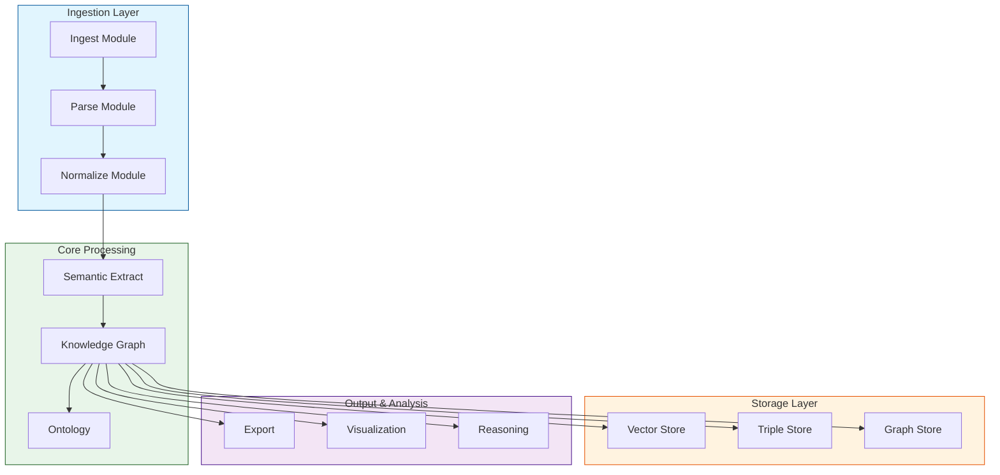
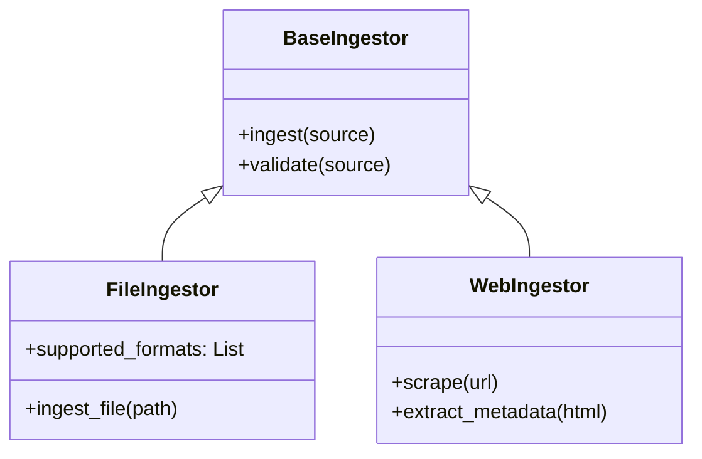
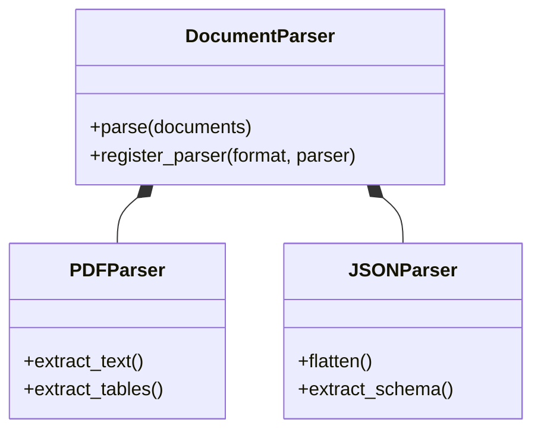
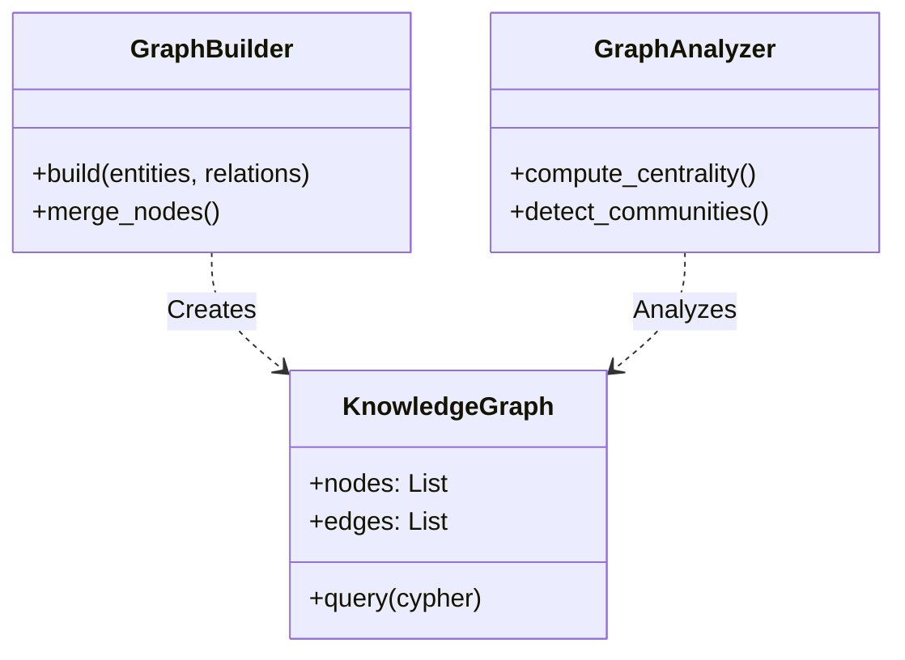
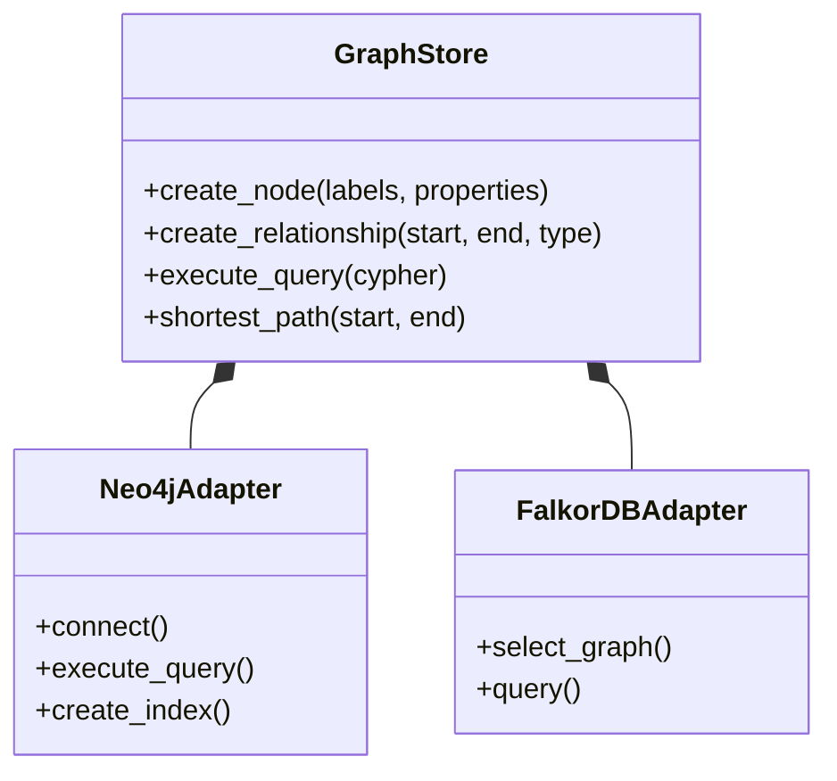

# Modules & Architecture

Semantica is built with a modular architecture, designed to be flexible and extensible. This guide provides an overview of the key modules and their responsibilities.

## 🏗️ Architecture Overview

The framework is organized into several core layers, each handling specific aspects of the semantic processing pipeline.



---

## 📦 Core Modules

Semantica is organized into 13 core modules. Below is a detailed breakdown of each.

### 1. Ingest Module
**Purpose**: Ingest data from various sources into a unified format.

The `ingest` module is the entry point for data. It handles the complexity of connecting to different data sources, from local files to web streams, and supports connecting to your own MCP (Model Context Protocol) servers.

- **Components**:
    - `FileIngestor`: Read files (PDF, DOCX, HTML, JSON, CSV, etc.)
    - `WebIngestor`: Scrape and ingest web pages
    - `FeedIngestor`: Process RSS/Atom feeds
    - `StreamIngestor`: Real-time data streaming
    - `DBIngestor`: Database queries and ingestion
    - `EmailIngestor`: Process email messages
    - `RepoIngestor`: Git repository analysis
    - `MCPIngestor`: Connect to your own Python/FastMCP MCP servers via URL for resource and tool-based data ingestion



```python
from semantica.ingest import FileIngestor, WebIngestor

# Ingest local files
file_ingestor = FileIngestor()
documents = file_ingestor.ingest("data/") # (1)

# Ingest web content
web_ingestor = WebIngestor()
web_docs = web_ingestor.ingest("https://example.com") # (2)
```

1.  Recursively scans the directory for supported file types (PDF, DOCX, etc.) and converts them to standard Document objects.
2.  Fetches the URL, renders JavaScript if necessary, and extracts the main content while stripping boilerplate.

### 2. Parse Module
**Purpose**: Parse and extract content from various raw formats.

Once data is ingested, the `parse` module extracts the raw text and metadata. It supports a wide range of formats and includes OCR capabilities.

- **Components**:
    - `DocumentParser`: Main parser orchestrator
    - `PDFParser`: Extract text, tables, images from PDFs
    - `DOCXParser`: Parse Word documents
    - `HTMLParser`: Extract content from HTML
    - `JSONParser`: Parse structured JSON data
    - `ExcelParser`: Process spreadsheets
    - `ImageParser`: OCR and image analysis
    - `CodeParser`: Parse source code files



```python
from semantica.parse import DocumentParser

parser = DocumentParser()
parsed_docs = parser.parse(documents) # (1)
```

1.  Automatically detects the file type of each document and routes it to the appropriate specialized parser (e.g., PDFParser for .pdf).

### 3. Normalize Module
**Purpose**: Clean and normalize text for processing.

Raw text is often noisy. The `normalize` module cleans, standardizes, and prepares text for semantic extraction.

- **Components**:
    - `TextNormalizer`: Main normalization orchestrator
    - `TextCleaner`: Remove noise, fix encoding
    - `DataCleaner`: Clean structured data
    - `EntityNormalizer`: Normalize entity names
    - `DateNormalizer`: Standardize date formats
    - `NumberNormalizer`: Normalize numeric values
    - `LanguageDetector`: Detect document language
    - `EncodingHandler`: Handle character encoding

```python
from semantica.normalize import TextNormalizer

normalizer = TextNormalizer()
normalized = normalizer.normalize(parsed_docs)
```

### 4. Semantic Extract Module
**Purpose**: Extract entities, relationships, and semantic information.

This is the brain of the operation. It uses LLMs and NLP techniques to understand the text and extract structured knowledge.

- **Components**:
    - `NERExtractor`: Named Entity Recognition
    - `RelationExtractor`: Extract relationships between entities
    - `SemanticAnalyzer`: Deep semantic analysis
    - `SemanticNetworkExtractor`: Extract semantic networks

```python
from semantica.semantic_extract import NERExtractor, RelationExtractor

# Extract entities
extractor = NERExtractor()
entities = extractor.extract(normalized_docs)

# Extract relationships
relation_extractor = RelationExtractor()
relationships = relation_extractor.extract(normalized_docs, entities)
```

### 5. Knowledge Graph (KG) Module
**Purpose**: Build and manage knowledge graphs.

The `kg` module constructs the graph from extracted entities and relationships, handling complex tasks like resolution and analysis.

- **Components**:
    - `GraphBuilder`: Construct knowledge graphs from entities/relationships
    - `GraphAnalyzer`: Analyze graph structure and properties
    - `GraphValidator`: Validate graph quality and consistency
    - `EntityResolver`: Resolve entity conflicts and duplicates
    - `ConflictDetector`: Detect conflicting information
    - `CentralityCalculator`: Calculate node importance metrics
    - `CommunityDetector`: Detect communities in graphs
    - `ConnectivityAnalyzer`: Analyze graph connectivity
    - `TemporalQuery`: Query temporal knowledge graphs
    - `Deduplicator`: Remove duplicate entities/relationships



```python
from semantica.kg import GraphBuilder, GraphAnalyzer

# Build graph
builder = GraphBuilder()
kg = builder.build(entities, relationships) # (1)

# Analyze graph
analyzer = GraphAnalyzer()
metrics = analyzer.analyze(kg) # (2)
```

1.  Constructs a NetworkX or Neo4j graph from the extracted entities and relationships, handling node merging and edge attributes.
2.  Computes graph-theoretic metrics like density, diameter, and centrality to assess the quality and structure of the knowledge graph.

### 6. Embeddings Module
**Purpose**: Generate vector embeddings for various data types.

Embeddings are crucial for semantic search. This module generates vectors for text, images, and graph nodes.

- **Components**:
    - `EmbeddingGenerator`: Main embedding orchestrator
    - `TextEmbedder`: Generate text embeddings
    - `ImageEmbedder`: Generate image embeddings
    - `AudioEmbedder`: Generate audio embeddings
    - `MultimodalEmbedder`: Combine multiple modalities
    - `EmbeddingOptimizer`: Optimize embedding quality
    - `ProviderAdapters`: Support for OpenAI, Cohere, etc.

```python
from semantica.embeddings import EmbeddingGenerator

generator = EmbeddingGenerator()
embeddings = generator.generate(documents)
```

### 7. Vector Store Module
**Purpose**: Store and search vector embeddings.

Manages the storage and retrieval of high-dimensional vectors, supporting hybrid search strategies.

- **Components**:
    - `VectorStore`: Main vector store interface
    - `FAISSAdapter`: FAISS integration
    - `HybridSearch`: Combine vector and keyword search
    - `VectorRetriever`: Retrieve relevant vectors

```python
from semantica.vector_store import VectorStore, HybridSearch

vector_store = VectorStore()
vector_store.store(embeddings, documents, metadata)

hybrid_search = HybridSearch(vector_store)
results = hybrid_search.search(query, top_k=10)
```

### 8. Graph Store Module
**Purpose**: Store and query property graphs with multiple backend support.

The `graph_store` module provides integration with property graph databases like Neo4j, KuzuDB, and FalkorDB for storing and querying knowledge graphs.

- **Components**:
    - `GraphStore`: Main graph store interface
    - `Neo4jAdapter`: Neo4j database integration
    - `KuzuAdapter`: KuzuDB embedded database integration
    - `FalkorDBAdapter`: FalkorDB (Redis-based) integration
    - `NodeManager`: Node CRUD operations
    - `RelationshipManager`: Relationship CRUD operations
    - `QueryEngine`: Cypher query execution
    - `GraphAnalytics`: Graph algorithms and analytics



```python
from semantica.graph_store import GraphStore, create_node, create_relationship

# Using GraphStore class
store = GraphStore(backend="neo4j", uri="bolt://localhost:7687")
store.connect()

# Create nodes
alice = store.create_node(["Person"], {"name": "Alice", "age": 30})
bob = store.create_node(["Person"], {"name": "Bob", "age": 25})

# Create relationship
store.create_relationship(alice["id"], bob["id"], "KNOWS", {"since": 2020})

# Query
results = store.execute_query("MATCH (p:Person) RETURN p.name")

# Or use convenience functions
node = create_node(labels=["Entity"], properties={"name": "Test"})
```

### 9. Reasoning Module
**Purpose**: Perform logical inference and reasoning.

Goes beyond simple retrieval to infer new facts and validate existing knowledge using logical rules.

- **Components**:
    - `InferenceEngine`: Main inference orchestrator
    - `RuleManager`: Manage inference rules
    - `DeductiveReasoner`: Deductive reasoning
    - `AbductiveReasoner`: Abductive reasoning
    - `ExplanationGenerator`: Generate explanations for inferences
    - `RETEEngine`: RETE algorithm for rule matching

```python
from semantica.reasoning import InferenceEngine, RuleManager

inference_engine = InferenceEngine()
rule_manager = RuleManager()
new_facts = inference_engine.forward_chain(kg, rule_manager)
```

### 10. Ontology Module
**Purpose**: Generate and manage ontologies.

Defines the schema and structure of your knowledge domain, ensuring consistency and enabling interoperability.

- **Components**:
    - `OntologyGenerator`: Generate ontologies from knowledge graphs
    - `OntologyValidator`: Validate ontology structure
    - `OWLGenerator`: Generate OWL format ontologies
    - `PropertyGenerator`: Generate ontology properties
    - `ClassInferrer`: Infer ontology classes

```python
from semantica.ontology import OntologyGenerator

generator = OntologyGenerator()
ontology = generator.generate_from_graph(kg)
```

### 11. Export Module
**Purpose**: Export data in various formats.

Allows you to take your knowledge graph and data out of Semantica for use in other tools.

- **Components**:
    - `JSONExporter`: Export to JSON
    - `RDFExporter`: Export to RDF/XML
    - `CSVExporter`: Export to CSV
    - `GraphExporter`: Export to graph formats (GraphML, GEXF)
    - `OWLExporter`: Export to OWL
    - `VectorExporter`: Export vectors

```python
from semantica.export import JSONExporter, RDFExporter

json_exporter = JSONExporter()
json_exporter.export(kg, "output.json")
```

### 12. Visualization Module
**Purpose**: Visualize knowledge graphs and analytics.

Provides tools to visually explore your data, making it easier to understand complex relationships.

- **Components**:
    - `KGVisualizer`: Visualize knowledge graphs
    - `EmbeddingVisualizer`: Visualize embeddings (t-SNE, PCA, UMAP)
    - `QualityVisualizer`: Visualize quality metrics
    - `AnalyticsVisualizer`: Visualize graph analytics
    - `TemporalVisualizer`: Visualize temporal data

```python
from semantica.visualization import KGVisualizer

visualizer = KGVisualizer()
visualizer.visualize(kg)
```

### 13. Pipeline Module
**Purpose**: Build and execute processing pipelines.

Orchestrates the entire flow, connecting modules together into robust, executable workflows.

- **Components**:
    - `PipelineBuilder`: Build complex pipelines
    - `ExecutionEngine`: Execute pipelines
    - `FailureHandler`: Handle pipeline failures
    - `ParallelismManager`: Enable parallel processing
    - `ResourceScheduler`: Schedule resources

```python
from semantica.pipeline import PipelineBuilder

builder = PipelineBuilder()
pipeline = builder.add_step("ingest", FileIngestor()) \
              .add_step("parse", DocumentParser()) \
              .build()
```
