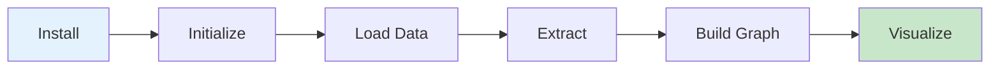

# Quickstart

Get started with Semantica in 5 minutes. This guide will walk you through building your first knowledge graph.

## Overview



## Step 1: Installation

If you haven't installed Semantica yet:

```bash
pip install semantica
```

See the [Installation Guide](installation.md) for detailed instructions.

## Step 2: Your First Knowledge Graph

Let's build a knowledge graph from a document:

```python
from semantica import Semantica

# Initialize Semantica
semantica = Semantica()

# Build knowledge graph from a document
result = semantica.build_knowledge_base(
    sources=["document.pdf"],
    embeddings=True,
    graph=True
)

# Access results
kg = result["knowledge_graph"]
embeddings = result["embeddings"]
statistics = result["statistics"]

print(f"Extracted {len(kg['entities'])} entities")
print(f"Created {len(kg['relationships'])} relationships")
print(f"Generated {len(embeddings)} embeddings")
```

**Expected Output:**
```
Extracted 45 entities
Created 32 relationships
Generated 45 embeddings
```

## Step 3: Extract Entities and Relationships

Extract structured information from text:

```python
from semantica import Semantica

semantica = Semantica()

# Sample text
text = """
Apple Inc. was founded by Steve Jobs in Cupertino, California in 1976.
The company designs and manufactures consumer electronics and software.
Tim Cook is the current CEO of Apple.
"""

# Extract entities
entities_result = semantica.semantic_extract.extract_entities(text)
entities = entities_result["entities"]

print("Extracted Entities:")
for entity in entities:
    print(f"  - {entity['text']} ({entity['type']})")

# Extract relationships
relationships_result = semantica.semantic_extract.extract_relationships(text)
relationships = relationships_result["relationships"]

print("\nExtracted Relationships:")
for rel in relationships:
    print(f"  - {rel['subject']} --[{rel['predicate']}]--> {rel['object']}")
```

**Expected Output:**
```
Extracted Entities:
  - Apple Inc. (ORGANIZATION)
  - Steve Jobs (PERSON)
  - Cupertino (LOCATION)
  - California (LOCATION)
  - Tim Cook (PERSON)

Extracted Relationships:
  - Apple Inc. --[founded_by]--> Steve Jobs
  - Apple Inc. --[located_in]--> Cupertino
  - Apple Inc. --[has_ceo]--> Tim Cook
```

## Step 4: Build Knowledge Graph from Multiple Sources

Combine data from multiple sources:

```python
from semantica import Semantica

semantica = Semantica()

# Multiple data sources
sources = [
    "documents/research_paper.pdf",
    "documents/company_report.docx",
    "https://example.com/news-article"
]

# Build unified knowledge graph
result = semantica.build_knowledge_base(
    sources=sources,
    embeddings=True,
    graph=True,
    normalize=True
)

kg = result["knowledge_graph"]

# Analyze the graph
print(f"Total entities: {len(kg['entities'])}")
print(f"Total relationships: {len(kg['relationships'])}")
print(f"Sources processed: {len(result['metadata']['sources'])}")
```

## Step 5: Visualize Your Knowledge Graph

Visualize the knowledge graph you created:

```python
from semantica import Semantica

semantica = Semantica()

# Build graph
result = semantica.build_knowledge_base(["document.pdf"])
kg = result["knowledge_graph"]

# Visualize
semantica.kg.visualize(kg, output_path="graph.html")
print("Graph visualization saved to graph.html")
```

Open `graph.html` in your browser to see an interactive visualization.

## Step 6: Export Your Knowledge Graph

Export your knowledge graph in various formats:

```python
from semantica import Semantica

semantica = Semantica()

# Build graph
result = semantica.build_knowledge_base(["data.pdf"])
kg = result["knowledge_graph"]

# Export to different formats
semantica.export.to_rdf(kg, "output.rdf")      # RDF/XML format
semantica.export.to_json(kg, "output.json")    # JSON format
semantica.export.to_csv(kg, "output.csv")      # CSV format
semantica.export.to_owl(kg, "output.owl")       # OWL ontology format

print("Exported knowledge graph to multiple formats")
```

## Common Patterns

### Pattern 1: Process Text Directly

```python
from semantica import Semantica

semantica = Semantica()

text = "Your text content here..."
result = semantica.process_document(text)
```

### Pattern 2: Custom Configuration

```python
from semantica import Semantica, Config

# Create custom configuration
config = Config(
    embeddings=True,
    graph=True,
    normalize=True,
    conflict_resolution="voting"
)

semantica = Semantica(config=config)
result = semantica.build_knowledge_base(["document.pdf"])
```

### Pattern 3: Incremental Building

```python
from semantica import Semantica

semantica = Semantica()

# Build incrementally
kg1 = semantica.kg.build_graph(["source1.pdf"])
kg2 = semantica.kg.build_graph(["source2.pdf"])

# Merge knowledge graphs
merged_kg = semantica.kg.merge([kg1, kg2])
```

## Next Steps

Now that you've built your first knowledge graph:

1. **[Explore Examples](examples.md)** - See more advanced use cases
2. **[API Reference](api.md)** - Learn about all available methods
3. **[Cookbook](cookbook.md)** - Interactive Jupyter notebooks
4. **[Full Documentation](../README.md)** - Comprehensive guide

## Troubleshooting

### Common Issues

**Issue**: No entities extracted
- **Solution**: Check that your document contains text content. PDFs with images only won't work without OCR.

**Issue**: Slow processing
- **Solution**: For large documents, consider processing in chunks or using GPU acceleration.

**Issue**: Memory errors
- **Solution**: Process documents one at a time or reduce batch sizes.

Need help? Check the [Installation Troubleshooting](installation.md#troubleshooting) or [GitHub Issues](https://github.com/Hawksight-AI/semantica/issues).
