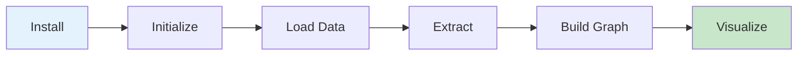

# Quickstart

Get started with Semantica in 5 minutes. This guide will walk you through building your first knowledge graph.

!!! tip "Before You Start"
    Make sure you have Semantica installed. If not, follow the [Installation Guide](installation.md) first. This quickstart assumes basic Python knowledge.

## Overview



## Step 1: Installation

If you haven't installed Semantica yet:

```bash
pip install semantica
```

See the [Installation Guide](installation.md) for detailed instructions.

!!! note "Installation Options"
    For production use, consider installing with optional dependencies for better performance: `pip install semantica[all]`. See the [Installation Guide](installation.md) for all options.

## Step 2: Your First Knowledge Graph

Building a knowledge graph involves these key steps:

1. **Ingest** your documents using `` `FileIngestor` ``
2. **Parse** documents to extract text using `` `DocumentParser` ``
3. **Extract** entities and relationships using `` `NERExtractor` `` and `` `RelationExtractor` ``
4. **Build** the graph using `` `GraphBuilder` ``
5. **Generate** embeddings (optional) using `` `TextEmbedder` ``

**Quick Example:**
```python
from semantica.ingest import FileIngestor
from semantica.parse import DocumentParser
from semantica.semantic_extract import NERExtractor, RelationExtractor
from semantica.kg import GraphBuilder

# Build your first knowledge graph
ingestor = FileIngestor()
parser = DocumentParser()
ner = NERExtractor()
rel_extractor = RelationExtractor()
builder = GraphBuilder()

# Process document and build graph
doc = ingestor.ingest_file("document.pdf")
parsed = parser.parse_document("document.pdf")
entities = ner.extract_entities(parsed.get("full_text", ""))
relationships = rel_extractor.extract_relations(parsed.get("full_text", ""), entities=entities)
kg = builder.build_graph(entities=entities, relationships=relationships)
```

**For complete step-by-step examples with detailed explanations, see:**
- **[Your First Knowledge Graph Cookbook](https://github.com/Hawksight-AI/semantica/blob/main/cookbook/introduction/08_Your_First_Knowledge_Graph.ipynb)**: Full tutorial with detailed explanations and expected outputs
  - **Topics**: Entity extraction, relationship extraction, graph construction, visualization
  - **Difficulty**: Beginner
  - **Time**: 20-30 minutes
  - **Use Cases**: Learning the basics, quick start

## Step 3: Extract Entities and Relationships

The semantic extraction step identifies named entities (people, organizations, locations) and relationships between them from your text.

**What gets extracted:**
- **Entities**: People, organizations, locations, dates, and other named entities
- **Relationships**: Connections between entities (e.g., `founded_by`, `located_in`, `has_ceo`)

**For detailed examples and different extraction methods, see:**
- **[Entity Extraction Cookbook](https://github.com/Hawksight-AI/semantica/blob/main/cookbook/introduction/05_Entity_Extraction.ipynb)**: Learn different NER methods and configurations
  - **Topics**: Named entity recognition, entity types, confidence scores
  - **Difficulty**: Beginner
  - **Time**: 15-20 minutes
  - **Use Cases**: Understanding entity extraction options

- **[Relation Extraction Cookbook](https://github.com/Hawksight-AI/semantica/blob/main/cookbook/introduction/06_Relation_Extraction.ipynb)**: Learn to extract relationships between entities
  - **Topics**: Relationship extraction, dependency parsing, semantic role labeling
  - **Difficulty**: Beginner
  - **Time**: 15-20 minutes
  - **Use Cases**: Building rich knowledge graphs with relationships

## Step 4: Build Knowledge Graph from Multiple Sources

You can combine data from multiple sources (files, web, databases) to build a unified knowledge graph. The process involves:

1. **Ingest** from multiple sources using different ingestors
2. **Parse** all documents to extract text
3. **Extract** entities and relationships from each source
4. **Build** a unified graph with entity merging enabled

**For complete examples with multiple sources, see:**
- **[Data Ingestion Cookbook](https://github.com/Hawksight-AI/semantica/blob/main/cookbook/introduction/02_Data_Ingestion.ipynb)**: Learn to ingest from files, web, feeds, streams, and databases
  - **Topics**: File, web, feed, stream, database ingestion
  - **Difficulty**: Beginner
  - **Time**: 15-20 minutes
  - **Use Cases**: Loading data from various sources

- **[Multi-Source Data Integration Cookbook](https://github.com/Hawksight-AI/semantica/blob/main/cookbook/advanced/06_Multi_Source_Data_Integration.ipynb)**: Advanced patterns for integrating multiple data sources
  - **Topics**: Multi-source integration, entity resolution, conflict handling
  - **Difficulty**: Intermediate
  - **Time**: 30-45 minutes
  - **Use Cases**: Building knowledge graphs from diverse data sources

## Step 5: Visualize Your Knowledge Graph

Visualization helps you understand and explore your knowledge graph structure. Semantica supports multiple visualization formats including interactive HTML, static images, and export formats.

**For detailed visualization examples, see:**
- **[Visualization Cookbook](https://github.com/Hawksight-AI/semantica/blob/main/cookbook/introduction/16_Visualization.ipynb)**: Learn to create interactive and static visualizations
  - **Topics**: Network graphs, interactive HTML, static images, export formats
  - **Difficulty**: Beginner
  - **Time**: 15-20 minutes
  - **Use Cases**: Exploring graph structure, presentations, analysis

- **[Complete Visualization Suite Cookbook](https://github.com/Hawksight-AI/semantica/blob/main/cookbook/advanced/03_Complete_Visualization_Suite.ipynb)**: Advanced visualization techniques
  - **Topics**: Custom layouts, filtering, styling, multiple graph types
  - **Difficulty**: Intermediate
  - **Time**: 30-45 minutes
  - **Use Cases**: Production visualizations, custom dashboards

## Step 6: Export Your Knowledge Graph

Export your knowledge graph to various formats for integration with other systems or tools. Semantica supports RDF, JSON, CSV, OWL, GraphML, and more.

**Supported export formats:**
- **RDF**: Turtle, RDF/XML, JSON-LD, N-Triples
- **JSON**: Standard JSON, JSON-LD, Cytoscape.js format
- **CSV**: Node and edge lists for spreadsheet tools
- **OWL**: OWL/XML and Turtle for ontologies
- **Graph Formats**: GraphML, GEXF, DOT for visualization tools

**For detailed export examples, see:**
- **[Export Cookbook](https://github.com/Hawksight-AI/semantica/blob/main/cookbook/introduction/15_Export.ipynb)**: Learn to export to all supported formats
  - **Topics**: RDF, JSON, CSV, OWL, GraphML export
  - **Difficulty**: Beginner
  - **Time**: 15-20 minutes
  - **Use Cases**: Data integration, sharing knowledge graphs

- **[Multi-Format Export Cookbook](https://github.com/Hawksight-AI/semantica/blob/main/cookbook/advanced/05_Multi_Format_Export.ipynb)**: Advanced export patterns
  - **Topics**: Batch export, custom formats, format conversion
  - **Difficulty**: Intermediate
  - **Time**: 30-45 minutes
  - **Use Cases**: Production exports, format migration

## Common Patterns

### Pattern 1: Process Text Directly

You can process text directly without file ingestion. This is useful when you already have text content in memory.

**For examples, see:**
- **[Entity Extraction Cookbook](https://github.com/Hawksight-AI/semantica/blob/main/cookbook/introduction/05_Entity_Extraction.ipynb)**: Processing text directly
- **[Building Knowledge Graphs Cookbook](https://github.com/Hawksight-AI/semantica/blob/main/cookbook/introduction/07_Building_Knowledge_Graphs.ipynb)**: Graph construction from text

### Pattern 2: Custom Entity Extraction

Configure entity extraction with different methods (ML models, LLMs) and parameters for your specific needs.

**For examples, see:**
- **[Entity Extraction Cookbook](https://github.com/Hawksight-AI/semantica/blob/main/cookbook/introduction/05_Entity_Extraction.ipynb)**: Different extraction methods and configurations
- **[Advanced Extraction Cookbook](https://github.com/Hawksight-AI/semantica/blob/main/cookbook/advanced/01_Advanced_Extraction.ipynb)**: Advanced extraction patterns

### Pattern 3: Incremental Building

Build knowledge graphs incrementally from multiple sources and merge them together.

**For examples, see:**
- **[Building Knowledge Graphs Cookbook](https://github.com/Hawksight-AI/semantica/blob/main/cookbook/introduction/07_Building_Knowledge_Graphs.ipynb)**: Graph construction and merging
- **[Multi-Source Data Integration Cookbook](https://github.com/Hawksight-AI/semantica/blob/main/cookbook/advanced/06_Multi_Source_Data_Integration.ipynb)**: Advanced integration patterns

## Next Steps

Now that you've built your first knowledge graph:

1. **[Explore Examples](examples.md)** - See more advanced use cases
2. **[API Reference](reference/core.md)** - Learn about all available methods
3. **[Cookbook](cookbook.md)** - Interactive Jupyter notebooks
4. **[Full Documentation](https://github.com/Hawksight-AI/semantica/blob/main/README.md)** - Comprehensive guide

### 🍳 Recommended Cookbook Tutorials

Continue learning with these interactive tutorials:

- **[Welcome to Semantica](https://github.com/Hawksight-AI/semantica/blob/main/cookbook/introduction/01_Welcome_to_Semantica.ipynb)**: Comprehensive introduction to all modules
  - **Topics**: Framework overview, all modules, architecture, configuration
  - **Difficulty**: Beginner
  - **Time**: 30-45 minutes
  - **Use Cases**: Understanding the complete framework

- **[Your First Knowledge Graph](https://github.com/Hawksight-AI/semantica/blob/main/cookbook/introduction/08_Your_First_Knowledge_Graph.ipynb)**: Build your first knowledge graph
  - **Topics**: Entity extraction, relationship extraction, graph construction, visualization
  - **Difficulty**: Beginner
  - **Time**: 20-30 minutes
  - **Use Cases**: Hands-on practice with complete workflow

- **[Data Ingestion](https://github.com/Hawksight-AI/semantica/blob/main/cookbook/introduction/02_Data_Ingestion.ipynb)**: Learn to ingest from multiple sources
  - **Topics**: File, web, feed, stream, database ingestion
  - **Difficulty**: Beginner
  - **Time**: 15-20 minutes
  - **Use Cases**: Loading data from various sources

- **[Document Parsing](https://github.com/Hawksight-AI/semantica/blob/main/cookbook/introduction/03_Document_Parsing.ipynb)**: Parse various document formats
  - **Topics**: PDF, DOCX, HTML, JSON parsing
  - **Difficulty**: Beginner
  - **Time**: 15-20 minutes
  - **Use Cases**: Extracting text from different file formats

## Troubleshooting

### Common Issues

**Issue**: No entities extracted
- **Solution**: Check that your document contains text content. PDFs with images only won't work without OCR.

**Issue**: Slow processing
- **Solution**: For large documents, consider processing in chunks or using GPU acceleration.

**Issue**: Memory errors
- **Solution**: Process documents one at a time or reduce batch sizes.

Need help? Check the [Installation Troubleshooting](installation.md#troubleshooting) or [GitHub Issues](https://github.com/Hawksight-AI/semantica/issues).
