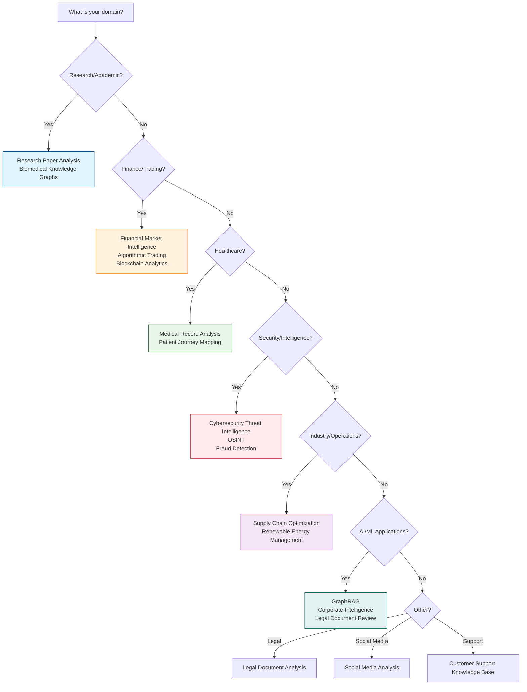

# Use Cases

Semantica is designed to solve complex data challenges across various domains. This guide explores common use cases and how to implement them.

!!! info "About This Guide"
    This guide provides detailed implementation guides for real-world use cases, complete with code examples, prerequisites, and step-by-step instructions.

---

## Table of Contents

- [Choosing the Right Use Case](#choosing-the-right-use-case)
- [Use Case Comparison](#use-case-comparison)
- [Research & Science](#research--science)
- [Finance & Trading](#finance--trading)
- [Healthcare & Life Sciences](#healthcare--life-sciences)
- [Security & Intelligence](#security--intelligence)
- [Industry & Operations](#industry--operations)
- [Advanced AI Patterns](#advanced-ai-patterns)
- [New Use Cases](#new-use-cases)

---

## Choosing the Right Use Case

Use this decision tree to find the use case that best fits your needs:



---

## Use Case Comparison

| Use Case                          | Difficulty    | Time        | Domain      | Key Features                                    |
| :-------------------------------- | :------------ | :---------- | :---------- | :---------------------------------------------- |
| **Research Paper Analysis**       | Beginner      | 30 min      | Research    | Citation networks, concept extraction           |
| **Biomedical Knowledge Graphs**  | Intermediate  | 1-2 hours   | Healthcare  | Gene-protein-disease relationships              |
| **Financial Market Intelligence** | Intermediate  | 1 hour      | Finance     | Sentiment analysis, trend detection             |
| **Algorithmic Trading**          | Advanced      | 2-3 hours   | Finance     | Multi-source integration, signal generation    |
| **Blockchain Analytics**         | Intermediate  | 1-2 hours   | Finance     | Transaction tracing, fraud detection             |
| **Medical Record Analysis**      | Intermediate  | 1 hour      | Healthcare  | Patient history, temporal tracking              |
| **Cybersecurity Threat Intelligence**| Advanced   | 2-3 hours   | Security    | Threat mapping, pattern detection              |
| **OSINT**                         | Intermediate  | 1-2 hours   | Security    | Multi-source intelligence                       |
| **Supply Chain Optimization**    | Intermediate  | 1-2 hours   | Industry    | Route optimization, risk management            |
| **GraphRAG**                      | Intermediate  | 1 hour      | AI          | Enhanced RAG with knowledge graphs              |
| **Legal Document Analysis**      | Intermediate  | 1-2 hours   | Legal       | Contract analysis, clause extraction            |
| **Social Media Analysis**        | Beginner      | 30 min      | Social      | Sentiment, trend analysis                       |
| **Customer Support KB**          | Beginner      | 30 min      | Support     | FAQ generation, knowledge base                 |

**Difficulty Levels**:
- **Beginner**: Basic Semantica knowledge required
- **Intermediate**: Some domain knowledge helpful
- **Advanced**: Requires domain expertise and advanced Semantica features

## Research & Science

### Research Paper Analysis

!!! abstract "Use Case"
    Extract structured knowledge from academic papers to discover trends, relationships, and key concepts.

**Difficulty**: Beginner  
**Time**: 30 minutes  
**Domain**: Research

**Prerequisites**:
- Semantica installed
- Python 3.8+
- Sample research papers (PDF format)
- OpenAI API key (optional, for LLM-based extraction)

**Goal**: Ingest PDFs, extract entities (Authors, Concepts, Methods), and build a citation network.

**Step-by-Step Implementation**:

1. **Install and Import**
   ```python
   from semantica import Semantica
   ```

2. **Initialize Semantica**
   ```python
   semantica = Semantica()
   ```

3. **Build Knowledge Base**
   ```python
   result = semantica.build_knowledge_base(
       sources=["papers/paper1.pdf", "papers/paper2.pdf"],
       embeddings=True,
       graph=True
   )
   ```

4. **Analyze Results**
   ```python
   kg = result["knowledge_graph"]
   print(f"Extracted {len(kg['entities'])} entities")
   print(f"Created {len(kg['relationships'])} relationships")
   ```

**Complete Code Example**:

```python
from semantica import Semantica
from semantica.visualization import KGVisualizer

# Initialize
semantica = Semantica()

# Build knowledge graph from research papers
result = semantica.build_knowledge_base(
    sources=[
        "papers/machine_learning_survey.pdf",
        "papers/deep_learning_review.pdf",
        "papers/nlp_advances.pdf"
    ],
    embeddings=True,
    graph=True,
    normalize=True
)

# Access results
kg = result["knowledge_graph"]
embeddings = result["embeddings"]

# Filter entities by type
authors = [e for e in kg['entities'] if e.get('type') == 'PERSON']
concepts = [e for e in kg['entities'] if e.get('type') == 'CONCEPT']
methods = [e for e in kg['entities'] if e.get('type') == 'METHOD']

print(f"Authors: {len(authors)}")
print(f"Concepts: {len(concepts)}")
print(f"Methods: {len(methods)}")

# Visualize citation network
visualizer = KGVisualizer()
visualizer.visualize(
    kg,
    output_format="html",
    output_path="citation_network.html"
)

# Export for analysis
semantica.export.to_json(kg, "research_kg.json")
```

**Expected Output**:
```
Authors: 45
Concepts: 120
Methods: 30
Relationships: 200
```

**Next Steps**:
- [:material-arrow-right: View Cookbook](cookbook/use_cases/biomedical/index.ipynb)
- [Explore Graph Analytics](reference/kg.md#graph-analytics)
- [Learn about Visualization](reference/visualization.md)

---

### Biomedical Knowledge Graphs

!!! abstract "Use Case"
    Accelerate drug discovery and understand disease pathways by connecting genes, proteins, drugs, and diseases.

**Difficulty**: Intermediate  
**Time**: 1-2 hours  
**Domain**: Healthcare/Research

**Prerequisites**:
- Domain knowledge of biomedical concepts
- Access to biomedical literature/databases
- LLM API access (recommended for accuracy)

**Goal**: Connect genes, proteins, drugs, and diseases from scientific literature and databases.

**Key Entities**: Gene, Protein, Drug, Disease, Pathway

**Complete Code Example**:

```python
from semantica import Semantica
from semantica.ontology import OntologyGenerator

# Initialize with biomedical focus
semantica = Semantica()

# Define custom entity types for biomedical domain
custom_entities = ["Gene", "Protein", "Drug", "Disease", "Pathway", "Mutation"]

# Build knowledge graph
result = semantica.build_knowledge_base(
    sources=[
        "literature/cancer_research.pdf",
        "databases/gene_protein_interactions.json"
    ],
    embeddings=True,
    graph=True,
    custom_entity_types=custom_entities
)

kg = result["knowledge_graph"]

# Generate ontology
ontology_gen = OntologyGenerator(base_uri="https://biomed.example.org/ontology/")
ontology = ontology_gen.generate_from_graph(kg)

# Query disease pathways
pathways = [r for r in kg['relationships'] 
            if r.get('predicate') == 'in_pathway']

print(f"Found {len(pathways)} pathway relationships")

# Export for further analysis
semantica.export.to_owl(ontology, "biomedical_ontology.owl")
```

**Expected Output**:
```
Found 150 pathway relationships
Generated ontology with 25 classes and 40 properties
```

**Next Steps**:
- [Ontology Module](reference/ontology.md)
- [Temporal Graphs](concepts.md#5-temporal-graphs)

---

## Finance & Trading

<div class="grid cards" markdown>

-   :material-finance: **Financial Market Intelligence**
    ---
    Analyze market trends and sentiment from news and reports.
    
    **Goal**: Ingest earnings call transcripts, news articles, and analyst reports to gauge market sentiment.
    
    [:material-arrow-right: View Cookbook](cookbook/use_cases/finance/index.ipynb)

-   :material-chart-line: **Algorithmic Trading Signals**
    ---
    Generate alpha by connecting disparate data points.
    
    **Goal**: Build a graph of companies, supply chains, and global events to identify non-obvious trading signals.
    
    [:material-arrow-right: View Cookbook](cookbook/use_cases/trading/index.ipynb)

-   :material-bitcoin: **Blockchain Analytics**
    ---
    Trace funds and identify illicit activity.
    
    **Goal**: Map transaction flows between wallets and exchanges to detect money laundering or fraud.
    
    [:material-arrow-right: View Cookbook](cookbook/use_cases/blockchain/index.ipynb)

</div>

---

## Healthcare & Life Sciences

<div class="grid cards" markdown>

-   :material-hospital-box: **Medical Record Analysis**
    ---
    Transform unstructured patient notes into structured medical histories.
    
    **Goal**: Extract Symptoms, Diagnoses, Medications, and Procedures, linking them temporally.
    
    [:material-arrow-right: View Cookbook](cookbook/use_cases/healthcare/index.ipynb)

-   :material-account-heart: **Patient Journey Mapping**
    ---
    Visualize and analyze the complete patient experience.
    
    **Goal**: Connect clinical encounters, lab results, and patient feedback to improve care delivery.

</div>

---

## Security & Intelligence

<div class="grid cards" markdown>

-   :material-shield-lock: **Cybersecurity Threat Intelligence**
    ---
    Proactively identify and mitigate cyber threats.
    
    **Goal**: Ingest threat feeds (STIX/TAXII), CVE databases, and system logs to map attack vectors.
    
    [:material-arrow-right: View Cookbook](cookbook/use_cases/cybersecurity/index.ipynb)

-   :material-eye: **Open Source Intelligence (OSINT)**
    ---
    Gather and analyze public information for intelligence purposes.
    
    **Goal**: Connect data from social media, news, and public records to build profiles.
    
    [:material-arrow-right: View Cookbook](cookbook/use_cases/intelligence/index.ipynb)

-   :material-account-network: **Criminal Network Analysis**
    ---
    Analyze criminal networks to identify key players, communities, and suspicious patterns.
    
    **Goal**: Build knowledge graphs from police reports, court records, and surveillance data to detect criminal structures and relationships.
    
    [:material-arrow-right: View Cookbook](cookbook/use_cases/intelligence/Criminal_Network_Analysis.ipynb)

-   :material-shield-search: **Law Enforcement and Forensics**
    ---
    Process forensic evidence and correlate cases using temporal knowledge graphs.
    
    **Goal**: Extract entities from case files, evidence logs, and witness statements to build temporal case timelines and identify cross-case connections.
    
    [:material-arrow-right: View Cookbook](cookbook/use_cases/intelligence/Law_Enforcement_Forensics.ipynb)

-   :material-incognito: **Fraud Detection**
    ---
    Detect complex fraud rings.
    
    **Goal**: Build a graph of Users, Devices, IP Addresses, and Transactions to find cycles and dense subgraphs.

</div>

---

## Industry & Operations

<div class="grid cards" markdown>

-   :material-truck-delivery: **Supply Chain Optimization**
    ---
    Visualize and optimize complex global supply chains.
    
    **Goal**: Map suppliers, logistics routes, and inventory levels to identify bottlenecks.
    
    [:material-arrow-right: View Cookbook](cookbook/use_cases/supply_chain/index.ipynb)

-   :material-wind-turbine: **Renewable Energy Management**
    ---
    Optimize grid operations and asset maintenance.
    
    **Goal**: Connect sensor data, weather forecasts, and maintenance logs to predict failures.
    
    [:material-arrow-right: View Cookbook](cookbook/use_cases/renewable_energy/index.ipynb)

</div>

---

## Advanced AI Patterns

<div class="grid cards" markdown>

-   :material-robot: **Graph-Augmented Generation (GraphRAG)**
    ---
    Enhance LLM responses with structured ground truth.
    
    **Goal**: Use the knowledge graph to retrieve precise context for RAG applications.
    
    [:material-arrow-right: View Cookbook](cookbook/use_cases/advanced_rag/index.ipynb)

-   :material-domain: **Corporate Intelligence**
    ---
    Unify internal documents into a single semantic layer.
    
    **Goal**: Connect People, Projects, and Decisions across the organization.

-   :material-gavel: **Legal Document Review**
    ---
    Analyze contracts and legal texts.
    
    **Goal**: Parse contracts, extract clauses, and identify relationships like "supersedes".

</div>

---

## New Use Cases

### Legal Document Analysis

!!! abstract "Use Case"
    Analyze contracts and legal texts to extract clauses, identify relationships, and understand document structure.

**Difficulty**: Intermediate  
**Time**: 1-2 hours  
**Domain**: Legal

**Prerequisites**:
- Legal document samples (contracts, agreements)
- Understanding of legal terminology
- LLM API access (recommended)

**Goal**: Parse contracts, extract clauses, and identify relationships like "supersedes", "amends", "references".

**Complete Code Example**:

```python
from semantica import Semantica
from semantica.semantic_extract import NERExtractor, RelationExtractor

semantica = Semantica()

# Define legal entity types
legal_entities = [
    "Party", "Clause", "Section", "Contract", "Agreement",
    "Term", "Condition", "Obligation", "Right"
]

# Build knowledge graph from contracts
result = semantica.build_knowledge_base(
    sources=[
        "contracts/agreement1.pdf",
        "contracts/amendment1.pdf"
    ],
    custom_entity_types=legal_entities,
    graph=True,
    temporal=True  # Track contract versions
)

kg = result["knowledge_graph"]

# Extract clause relationships
clause_rels = [r for r in kg['relationships'] 
               if r.get('predicate') in ['supersedes', 'amends', 'references']]

print(f"Found {len(clause_rels)} clause relationships")

# Query contract structure
parties = [e for e in kg['entities'] if e.get('type') == 'Party']
print(f"Parties: {[p.get('text') for p in parties]}")

# Export for legal review
semantica.export.to_json(kg, "contract_analysis.json")
```

**Expected Output**:
```
Found 15 clause relationships
Parties: ['Company A', 'Company B']
```

---

### Social Media Analysis

!!! abstract "Use Case"
    Analyze social media content to extract sentiment, trends, and relationships between users and topics.

**Difficulty**: Beginner  
**Time**: 30 minutes  
**Domain**: Social Media

**Prerequisites**:
- Social media data (JSON, CSV, or API access)
- Basic understanding of sentiment analysis

**Goal**: Extract entities, relationships, and sentiment from social media posts to understand trends and user connections.

**Complete Code Example**:

```python
from semantica import Semantica
from semantica.ingest import FileIngestor

semantica = Semantica()

# Ingest social media data
ingestor = FileIngestor()
posts = ingestor.ingest("social_media/posts.json")

# Build knowledge graph
result = semantica.build_knowledge_base(
    sources=posts,
    embeddings=True,
    graph=True
)

kg = result["knowledge_graph"]

# Analyze trends
hashtags = [e for e in kg['entities'] if e.get('text', '').startswith('#')]
mentions = [e for e in kg['entities'] if e.get('text', '').startswith('@')]

print(f"Hashtags: {len(hashtags)}")
print(f"Mentions: {len(mentions)}")

# Find popular topics
from collections import Counter
topic_counts = Counter([e.get('text') for e in hashtags])
print(f"Top topics: {topic_counts.most_common(10)}")

# Visualize social network
semantica.visualization.visualize_network(
    kg,
    output="social_network.html"
)
```

**Expected Output**:
```
Hashtags: 150
Mentions: 200
Top topics: [('AI', 45), ('MachineLearning', 30), ('Python', 25)]
```

---

### Customer Support Knowledge Base

!!! abstract "Use Case"
    Build a knowledge base from support tickets, documentation, and FAQs to improve customer service.

**Difficulty**: Beginner  
**Time**: 30 minutes  
**Domain**: Customer Support

**Prerequisites**:
- Support tickets or documentation
- FAQ documents
- Basic text data

**Goal**: Create a searchable knowledge base that connects support issues, solutions, and related topics.

**Complete Code Example**:

```python
from semantica import Semantica
from semantica.vector_store import VectorStore, HybridSearch

semantica = Semantica()

# Build knowledge base from support docs
result = semantica.build_knowledge_base(
    sources=[
        "support/tickets/",
        "support/faqs/",
        "support/documentation/"
    ],
    embeddings=True,
    graph=True
)

kg = result["knowledge_graph"]
embeddings = result["embeddings"]

# Set up semantic search
vector_store = VectorStore()
vector_store.store(embeddings, result["documents"])

# Search for similar issues
hybrid_search = HybridSearch(vector_store)
results = hybrid_search.search(
    query="How do I reset my password?",
    top_k=5
)

print("Similar support articles:")
for result in results:
    print(f"  - {result.document.metadata.get('title', 'N/A')} (Score: {result.score:.3f})")

# Export knowledge base
semantica.export.to_json(kg, "support_kb.json")
```

**Expected Output**:
```
Similar support articles:
  - Password Reset Guide (Score: 0.892)
  - Account Recovery (Score: 0.856)
  - Login Issues FAQ (Score: 0.823)
```

---

## Implementation Example

Here is a general pattern for implementing these use cases:

```python
from semantica import Semantica

# 1. Initialize with domain-specific configuration
semantica = Semantica(domain="finance")

# 2. Ingest Data
docs = semantica.ingest.load("data/", recursive=True)

# 3. Build Knowledge Graph
kg = semantica.kg.build_graph(docs)

# 4. Analyze or Query
insights = semantica.kg.query("MATCH (c:Company)-[:HAS_RISK]->(r:Risk) RETURN c, r")
```

---

## Summary

This guide covered use cases across multiple domains:

- **Research & Science**: Academic paper analysis, biomedical knowledge graphs
- **Finance & Trading**: Market intelligence, trading signals, blockchain analytics
- **Healthcare**: Medical records, patient journey mapping
- **Security**: Threat intelligence, OSINT, fraud detection
- **Industry**: Supply chain, energy management
- **AI Applications**: GraphRAG, corporate intelligence
- **New Use Cases**: Legal analysis, social media, customer support

Each use case follows a similar pattern:
1. **Ingest** data from various sources
2. **Extract** entities and relationships
3. **Build** knowledge graph
4. **Analyze** and query
5. **Export** or visualize results

---

## Next Steps

- **[Examples](examples.md)** - More detailed code examples
- **[Modules Guide](modules.md)** - Learn about available modules
- **[Cookbook](cookbook.md)** - Interactive Jupyter notebooks
- **[API Reference](reference/core.md)** - Complete API documentation

---

!!! info "Contribute"
    Have a use case to add? [Contribute on GitHub](https://github.com/Hawksight-AI/semantica)

**Last Updated**: 2024
