# Use Cases

Semantica is designed to solve complex data challenges across various domains. This guide explores common use cases and how to implement them.

## 🔬 Research & Science

<div class="grid cards" markdown>

-   :material-microscope: **Research Paper Analysis**
    ---
    Extract structured knowledge from academic papers to discover trends, relationships, and key concepts.
    
    **Goal**: Ingest PDFs, extract entities (Authors, Concepts, Methods), and build a citation network.
    
    [:material-arrow-right: View Cookbook](cookbook/use_cases/biomedical/index.ipynb)

-   :material-dna: **Biomedical Knowledge Graphs**
    ---
    Accelerate drug discovery and understand disease pathways.
    
    **Goal**: Connect genes, proteins, drugs, and diseases from scientific literature and databases.
    
    **Key Entities**: Gene, Protein, Drug, Disease, Pathway.

</div>

---

## 💼 Finance & Trading

<div class="grid cards" markdown>

-   :material-finance: **Financial Market Intelligence**
    ---
    Analyze market trends and sentiment from news and reports.
    
    **Goal**: Ingest earnings call transcripts, news articles, and analyst reports to gauge market sentiment.
    
    [:material-arrow-right: View Cookbook](cookbook/use_cases/finance/index.ipynb)

-   :material-chart-line: **Algorithmic Trading Signals**
    ---
    Generate alpha by connecting disparate data points.
    
    **Goal**: Build a graph of companies, supply chains, and global events to identify non-obvious trading signals.
    
    [:material-arrow-right: View Cookbook](cookbook/use_cases/trading/index.ipynb)

-   :material-bitcoin: **Blockchain Analytics**
    ---
    Trace funds and identify illicit activity.
    
    **Goal**: Map transaction flows between wallets and exchanges to detect money laundering or fraud.
    
    [:material-arrow-right: View Cookbook](cookbook/use_cases/blockchain/index.ipynb)

</div>

### 📊 Financial Data Pipeline Architecture


---

## 🏥 Healthcare & Life Sciences

<div class="grid cards" markdown>

-   :material-hospital-box: **Medical Record Analysis**
    ---
    Transform unstructured patient notes into structured medical histories.
    
    **Goal**: Extract Symptoms, Diagnoses, Medications, and Procedures, linking them temporally.
    
    [:material-arrow-right: View Cookbook](cookbook/use_cases/healthcare/index.ipynb)

-   :material-account-heart: **Patient Journey Mapping**
    ---
    Visualize and analyze the complete patient experience.
    
    **Goal**: Connect clinical encounters, lab results, and patient feedback to improve care delivery.

</div>

---

## 🛡️ Security & Intelligence

<div class="grid cards" markdown>

-   :material-shield-lock: **Cybersecurity Threat Intelligence**
    ---
    Proactively identify and mitigate cyber threats.
    
    **Goal**: Ingest threat feeds (STIX/TAXII), CVE databases, and system logs to map attack vectors.
    
    [:material-arrow-right: View Cookbook](cookbook/use_cases/cybersecurity/index.ipynb)

-   :material-eye: **Open Source Intelligence (OSINT)**
    ---
    Gather and analyze public information for intelligence purposes.
    
    **Goal**: Connect data from social media, news, and public records to build profiles.
    
    [:material-arrow-right: View Cookbook](cookbook/use_cases/intelligence/index.ipynb)

-   :material-account-network: **Criminal Network Analysis**
    ---
    Analyze criminal networks to identify key players, communities, and suspicious patterns.
    
    **Goal**: Build knowledge graphs from police reports, court records, and surveillance data to detect criminal structures and relationships.
    
    [:material-arrow-right: View Cookbook](cookbook/use_cases/intelligence/Criminal_Network_Analysis.ipynb)

-   :material-shield-search: **Law Enforcement and Forensics**
    ---
    Process forensic evidence and correlate cases using temporal knowledge graphs.
    
    **Goal**: Extract entities from case files, evidence logs, and witness statements to build temporal case timelines and identify cross-case connections.
    
    [:material-arrow-right: View Cookbook](cookbook/use_cases/intelligence/Law_Enforcement_Forensics.ipynb)

-   :material-incognito: **Fraud Detection**
    ---
    Detect complex fraud rings.
    
    **Goal**: Build a graph of Users, Devices, IP Addresses, and Transactions to find cycles and dense subgraphs.

</div>

### 🛡️ Threat Intelligence Architecture


---

## 🏭 Industry & Operations

<div class="grid cards" markdown>

-   :material-truck-delivery: **Supply Chain Optimization**
    ---
    Visualize and optimize complex global supply chains.
    
    **Goal**: Map suppliers, logistics routes, and inventory levels to identify bottlenecks.
    
    [:material-arrow-right: View Cookbook](cookbook/use_cases/supply_chain/index.ipynb)

-   :material-wind-turbine: **Renewable Energy Management**
    ---
    Optimize grid operations and asset maintenance.
    
    **Goal**: Connect sensor data, weather forecasts, and maintenance logs to predict failures.
    
    [:material-arrow-right: View Cookbook](cookbook/use_cases/renewable_energy/index.ipynb)

</div>

---

## 🤖 Advanced AI Patterns

<div class="grid cards" markdown>

-   :material-robot: **Graph-Augmented Generation (GraphRAG)**
    ---
    Enhance LLM responses with structured ground truth.
    
    **Goal**: Use the knowledge graph to retrieve precise context for RAG applications.
    
    [:material-arrow-right: View Cookbook](cookbook/use_cases/advanced_rag/index.ipynb)

-   :material-domain: **Corporate Intelligence**
    ---
    Unify internal documents into a single semantic layer.
    
    **Goal**: Connect People, Projects, and Decisions across the organization.

-   :material-gavel: **Legal Document Review**
    ---
    Analyze contracts and legal texts.
    
    **Goal**: Parse contracts, extract clauses, and identify relationships like "supersedes".

</div>

---

## 🧩 Implementation Example

Here is a general pattern for implementing these use cases:

```mermaid
graph LR
    Input[📄 Data Sources] --> Ingest
    Ingest --> Extract[🧠 Semantic Extraction]
    Extract --> KG[🕸️ Knowledge Graph]
    KG --> App[🚀 Application]
    
    subgraph Application Layer
        App --> Search[Semantic Search]
        App --> RAG[GraphRAG]
        App --> Analytics[Graph Analytics]
    end
```



```python
from semantica import Semantica

# 1. Initialize with domain-specific configuration
semantica = Semantica(domain="finance")

# 2. Ingest Data
docs = semantica.ingest.load("data/", recursive=True)

# 3. Build Knowledge Graph
kg = semantica.kg.build_graph(docs)

# 4. Analyze or Query
insights = semantica.kg.query("MATCH (c:Company)-[:HAS_RISK]->(r:Risk) RETURN c, r")
```
